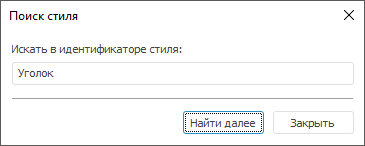

# Поиск стиля

Поиск стиля
-

# Поиск стиля

Поиск стиля отличается в настольном и веб-приложении.

	Веб-приложение Настольное приложение

		Для поиска стиля:

			- Нажмите кнопку  «Найти»
			 на панели «Стили».

			- Введите наименование искомого стиля в появившейся строке
			 поиска.

		В результате выполнения действий на панели «Стили»
		 будут отображаться те стили, в наименовании которых встречается
		 введённая строка. Поиск регистрозависимый и выполняется только
		 внутри таблицы стилей.

		Для поиска стиля:

			- нажмите кнопку  «Найти»
			 на панели инструментов;

			- нажмите сочетание клавиш CTRL+F.

		В открывшемся окне введите наименование искомого стиля:

		

		При нажатии кнопки «Найти далее»
		 фокус будет перемещен к найденному стилю. Поиск регистронезависимый
		 и выполняется только внутри таблицы стилей.

См. также:

[Работа
 с готовой таблицей стилей](StylesTable_working.htm)

		Справочная
		 система на версию 10.9
		 от 18/08/2025,
		 © ООО «ФОРСАЙТ»,
