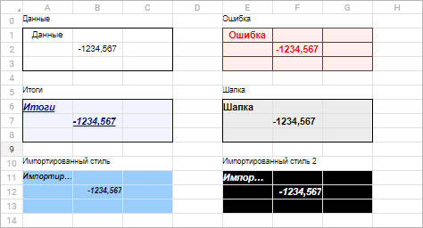

# Просмотр стилей

Просмотр стилей
-

# Просмотр стилей

Для просмотра стилей используется [область
 просмотра](StylesTable.htm#elements).

Просмотр стилей отличается в настольном и веб-приложении.

	Веб-приложение Настольное приложение

		Для просмотра стилей используется область просмотра,
		 в которой отображаются примеры оформления всех стилей из таблицы
		 стилей:

		

		Для просмотра:

			- одного стиля.
			 Выделите его на панели «Стили»;

			- нескольких стилей.
			 Выделите стили одного визуализатора на панели «Стили»
			 с зажатой клавишей CTRL;

		Примечание.
		 Если выделены стили нескольких визуализаторов, то просмотр невозможен
		 и в области просмотра отображается сообщение «Выделено
		 несколько стилей».

			- всех стилей одного
			 визуализатора. Выделите папку, содержащую стили визуализатора.

		Пример оформления стилей отобразится в области просмотра.

См. также:

[Работа
 с готовой таблицей стилей](StylesTable_working.htm)

		Справочная
		 система на версию 10.9
		 от 18/08/2025,
		 © ООО «ФОРСАЙТ»,
