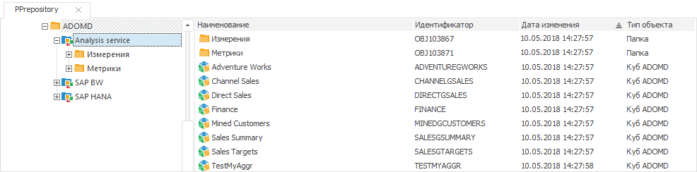

# Подключение к Microsoft Analysis Services

Подключение к Microsoft Analysis Services
-

# Подключение к Microsoft Analysis Services

Для подключения к Microsoft Analysis Services в репозитории предназначен
 объект - Каталог ADOMD. Структура источников данных, применяемых в Microsoft
 Analysis Services, схожа со структурой [кубов
 продукта «Форсайт. Аналитическая платформа»](../Cube/UiMd_Cube_Type.htm).

Примечание.
 Создание каталога ADOMD доступно только в настольном приложении. Для успешной
 работы с выбранной базой необходимо наличие установленного драйвера в
 операционной системе того компьютера, с которого будет осуществляться
 подключение.

Каталог ADOMD является контейнером, в котором после подключения будут
 созданы кубы и измерения, являющиеся отображением многомерных источников,
 хранящихся на сервере многомерной базы данных. После подключения каталог
 считывает метаданные объектов, хранящихся на сервере, и создает их аналоги
 в репозитории - справочники ADOMD и кубы ADOMD. Если в исходных кубах
 используются переменные, то для управления значениями этих переменных
 в кубах ADOMD будут созданы параметры. Порядок и настройки параметров
 зависят от настроек используемых переменных.

Используя созданные в каталоге ADOMD объекты, можно получить доступ
 к данным исходных объектов. Каталог ADOMD осуществляет все необходимые
 действия по формированию и выполнению MDX-запросов, которые используются
 при работе с многомерными источниками данных.

## Создание подключения

По умолчанию необходимый драйвер для подключения к многомерным базам
 данных на базе Microsoft Analysis Services уже установлен в операционной
 системе Windows. Обновлённая версия драйвера может быть установлена вместе
 с клиентской частью Microsoft SQL Server (Native Client).

Для создания подключения к Microsoft Analysis Services выполните следующие
 действия:

	- В навигаторе объектов выполните команду «Другие >
	 Каталог ADOMD» в раскрывающемся меню кнопки «Новый
	 объект» на вкладке ленты «Главная»
	 или команду «Создать > Другие
	 > Каталог ADOMD» в контекстном меню навигатора объектов.

	- При необходимости измените наименование и идентификатор создаваемого
	 объекта на странице «Базовые свойства»
	 мастера:

Нажмите кнопку «Далее»
 для перехода к странице мастера «Параметры».

	- Выберите драйвер «Analysis
	 Services», в поле «Сервер»
	 укажите IP-адрес или наименование сервера. Для подключения определите
	 способ аутентификации пользователя, при необходимости установите флажок
	 «Автоматическое подключение»
	 и укажите имя пользователя и пароль. Если флажок «Автоматическое
	 подключение» снят, то имя пользователя и пароль будут запрашиваться
	 при первом обращении к каталогу или его объектам в рамках текущего
	 соединения с репозиторием. Нажмите кнопку «Проверить
	 подключение». После успешного подключения в раскрывающемся
	 списке «Имя» выберите многомерную
	 базу данных, в соответствии с содержимым которой в репозитории будут
	 созданы необходимые объекты. Если установить флажок «Автоматическое
	 обновление структуры кубов», то при каждом открытии какого-либо
	 куба его структура будет синхронизироваться со структурой куба на
	 сервере. По умолчанию флажок снят, при этом синхронизация происходит
	 только при полном обновлении содержимого каталога.

Нажмите кнопку «Готово».

	- Для созданного в репозитории каталога ADOMD выполните команду
	 контекстного меню «Обновить».
	 Дождитесь пока «Форсайт. Аналитическая платформа»
	 по полученным с сервера метаданным создаст все необходимые объекты -
	 справочники ADOMD и кубы ADOMD:

Примечание.
 Если при обновлении каталога метаданные источников по какой-либо причине
 не были прочитаны через ADOMD, например, в источниках использовались вычисления,
 не поддерживаемые через ADOMD, то такие источники не будут добавлены в
 каталог. При этом будет выведено сообщение с перечнем пропущенных источников
 и текстом ошибок от ADOMD.

## Использование объектов каталога ADOMD

Объекты, созданные в каталоге ADOMD, можно использовать в различных
 инструментах продукта «Форсайт. Аналитическая платформа»:
 «Аналитические панели», «Аналитические запросы (OLAP)»,
 «Отчеты».

См. также:

[Подключение
 к многомерным базам данным ADOMD](UiDb_relational_ADOMD.htm)

		Справочная
		 система на версию 10.9
		 от 18/08/2025,
		 © ООО «ФОРСАЙТ»,
