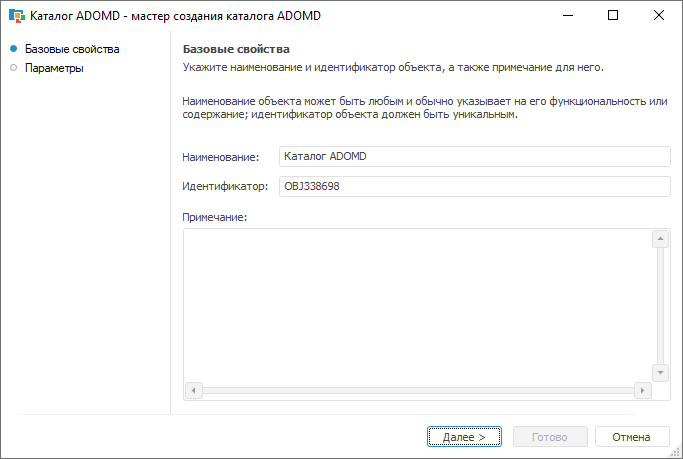
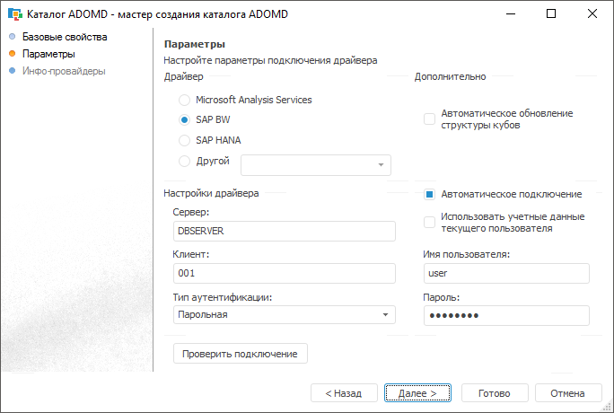
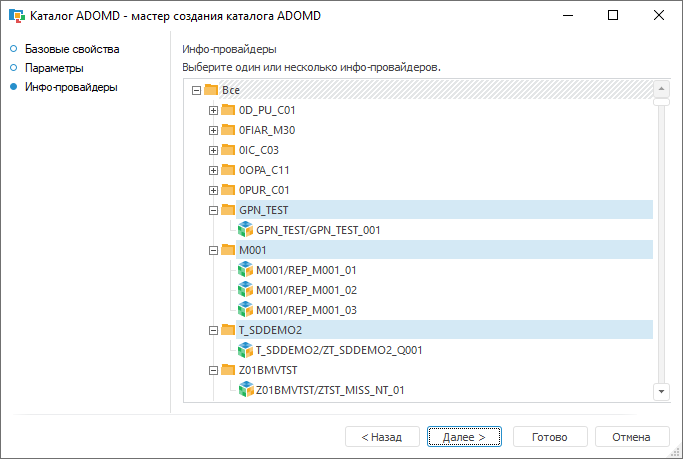
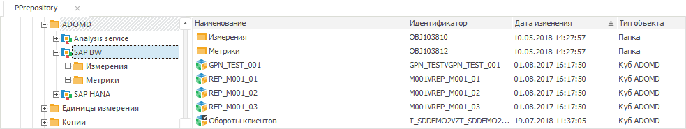
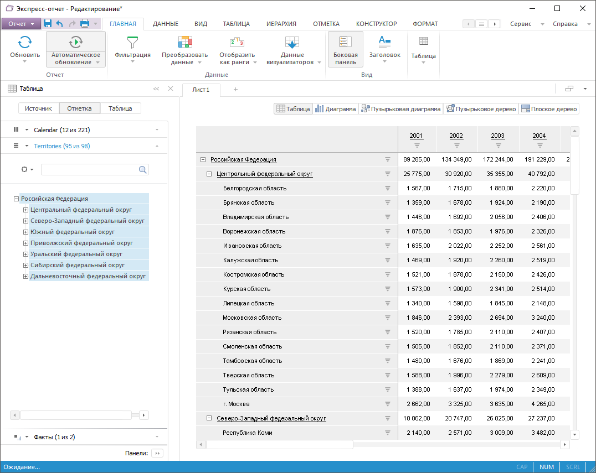

# Подключение к SAP NetWeaver BW

Подключение к SAP NetWeaver BW
-

# Подключение к SAP NetWeaver BW

Для подключения к многомерным базам данных на базе SAP NetWeaver BW
 предварительно необходимо установить программное обеспечение SAP GUI for
 Windows, включающее в себя необходимый OLE DB драйвер. Необходимое программное
 обеспечение можно скачать с сайта [SAP
 Service Marketplace](http://service.sap.com/swdc) (требуется предварительная регистрация). Разрядность
 должна совпадать с разрядностью используемой версии продукта «Форсайт. Аналитическая платформа».
 После установки необходимо настроить конфигурационный файл saplogon.ini.
 Данный файл может располагаться в различных местах, более подробно читайте
 в статье «[SAP
 GUI Logon Configuration](https://wiki.scn.sap.com/wiki/display/NWTech/SAP%2bGUI%2bLogon%2bConfiguration)». Если файл отсутствует, то создайте его.

Пример файла: [saplogon.zip](saplogon.zip).

В файле задайте следующие настройки:

	- в разделе Server укажите
	 наименование или IP-адрес сервера SAP NetWeaver BW. Информацию можно
	 получить у администратора баз данных SAP NetWeaver BW;

	- в разделе Description
	 укажите описание, которое будет иметь ссылка на сервер SAP NetWeaver
	 BW. Данная ссылка будет использоваться каталогом ADOMD для подключения.

Для создания подключения к SAP NetWeaver BW выполните следующие действия:

	- В навигаторе объектов выполните команду «Другие
	 > Каталог ADOMD» в раскрывающемся меню кнопки «Новый
	 объект» на вкладке ленты «Главная»
	 или команду «Создать > Другие
	 > Каталог ADOMD» в контекстном меню навигатора объектов.

	- При необходимости измените наименование и идентификатор создаваемого
	 объекта на странице «Базовые свойства»
	 мастера:

Нажмите кнопку «Далее»
 для перехода к странице мастера «Параметры».

	- Выберите драйвер «SAP BW»,
	 в поле «Сервер» укажите описание,
	 которое было задано в разделе [Description]
	 файла saplogon.ini. В поле
	 «Клиент» укажите номер клиента.
	 В соответствии с ролью указанного клиента в дальнейшем будет предоставлен
	 доступ к данным. Для подключения определите способ аутентификации
	 пользователя, при необходимости установите флажок «Автоматическое
	 подключение» и укажите имя пользователя и пароль. Если флажок
	 «Автоматическое подключение»
	 снят, то имя пользователя и пароль будут запрашиваться при первом
	 обращении к каталогу или его объектам в рамках текущего соединения
	 с репозиторием. Всю информацию, необходимую для подключения, можно
	 получить у администратора баз данных SAP NetWeaver BW. Если установить
	 флажок «Автоматическое обновление
	 структуры кубов», то при каждом открытии какого-либо куба его
	 структура будет синхронизироваться со структурой куба на сервере.
	 По умолчанию флажок снят, при этом синхронизация происходит только
	 при полном обновлении содержимого каталога.

	- Нажмите кнопку «Проверить подключение».
	 При успешном подключении нажмите кнопку «Далее»
	 для перехода к странице «Инфо-провайдеры».
	 На данной странице можно выбрать каталоги или инфо-провайдеры, на
	 основании информации которых будут создаваться объекты в каталоге
	 ADOMD. По умолчанию выделен элемент «Все»,
	 при этом будут созданы все кубы, которые созданы на сервере. При необходимости
	 список создаваемых объектов можно сократить, для этого выделите необходимые
	 каталоги или отдельные инфо-провайдеры. Список выделенных объектов
	 сохраняется, при обновлении содержимого каталога ADOMD будет обновлена
	 информация только о выделенных объектах.

	- Для созданного в репозитории каталога ADOMD выполните команду
	 контекстного меню «Обновить».
	 Дождитесь пока «Форсайт. Аналитическая платформа»
	 по полученным с сервера метаданным создаст все необходимые объекты
	 - справочники ADOMD и кубы ADOMD:

Примечание.
 Если при обновлении каталога метаданные источников по какой-либо причине
 не были прочитаны через ADOMD, например, в источниках использовались вычисления,
 не поддерживаемые через ADOMD, то такие источники не будут добавлены в
 каталог. При этом будет выведено сообщение с перечнем пропущенных источников
 и текстом ошибок от ADOMD.

## Использование объектов каталога ADOMD

Объекты, созданные в каталоге ADOMD, можно использовать в различных
 инструментах продукта «Форсайт. Аналитическая платформа»:
 «Аналитические панели», «Аналитические запросы (OLAP)»,
 «Отчеты».

См. также:

[Подключение
 к многомерным базам данным ADOMD](UiDb_relational_ADOMD.htm)

		Справочная
		 система на версию 10.9
		 от 18/08/2025,
		 © ООО «ФОРСАЙТ»,
