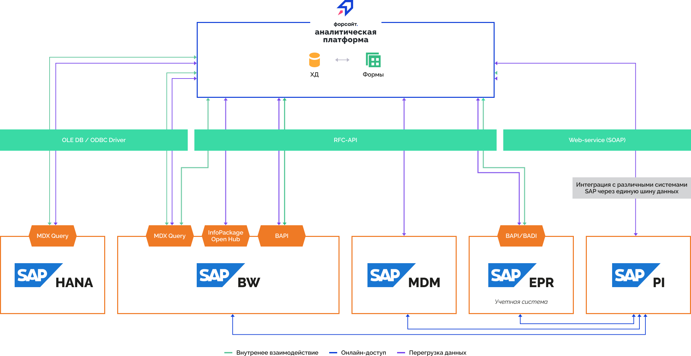

# Подключение к SAP

Подключение к SAP
-

# Подключение к SAP

Продукт «Форсайт. Аналитическая платформа»
 позволяет настроить взаимодействие с различными продуктами и платформами
 SAP. В общем виде схема интеграции выглядит следующим образом:

Подключение к SAP NetWeaver BW и SAP HANA можно настроить непосредственно
 из репозитория. Структура источников данных, применяемых в этих программных
 продуктах, схожа со структурой [кубов
 продукта «Форсайт. Аналитическая платформа»](../Cube/UiMd_Cube_Type.htm).

Для подключения предназначен объект - Каталог ADOMD.

Примечание.
 Создание каталога ADOMD доступно только в настольном приложении. Для успешной
 работы с выбранной базой необходимо наличие установленного драйвера в
 операционной системе того компьютера, с которого будет осуществляться
 подключение.

Каталог ADOMD является контейнером, в котором после подключения будут
 созданы кубы и измерения, являющиеся отображением многомерных источников,
 хранящихся на сервере многомерной базы данных. После подключения каталог
 считывает метаданные объектов, хранящихся на сервере, и создает их аналоги
 в репозитории - справочники ADOMD и кубы ADOMD. Если в исходных кубах
 используются переменные, то для управления значениями этих переменных
 в кубах ADOMD будут созданы параметры. Порядок и настройки параметров
 зависят от настроек используемых переменных.

Используя созданные в каталоге ADOMD объекты, можно получить доступ
 к данным исходных объектов. Каталог ADOMD осуществляет все необходимые
 действия по формированию и выполнению MDX-запросов, которые используются
 при работе с многомерными источниками данных.

Описание действий, необходимых для настройки подключения, представлено
 в следующих подразделах:

	- [Подключение к SAP
	 NetWeaver BW](Connect_to_SAP_NetWeaver_BW.htm);

	- [Подключение к SAP HANA](Connect_to_SAP_HANA.htm).

## Доступ к данным

Доступ к данным других продуктов SAP возможен через вызов RFC-функций
 или через взаимодействие по протоколу SOAP в веб-приложении. Для этого
 потребуется разработка дополнительного прикладного приложения, которое
 будет осуществлять все необходимые действия по подключению, извлечению
 и передаче данных в инструменты «Форсайт. Аналитическая платформа».
 Работа с RFC-функциями возможна на языке Python, для этого используется
 библиотека [PyRFC](https://github.com/SAP/PyRFC).
 В платформе для работы с языком Python могут использоваться [Python-модули](UiDevEnv.chm::/01_Development_Environment/02_Work_in_Development_Environment/DevEnv_Object/python_module.htm)
 или осуществляться непосредственный вызов функций, реализованных во внешних
 Python-файлах, с помощью метода [Python.Invoke](KePython.chm::/Class/Python/Python.Invoke.htm)
 языка Fore.

Примечание.
 Для работы с языком Python в «Форсайт. Аналитическая платформа»
 предварительно должна быть осуществлена [интеграция](UiNav.chm::/02_Navigator/CommonSettings/Integration.htm#python).

См. также:

[Подключение
 к внешним базам данных](../connect_to_database.htm) | [IAdoMdCatalog](keadomd.chm::/interface/iadomdcatalog/iadomdcatalog.htm)

		Справочная
		 система на версию 10.9
		 от 18/08/2025,
		 © ООО «ФОРСАЙТ»,
