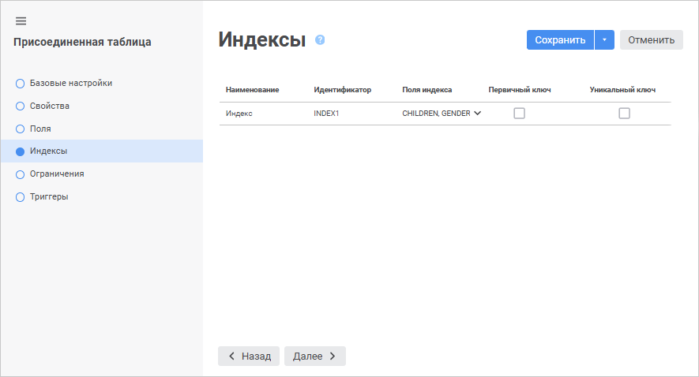
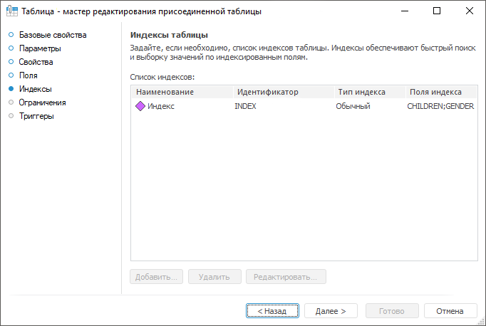

# Страница «Индексы»: Присоединенная таблица

Страница «Индексы»: Присоединенная таблица
-

# Индексы присоединенной таблицы

На странице «Индексы» отображается
 список индексов присоединенной таблицы. Список индексов присоединенной
 таблицы формируется из [индексов
 таблицы](../../Table/Master/UiDb_relational_table_master_Index.htm), выбранной на странице «[Свойства](UiDb_relational_AttachTable_master_database.htm)».

	Веб-приложение Настольное приложение

		

		

Для перехода на следующую страницу мастера нажмите кнопку «Далее».

См. также:

[Присоединенная
 таблица](../UiDb_relational_AttachTable.htm) | [Ограничения
 присоединенной таблицы](Attach_table_master_contingencies.htm)

		Справочная
		 система на версию 10.9
		 от 18/08/2025,
		 © ООО «ФОРСАЙТ»,
