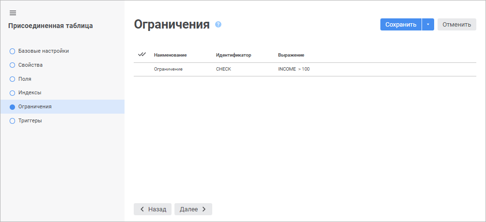
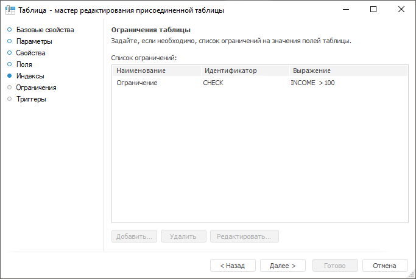

# Страница «Ограничения»: Присоединенная таблица

Страница «Ограничения»: Присоединенная таблица
-

# Ограничения присоединенной таблицы

На странице «Ограничения» отображается
 список ограничений на поля присоединенной таблицы. Ограничения используются
 для автоматического контроля над данными, хранящимися в таблице, выбранной
 на странице «[Свойства](UiDb_relational_AttachTable_master_database.htm)».

	Веб-приложение Настольное приложение

		

		

Для перехода на следующую страницу мастера нажмите кнопку «Далее».

См. также:

[Присоединенная
 таблица](../UiDb_relational_AttachTable.htm) | [Триггеры
 присоединенной таблицы](Attach_table_master_trigger.htm)

		Справочная
		 система на версию 10.9
		 от 18/08/2025,
		 © ООО «ФОРСАЙТ»,
