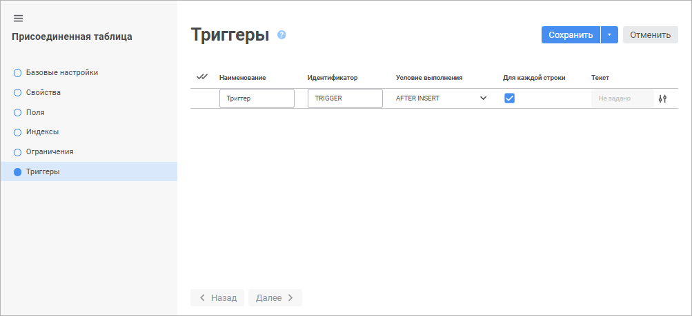
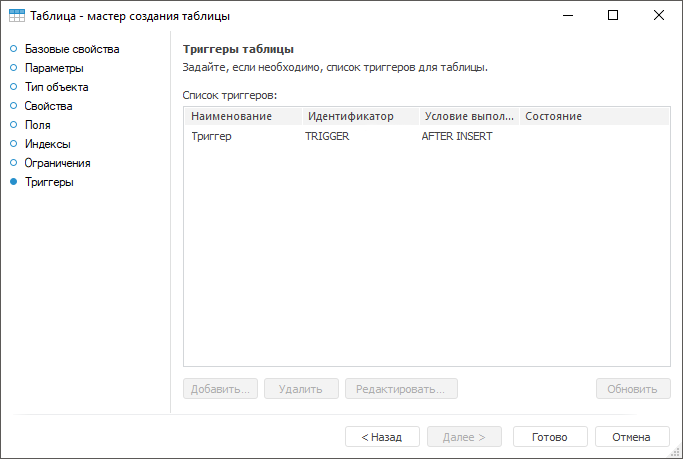

# Страница «Триггеры»: Присоединенная таблица

Страница «Триггеры»: Присоединенная таблица
-

# Триггеры присоединенной таблицы

На странице «Триггеры» отображается
 список триггеров присоединенной таблицы. Список триггеров присоединенной
 таблицы формируется из [триггеров
 таблицы](../../Table/Master/UiDb_relational_table_master_trigger.htm), выбранной на странице «[Свойства](UiDb_relational_AttachTable_master_database.htm)».

	Веб-приложение Настольное приложение

		

		

См. также:

[Присоединенная
 таблица](../UiDb_relational_AttachTable.htm)

		Справочная
		 система на версию 10.9
		 от 18/08/2025,
		 © ООО «ФОРСАЙТ»,
