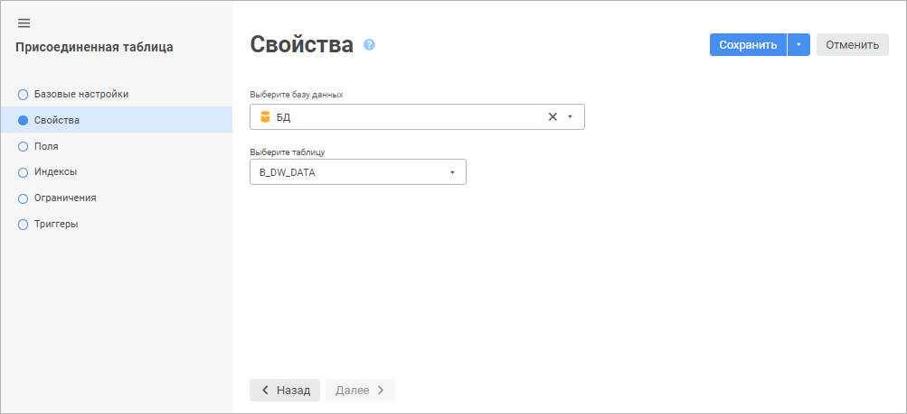

# Страница «Выбор базы данных»: Присоединенная таблица

Страница «Выбор базы данных»: Присоединенная таблица
-

# Свойства/Выбор базы данных

На странице «Свойства» в веб-приложении
 и странице «Выбор базы данных»
 в настольном приложении укажите базу данных, содержащую таблицы, на основе
 которых требуется создать новые присоединенные таблицы репозитория.

	Веб-приложение Настольное приложение

		

		Выберите базу данных в раскрывающемся списке. Использование
		 базы данных СУБД ClickHouse доступно только в веб-приложении.

Для быстрого выбора объекта в поле для поиска введите его название/идентификатор/ключ,
 в зависимости от настроек отображения. Поиск будет выполняться автоматически
 по мере ввода текста. Список будет содержать объекты, наименования/идентификаторы/ключи
 которых содержат вводимый текст.

Для настройки отображения объектов репозитория в списке нажмите кнопку
  «Отображение
 объекта» и выберите в раскрывающемся меню вариант отображения:

	- Наименование. Объекты
	 отображаются под своими наименованиями. Вариант по умолчанию;

	- Идентификатор. Объекты
	 отображаются под своими идентификаторами;

	- Ключ. Объекты отображаются
	 под своими ключами.

Выбрать можно несколько вариантов. Идентификатор и ключ будут указаны
 в скобках.

Для сброса отметки выбранных объектов нажмите кнопку 
 «Очистить».

		Если для выбранной базы данных не настроено автоматическое подключение,
		 то будет открыто окно «[Авторизация
		 в БД](../../database/UiDb_database_authorization.htm)». Если для выбранной базы данных при [создании](../../database/UiDb_database_master_property.htm)
		 были отмечены флажки «Управление
		 правами на объекты СУБД» и «Использовать
		 учетные данные, указанные при входе в систему», то в списке
		 таблиц будут присутствовать только таблицы данной базы данных,
		 а не всей схемы.

		При нажатии на кнопку «Сохранить»
		 для выбранной таблицы в репозитории будет создана присоединенная
		 таблица и открыта на редактирование. При последующем редактировании
		 присоединенной таблицы будет открываться [мастер](../../Table/UiDb_relational_table.htm#master),
		 аналогичный обычной таблице. Вся информация о таблице (списки
		 полей, индексов, ограничений и другие) в мастере будет доступна
		 только для чтения.

		

		Выберите базу данных в раскрывающемся списке. Если для выбранной
		 базы данных не настроено автоматическое подключение, то будет
		 выведен диалог «[Авторизация в БД](../../database/UiDb_database_authorization.htm)».

		При нажатии кнопки «Далее»
		 будет открыта страница мастера «[Выбор таблиц](UiDb_relational_AttachTable_master_table.htm)».

См. также:

[Присоединенная
 таблица](../UiDb_relational_AttachTable.htm) | [База данных](../../database/UiDb_database.htm)

		Справочная
		 система на версию 10.9
		 от 18/08/2025,
		 © ООО «ФОРСАЙТ»,
