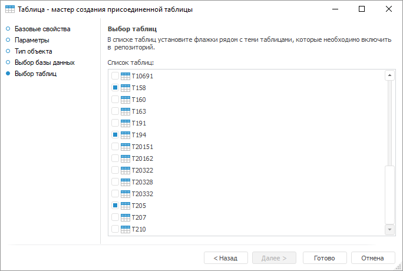

# Страница «Выбор таблиц»: Присоединенная таблица

Страница «Выбор таблиц»: Присоединенная таблица
-

# Выбор таблиц

На странице «Выбор таблиц» выберите
 таблицы, которые будут включены в репозиторий. Для этого в списке таблиц
 установите флажки рядом с теми таблицами, которые необходимо включить
 в репозиторий в качестве присоединенных. Страница доступна только в настольном
 приложении.

Если в базе данных, которая выбрана на предыдущей странице, при создании
 были отмечены флажки «Управление правами
 на объекты СУБД» и «Использовать
 учетные данные, указанные при входе в систему», то в списке таблиц
 будут присутствовать только таблицы данной базы данных, а не всей схемы.

При нажатии на кнопку «Готово»
 для выбранных таблиц в репозитории будут созданы присоединенные таблицы.
 При редактировании присоединенной таблицы будет открываться [мастер](../../Table/UiDb_relational_table.htm#master),
 аналогичный обычной таблице. Вся информация о таблице (списки полей, индексов,
 ограничений и другие) в мастере будет доступна только для чтения.

См. также:

[Присоединенная
 таблица](../UiDb_relational_AttachTable.htm)

		Справочная
		 система на версию 10.9
		 от 18/08/2025,
		 © ООО «ФОРСАЙТ»,
