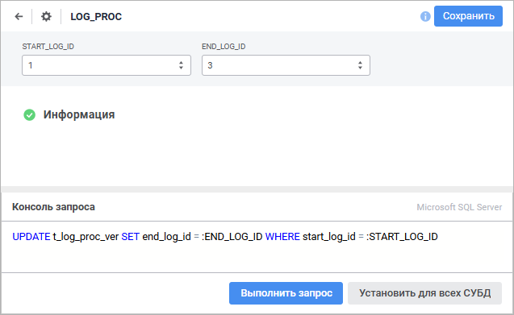

# Назначение и основные возможности: Команда СУБД

Назначение и основные возможности: Команда СУБД
-

# Команда СУБД

Объект «Команда СУБД» предназначен
 для выполнения следующих операций с объектами базы данных репозитория:

	- извлечение данных;

	- операции над строками таблицы:

		- вставка строк;

		- обновление строк;

		- удаление строк;

	- операции над физическими объектами:

		- создание объектов;

		- замена объектов;

		- изменение объектов;

		- удаление объектов.

В отличие от [процедур](../procedure/UiDb_relationa_procedure.htm)
 при создании в репозитории команды СУБД никаких дополнительных объектов
 на сервере не создается.

Для создания объекта «Команда СУБД»
 в [навигаторе
 объектов](GetStarted.chm::/Interface/Interface_Navigator.htm):

	- в веб-приложении нажмите кнопку  «Создать» в главном меню и выберите
	 тип объекта на боковой панели «[Новый объект](UiNav.chm::/02_Navigator/General_Principles_of_Work.htm#add_object)»;

	- в настольном приложении:

		- выполните команду «Создать >
		 Другие > Команда СУБД»
		 в контекстном меню;

		- выполните команду «Новый
		 объект > Другие > Команда СУБД», расположенную
		 в группе «Создать» на
		 вкладке «[Главная](GetStarted.chm::/Interface/Interface_Description.htm#customize_ribbon)»
		 ленты инструментов.

После выполнения одного из действий будет открыт мастер команды СУБД,
 содержащий страницы:

	- [Базовые
	 настройки/Базовые свойства](base_settings.htm). Задаются наименование объекта,
	 идентификатор и примечание;

	- [Параметры](parameters.htm).
	 Формируется список параметров;

	- [Команда
	 СУБД](UiDb_relationa_CUBD_master_command.htm). Осуществляется настройка и указывается SQL-запрос, используемый
	 для внесения изменений в объекты базы данных.

Для сохранения настроек в мастере команды СУБД:

	- в веб-приложении:

		- нажмите кнопку «Сохранить»;

		- выполните команду «Сохранить
		 и закрыть» в раскрывающемся меню кнопки «Сохранить».
		 После этого будут сохранены заданные настройки, закрыт мастер
		 и выполнен переход в [режим
		 редактирования](UiDb_relationa_CUBD.htm#edit) данных;

Примечание.
 Команда «Сохранить и закрыть»
 доступна только при [редактировании
 настроек](UiDb_relationa_CUBD.htm#edit_settings).

	- в настольном приложении нажмите кнопку «Готово».

## Работа с командой СУБД

[Выполнение команды
 СУБД](javascript:TextPopup(this))

	Для запуска команды СУБД выполните одно из действий:

		- в веб-приложении:

			- выполните команду «Открыть»
			 в контекстном меню объекта.

			- выполните команду «Открыть
			 в новой вкладке» в контекстном меню объекта;

			- выполните команду «Открыть
			 в новом окне» в контекстном меню объекта;

			- дважды щёлкните по объекту;

		- в настольном приложении:

			- нажмите кнопку 
			 «Открыть» в группе
			 «Открыть» на вкладке
			 «Главная» ленты инструментов;

			- нажмите кнопку 
			 «Открыть > В инструменте
			 по умолчанию» в группе «Открыть»
			 на вкладке «Главная»
			 ленты инструментов;

			- выполните команду «Открыть»
			 в контекстном меню объекта;

			- дважды щёлкните по объекту.

	Результатом работы команды СУБД является количество обработанных
	 записей.

	Примечание.
	 Команда СУБД запускается в рамках транзакции, которую создает платформа.
	 Это необходимо учитывать в скрипте, использующем пользовательские
	 транзакции.

[Редактирование
 настроек](javascript:TextPopup(this))

	Для редактирования команды СУБД выделите соответствующий объект
	 в [навигаторе
	 объектов](GetStarted.chm::/Interface/Interface_Navigator.htm) и выполните одно из действий:

		- в веб-приложении:

			- Откройте команду СУБД на [редактирование](UiDb_relationa_CUBD.htm#edit).

			- Нажмите кнопку  «Настройки»;

		- в настольном приложении:

			- нажмите кнопку 
			 «Редактировать» на вкладке
			 «Главная» ленты инструментов;

			- выполните команду «Редактировать»
			 в контекстном меню команды;

			- нажмите клавишу F4.

	После выполнения одного из действий будет открыт мастер команды
	 СУБД. Измените настройки на соответствующих страницах мастера.

[Управление версиями](javascript:TextPopup(this))

	Если репозиторий [подключён
	 к системе управления версиями](uidevenv.chm::/04_NavigatorSetting/VCS/Add_In_VCS.htm), то команда СУБД
	 может быть добавлена в систему для контроля изменений её версии. Для
	 этого в навигаторе объектов в контекстном меню для команды СУБД выполните
	 команду «Добавить в VCS».
	 После отправки объекта на сервер VCS будет возможность отслеживать
	 его изменение. В системе управления версиями сохраняются текст команды
	 СУБД и настройки параметров. Более подробно о работе с объектами,
	 добавленными в систему управления версиями, читайте в подразделе «[Разработка
	 приложений в команде](UiDevEnv.chm::/01_Development_Environment/06_Version_Control_System/VSC_Introduction.htm)».

## Редактирование команды СУБД в веб-приложении

Для открытия команды СУБД на редактирование выделите соответствующий
 объект в [навигаторе
 объектов](GetStarted.chm::/Interface/Interface_Navigator.htm) и выполните одно из действий:

	- выполните команду «Редактировать»
	 в контекстном меню команды СУБД;

	- выполните команду «Редактировать
	 в новой вкладке» в контекстном меню команды СУБД;

	- выполните команду «Редактировать
	 в новом окне» в контекстном меню команды СУБД;

	- нажмите клавишу F4.

Откроется окно редактирования команды СУБД:

Доступные операции:

[Изменение текста
 команды](javascript:TextPopup(this))

	Для изменения текста команды СУБД используйте панель «Консоль
	 запроса».

	На панели отображается используемый драйвер СУБД и содержится текст
	 команды, заданный при её [создании](UiDb_relationa_CUBD_master_command.htm).
	 Сформируйте новый текст на языке SQL в соответствии с синтаксисом,
	 который установлен для драйвера СУБД.

	Примечание.
	 При указании текста команды учитывайте различия языка SQL, которые
	 используются в реализациях различных СУБД.

	Для установки указанного текста команды для всех СУБД нажмите кнопку
	 «Установить для всех СУБД».
	 После чего будет открыто окно для подтверждения производимого действия.
	 Запрос на подтверждение действия выдается только в том случае, если
	 хотя бы для одного драйвера, отличного от текущего, текст команды
	 непустой.

	Для выполнения команды нажмите кнопку «Выполнить
	 запрос». Результатом работы команды СУБД является количество
	 обработанных записей.

	Примечание.
	 Команда СУБД запускается в рамках транзакции, которую создает платформа.
	 Это необходимо учитывать в скрипте, использующем пользовательские
	 транзакции.

[Переименование
 команды](javascript:TextPopup(this))

	Для переименования команды СУБД:

		- Щёлкните по наименованию команды в области «Базовые
		 настройки». Наименование будет переведено в режим редактирования.

		- Внесите требуемые изменения.

		- Щёлкните за пределами наименования команды.

[Сохранение
 команды СУБД](javascript:TextPopup(this))

	Для сохранения команды СУБД:

		- нажмите кнопку «Сохранить»;

		- подтвердите производимое действие в информационном окне
		 при переходе в [навигатор
		 объектов](getstarted.chm::/Interface/Interface_Navigator.htm)/[мастер
		 команды СУБД](base_settings.htm).

См. также:

[Пример создания команды СУБД](UiDb_relationa_CUBD_Example.htm) |
 [Обработчики данных в СУБД](../database/data_handler.htm)

		Справочная
		 система на версию 10.9
		 от 18/08/2025,
		 © ООО «ФОРСАЙТ»,
