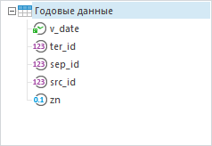
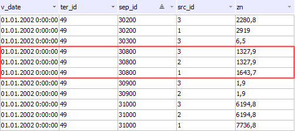
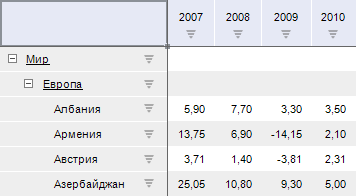
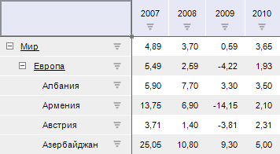
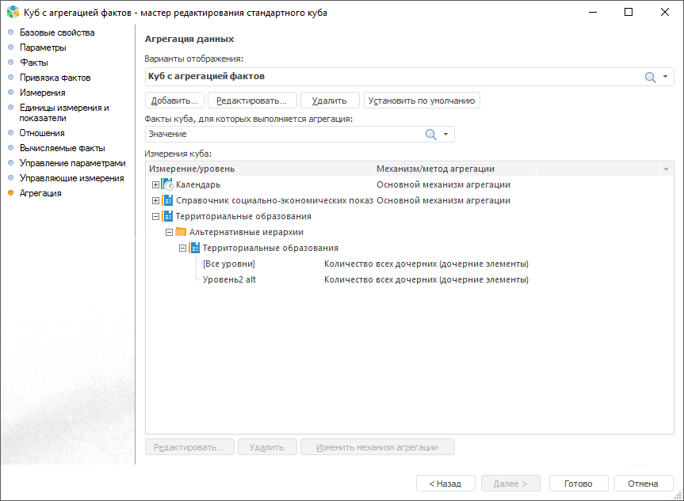

# Агрегация данных

Агрегация данных
-

# Агрегация данных

	Агрегация предназначена
	 для объединения нескольких элементов измерения. Например, для расчёта
	 родительского элемента на основании отмеченных дочерних или для расчёта
	 данных одного элемента на основе нескольких полей.

	Данные объединяются, используя различные математические функции,
	 например, сумма или среднее арифметическое всех агрегируемых значений.

	В «Форсайт. Аналитическая платформа»
	 доступны следующие типы агрегации:

		- [агрегация измерения фактов куба](#fact);

		- [агрегация по уровням измерения](#level);

		- [агрегация по уровням альтернативной иерархии](#alt);

		- [агрегация фиксированных измерений](#fixed).

	Для настройки расчёта вычислений
	 по отредактированным данным без предварительного сохранения данных
	 в источник используется «[Настройка
	 расчета формул](UiAnalyticalArea.chm::/Working_with_table_data/FormulaCalculation.htm)».

## Агрегация измерения фактов куба

	Позволяет объединять поля источника данных, не привязанные к измерениям
	 куба. Результат агрегации передаётся в измерение фактов куба.

	Агрегация по месту вычисления делится на два типа:

		- Агрегация на сервере.
		 Данный тип агрегации производится сервером СУБД. Используйте данный
		 тип агрегации при недостаточности системных ресурсов и для минимизации
		 затрат по времени;

		- Агрегация на клиенте.
		 Данный тип агрегации будет выполняться с помощью «Форсайт. Аналитическая платформа»
		 на компьютере-клиенте после извлечения всех данных с сервера.

	По умолчанию установлен флажок «На
	 сервере».

	Агрегация настраивается на странице «[Привязка
	 фактов](CreateCube/Master_Standart/UiMd_Cube_CreateCube_Master_Standart_2.htm)» мастера стандартного куба.

	[Метод агрегации
	 данных](javascript:TextPopup(this))

		В столбце «Метод агрегации»
		 из раскрывающегося списка выберите метод агрегации данных куба:

			- Нет. Агрегация
			 не производится;

			- Сумма. Суммируются
			 элементы уровня-источника;

			- Минимум. На
			 уровне-источнике выбирается минимальное значение;

			- Максимум. На
			 уровне-источнике выбирается максимальное значение;

			- Количество непустых.
			 Определяется количество непустых значений на уровне-источнике;

			- Количество пустых.
			 Определяется количество пустых значений на уровне-источнике;

			- Количество всех дочерних.
			 Определяется количество дочерних элементов на уровне-источнике;

			- Арифметическое среднее.
			 Определяется среднее значение элементов уровня с учетом пустых
			 значений;

			- Фактическое среднее.
			 Определяется среднее значение элементов уровня без учета пустых
			 значений;

			- Первое фактическое.
			 На уровне-источнике берётся первое имеющееся (фактическое)
			 значение;

			- Последнее фактическое.
			 На уровне-источнике берётся последнее имеющееся (фактическое)
			 значение;

			- Среднеквадратическое
			 отклонение на выборке. Определяется среднеквадратическое
			 отклонение ряда по выборке;

			- Медиана. Определяется
			 медиана для значений на уровне-источнике;

			- Среднеквадратическое
			 отклонение. Определяется среднеквадратическое отклонение
			 ряда по генеральной совокупности;

			- Количество различных
			 значений. Определяется количество уникальных значений
			 на уровне-источнике.

	[Пример
	 агрегации](javascript:TextPopup(this))

		Рассматриваемый пример основан на [примере
		 создания куба](UiMd_Cube_Example.htm), но поле src_id
		 не будет привязано к отдельному измерению.

		Для каждого значения (zn) одни и те же данные предоставлены
		 от разных субъектов (src_id). Для определения наиболее подходящего
		 значения настроим отображение максимального из доступных значений.

		Таблица, используемая в качестве источника данных для куба,
		 содержит поля:

			- src_id. Поле,
			 содержащее данные о субъекте, предоставившем данные. Поле
			 не привязано к измерению;

			- zn. Поле со
			 значениями. Используется для привязки к измерению фактов;

			- ter_id. Поле
			 для привязки измерения территориальных образований;

			- sep_id. Поле
			 для привязки измерения показателей;

			- v_date. Поле
			 для привязки календаря.

		

		На странице «[Привязка
		 фактов](CreateCube/Master_Standart/UiMd_Cube_CreateCube_Master_Standart_2.htm)»:

			- Настроим для факта метод
			 агрегации «Максимум».

			- Укажем необходимые настройки
			 на дополнительной панели «Свойства
			 источника».

		На странице «[Измерения](CreateCube/Master_Standart/UiMd_Cube_CreateCube_Master_Standart_3.htm)»
		 создадим и привяжем измерения для территориальных образований
		 (ter_id), показателей (sep_id) и календаря (v_date). Поле src_id останется не используемым.

		Исходная таблица содержит следующие данные:

		

		В результате при работе с кубом, при отображении элемента за
		 2002 год у объекта наблюдения (с индексом 49) показатель (с индексом
		 30800) будет иметь значение «1643,7».

	Примечание.
	 При настроенной агрегации измерения фактов куба недоступно использование
	 [вычисляемых
	 выражений](CreateCube/Master_Standart/UiMd_Cube_CreateCube_Master_Standart_2.htm) в привязанных фактах куба.

## Агрегация по уровням измерения

	Настраивается для иерархических справочников, в которых данные с
	 дочерних элементов справочника агрегируются [заданным
	 методом](CreateCube/Master_Standart/UiMd_Cube_CreateCube_Master_Standart_7.htm) и записываются в «элемент-родитель». При этом доступна
	 настройка агрегации в родительский элемент всех дочерних элементов
	 или только отмеченных элементов.

	Позволяет объединять данные элементов измерения по уровням. Результат
	 агрегации дочерних элементов передаётся в родительский элемент.

	Агрегация производится в открытом кубе на компьютере-клиенте.

	Настраивается для отдельного варианта отображения куба на странице
	 «Агрегация» мастера [стандартного](CreateCube/Master_Standart/UiMd_Cube_CreateCube_Master_Standart_7.htm)
	 или [автоматического](CreateCube/Master_Auto/UiMd_Cube_CreateCube_Master_Auto_Aggreg.htm)
	 куба.

	[Метод
	 агрегации данных](javascript:TextPopup(this))

		Метод агрегации зависит от выбранного механизма агрегации:

			- [Основной механизм агрегации](Work_Cube/Tuning_agr/UiMd_Cube_Work_Cube_Tuning_agr_Basic.htm).
			 Настраивается для любого измерения, в том числе для календарного;

			- [Хронологический механизм
			 агрегации](Work_Cube/Tuning_agr/UiMd_Cube_Work_Cube_Tuning_agr_chronological.htm). Настраивается только для календарного измерения.

	[Пример
	 агрегации](javascript:TextPopup(this))

		При настройке было создано 2 варианта отображения куба:

			- Стандартный вариант
			 отображения. Родительские элементы не содержат значений:

		

			- Вариант отображения
			 с агрегацией. В родительские элементы были агрегированы
			 данные из всех дочерних элементов. Метод агрегации - арифметическое
			 среднее по уровням территориальных субъектов:

		

	Примечание.
	 Если включено отображение куба с агрегацией по уровням измерения,
	 то при настройке [итогов](UiAnalyticalArea.chm::/Totals/Calculate_totals.htm)
	 в табличном визуализаторе будет доступен метод расчёта «Итоги
	 из источника».

## Агрегация по уровням альтернативной иерархии

	Позволяет объединять данные элементов измерения по уровням альтернативной
	 иерархии. Результат агрегации дочерних элементов передаётся в родительский
	 элемент.

	Агрегация производится в открытом кубе на компьютере-клиенте.

	Настраивается для отдельного варианта отображения куба на странице
	 «Агрегация» мастера [стандартного](CreateCube/Master_Standart/UiMd_Cube_CreateCube_Master_Standart_7.htm#alt_agr)
	 или [автоматического](CreateCube/Master_Auto/UiMd_Cube_CreateCube_Master_Auto_Aggreg.htm)
	 куба.

	[Метод
	 агрегации данных](javascript:TextPopup(this))

		Метод агрегации зависит от выбранного механизма агрегации:

			- [Основной механизм агрегации](Work_Cube/Tuning_agr/UiMd_Cube_Work_Cube_Tuning_agr_Basic.htm).
			 Настраивается для любого измерения, в том числе для календарного;

			- [Хронологический механизм
			 агрегации](Work_Cube/Tuning_agr/UiMd_Cube_Work_Cube_Tuning_agr_chronological.htm). Настраивается только для календарного измерения.

	[Пример
	 агрегации](javascript:TextPopup(this))

		Настройка по уровням альтернативной иерархии аналогична настройке
		 агрегации по уровням измерений.

		

		При выборе пункта «Альтернативный
		 календарь» будет применена агрегация по уровням альтернативной
		 иерархии, заданная при настройке агрегации [стандартного](CreateCube/Master_Standart/UiMd_Cube_CreateCube_Master_Standart_7.htm#alt_agr)
		 или [автоматического](CreateCube/Master_Auto/UiMd_Cube_CreateCube_Master_Auto_Aggreg.htm)
		 куба.

		При выборе пункта «Сбросить»
		 будут сброшены настройки, которые хранятся в кубе у основного
		 измерения и альтернативных иерархий. Сброс происходит у выделенного
		 измерения.

## Агрегация фиксированных измерений для метрик

	Позволяет объединять данные элементов, отмеченных в фиксированных
	 измерениях. Результат агрегации передаётся в визуализатор инструмента.
	 Метод агрегации на измерениях доступен для каждой метрики измерения
	 с ролью «Метрика».

	Примечание.
	 Агрегация фиксированных измерений для метрик недоступна при работе
	 с [глобальным
	 кешем](UiNav.chm::/02_Navigator/Cache_In_Blob.htm).

	Метод агрегации устанавливается вручную в отчёте или передаётся
	 из куба:

		- если в качестве измерения метрики в отчёте указано измерение
		 фактов куба, то тип агрегации фиксированных измерений для метрики
		 передаётся из куба в зависимости от отмеченного элемента измерения.
		 При изменении отмеченного элемента в измерении, тип агрегации
		 берется из куба до тех пор, пока тип агрегации не будет изменен
		 вручную в отчёте;

		- если в измерении фактов куба не был определен метод агрегации,
		 то в отчёте по умолчанию устанавливается метод агрегации «Сумма».

	При множественной отметке по метрике «Значение»
	 берется тип агрегации первого элемента в кубе.

	[Метод
	 агрегации данных](javascript:TextPopup(this))

		В строке «Метод агрегации»
		 из раскрывающегося списка выберите метод агрегации данных куба:

			- Сумма. Суммируются
			 элементы уровня-источника;

			- Минимум. На
			 уровне-источнике выбирается минимальное значение;

			- Максимум. На
			 уровне-источнике выбирается максимальное значение;

			- Количество непустых.
			 Определяется количество непустых значений на уровне-источнике;

			- Количество пустых.
			 Определяется количество пустых значений на уровне-источнике;

			- Количество всех дочерних.
			 Определяется количество дочерних элементов на уровне-источнике;

			- Арифметическое среднее.
			 Определяется среднее значение элементов уровня с учетом пустых
			 значений;

			- Фактическое среднее.
			 Определяется среднее значение элементов уровня без учета пустых
			 значений;

			- Первое фактическое.
			 На уровне-источнике берется первое имеющееся (фактическое)
			 значение;

			- Последнее фактическое.
			 На уровне-источнике берется последнее имеющееся (фактическое)
			 значение;

			- Среднеквадратическое
			 отклонение на выборке. Определяется среднеквадратическое
			 отклонение ряда по выборке;

			- Медиана. Определяется
			 медиана для значений на уровне-источнике;

			- Среднеквадратическое
			 отклонение. Определяется среднеквадратическое отклонение
			 ряда по генеральной совокупности;

			- Количество различных
			 значений. Определяется количество различных значений
			 на уровне-источнике.

См. также:

[Куб](CreateCube/UiMd_Cube_CreateCube.htm) |
 [Работа с кубами](Work_Cube/UiMd_Cube_Work_Cube.htm)

		Справочная
		 система на версию 10.9
		 от 18/08/2025,
		 © ООО «ФОРСАЙТ»,
