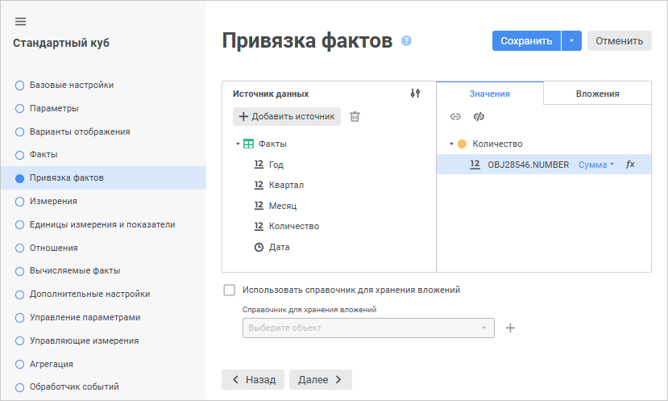
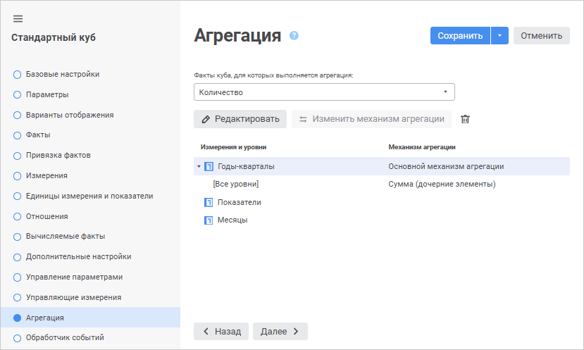
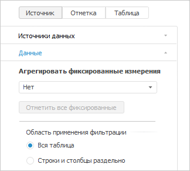
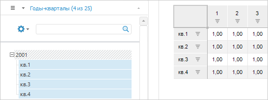
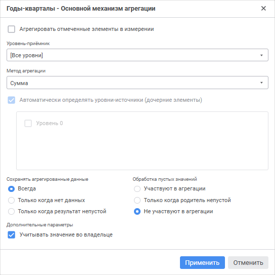
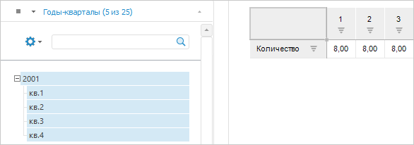
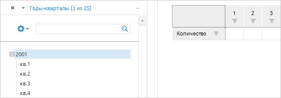
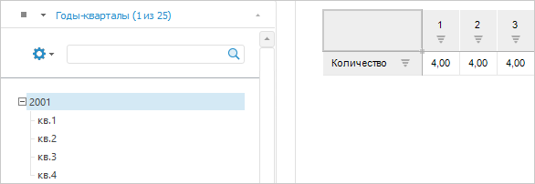
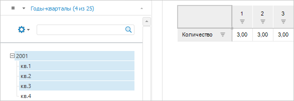
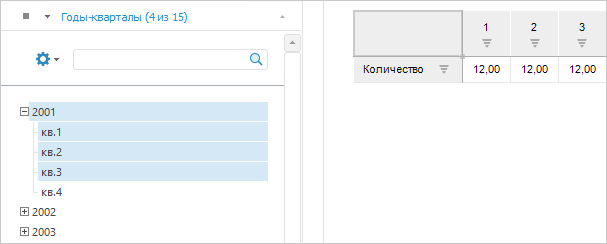

# Пример настройки агрегации данных в кубах и отчётах

Пример настройки агрегации данных в кубах и отчётах
-

# Пример настройки агрегации данных в кубах и отчётах

Агрегация предназначена для
 объединения нескольких значений c использованием различных математических
 функций, например, суммы, арифметического среднего и т.д. Часто в отчетах
 требуется отобразить данные, агрегированные по тому или иному методу.
 Продукт «Форсайт. Аналитическая платформа»
 предоставляет пользователям возможность гибкой настройки агрегации в различных
 инструментах отчетности, а также в кубах. В зависимости от того, где настроена
 агрегация, она может считаться на сервере или на клиенте, самими кубами
 или отчетами.

Агрегация по фактам куба (серверная
 агрегация) позволяет выполнить расчет на этапе извлечения данных из источников
 куба на самом сервере. Если в качестве таблицы фактов выбран «[Источник
 данных ODBC](../ODBC/UiDb_relational_ODBC.htm)», то мастере стандартного куба для данного источника есть
 возможность настройки расчета агрегации на клиенте.

Данный вид агрегации настраивается в мастере стандартного куба на странице
 «[Привязка
 фактов](CreateCube/Master_Standart/UiMd_Cube_CreateCube_Master_Standart_2.htm)». Для разных фактов можно выбрать свой метод агрегации, а для
 каждого источника указать, где выполнить расчет – на сервере или на клиенте.
 По умолчанию данные агрегируются на сервере:

Если в источнике для одного набора измерений есть несколько записей,
 требующих агрегации, настройте агрегацию по фактам куба. При настроенной
 серверной агрегации эти значения будут агрегированы по указанному методу.

[Агрегация по уровням измерения](Agregation.htm#level) настраивается
 для иерархических справочников, где по тому или иному методу данные с
 дочерних элементов справочника агрегируются и записываются в «элемент-родитель».
 При этом пользователь имеет возможность самостоятельно настроить, т.е.
 агрегировать в родительский элемент все его дочерние или только отмеченные
 элементы.

Агрегация по уровням рассчитывается на клиенте, поэтому скорость и время
 расчета напрямую зависят от технических характеристик клиентской машины,
 а также от отметки в измерениях куба и количества данных в источниках
 по этой отметке.

Этот вид агрегации доступен для настройки в мастерах [стандартного](CreateCube/Master_Standart/UiMd_Cube_CreateCube_Master_Standart.htm)
 и [автоматического](CreateCube/Master_Auto/UiMd_Cube_CreateCube_Master_Auto.htm)
 кубов на странице «Агрегация». Здесь для каждого измерения можно настроить
 различные методы агрегации для разных фактов:

Агрегация по фиксированным измерениям в инструментах отчетности платформы
 позволяет объединять данные по отмеченным элементам в фиксированных измерениях.
 Настройка осуществляется в отчетах на вкладке «Данные»
 группы вкладок «Источник» боковой
 панели:

Агрегация по элементам фиксированных измерений, рассчитываемая самими
 отчетами, реализована лишь по методам «Сумма», «Среднее», «Максимум» и
 «Минимум». Однако отчеты позволяют при агрегации в фиксированных измерениях
 использовать методы, настроенные в кубе для измерений. При выборе метода
 «Из измерений источника» данные
 по фиксированному измерению будут объединены согласно настройкам со страницы
 «[Агрегация](CreateCube/Master_Standart/UiMd_Cube_CreateCube_Master_Standart_7.htm)»
 мастера куба.

Также доступен метод агрегации для фиксированных измерений «Из
 фактов источника», который становится доступным в отчете, если
 в кубе на странице «[Измерения](CreateCube/Master_Standart/UiMd_Cube_CreateCube_Master_Standart_3.htm)»
 установлен флажок «Агрегировать данные
 по измерениям с полной отметкой», и для фактов задана агрегация
 на странице «[Привязка
 фактов](CreateCube/Master_Standart/UiMd_Cube_CreateCube_Master_Standart_2.htm)». Данная агрегация рассчитывается на сервере в соответствии
 с методами, заданными для фактов куба, и только для фиксированных измерений
 с полной отметкой. Кроме того, флажок позволяет переопределить методы
 агрегации, настроенные в кубе для фактов. То есть если при установленном
 флажке выбрать в отчете, например, метод «Сумма», то для всех фактов агрегация
 на сервере будет посчитана по методу «Сумма», а не по тем, которые настроены
 в кубе.

[Пример](javascript:TextPopup(this))

	Рассмотрим на примере совместной работы инструментов агрегации по
	 фиксированным измерениям и агрегации, настроенной в кубе. Проиллюстрируем
	 эти особенности на простом примере куба, где заполнены данными только
	 самые нижние элементы по календарному измерению. Для наглядности все
	 данные заполнены единицами:

	

	В кубе по измерению «Годы-кварталы» [настроим
	 агрегацию](CreateCube/Master_Standart/UiMd_Cube_CreateCube_Master_Standart_7.htm) по методу «Сумма»:

	

	Поместим измерение «Годы-кварталы» в фиксированную область в отчете
	 и настроим для отчета агрегацию по фиксированным измерениям по методу
	 «Сумма».

	Если в настройках агрегации у измерения куба установлен флажок «Агрегировать отмеченные элементы в измерении»,
	 то при отметке родительского элемента с дочерними данные будут удваиваться,
	 т.к. в родительском элементе уже посчитана агрегация из куба:

	

	При отметке родительского элемента без дочерних агрегация с дочерних
	 не будет посчитана, так как они отсутствуют в отметке:

	

	Если флажок «Агрегировать отмеченные
	 элементы в измерении» не установлен, и агрегация идет по всему
	 измерению, то при отметке только родительского элемента данные в нем
	 будут агрегированы с дочерних, а при отметке родительского с дочерними
	 – в родительском элементе будет удвоение данных.

	

	Если в отчете выбрать метод агрегации «Из
	 измерений источника» и установлен флажок «Агрегировать
	 отмеченные элементы в измерении», то агрегация будет посчитана
	 только по отмеченным элементам. При этом, если в отметке будет только
	 родительский элемент без дочерних, то данные в него агрегированы не
	 будут:

	

	Если флажок «Агрегировать отмеченные
	 элементы в измерении» не установлен, то при множественной отметке
	 всегда будет показан результат агрегации по всему измерению независимо
	 от отметки:

	

	Если отметка единичная, и это «элемент-родитель», то данные будут
	 агрегированы с его дочерних элементов.

	Если агрегация в кубе по измерению не настроена, то будут отображены
	 значения по первому в отметке элементу.

См. также:

[Создание
 многомерных структур данных](UiMd_Cube_Type.htm) | [Куб](CreateCube/UiMd_Cube_CreateCube.htm)
 | [Привязка
 фактов куба](CreateCube/Master_Standart/UiMd_Cube_CreateCube_Master_Standart_2.htm) | [Агрегация
 данных](CreateCube/Master_Standart/UiMd_Cube_CreateCube_Master_Standart_7.htm)

		Справочная
		 система на версию 10.9
		 от 18/08/2025,
		 © ООО «ФОРСАЙТ»,
