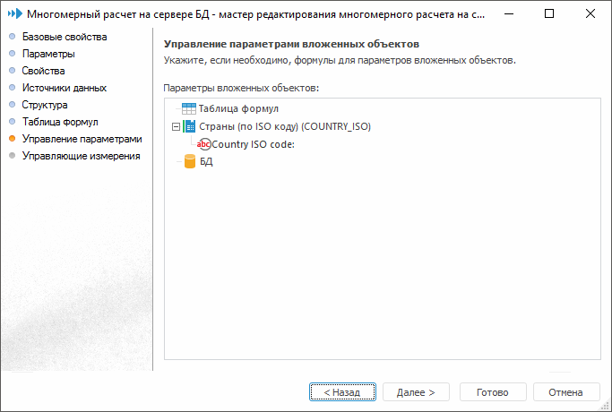

# Управление параметрами

Управление параметрами
-

# Управление параметрами

На странице «Управление параметрами»
 указывается, какие параметры объекта будут управлять параметрами вложенных
 объектов и каким образом:

На данной странице отображается список всех объектов, используемых многомерным
 расчетом. Возможны варианты:

	- если объект не имеет параметров, то отображается только его
	 наименование;

	- если объект имеет некоторый набор параметров, то отображается
	 список параметров данного объекта.

Установка значений параметров производится в окне «[Редактор
 выражения](UiNav.chm::/GUI/ExpressionEditor.htm)», которое вызывается двойным щелчком
 левой кнопки мыши на выбранном параметре.

При нажатии кнопки «Далее» появится
 следующая страница мастера.

См. также:

[Многомерный
 расчет на сервере БД](Work_Cube/UiMd_CubeWork_MultivariateAccount.htm)

		Справочная
		 система на версию 10.9
		 от 18/08/2025,
		 © ООО «ФОРСАЙТ»,
