# Пример создания куба

Пример создания куба
-

# Пример создания куба

В примере рассматривается процесс создания куба «Куб
 социально-экономических показателей».

Для создания куба в [навигаторе
 объектов](GetStarted.chm::/Interface/Interface_Navigator.htm):

	- Убедитесь, что в репозитории созданы справочники:

		- [Календарь](../reference_book/Calendar.htm);

		- [Территориальные
		 образования](../reference_book/UiMd_reference_book_example_Terr.htm);

		- [Социально-экономические
		 показатели](../reference_book/UiMd_reference_book_example.htm);

		- [Типы
		 данных](../reference_book/UiMd_reference_book_example_Type.htm).

	- Нажмите кнопку  «Создать» в главном меню и выберите
	 «Стандартный куб» на боковой
	 панели «[Новый
	 объект](UiNav.chm::/02_Navigator/General_Principles_of_Work.htm#add_object)».

После выполнения последовательности шагов
 будет открыт мастер стандартного куба:

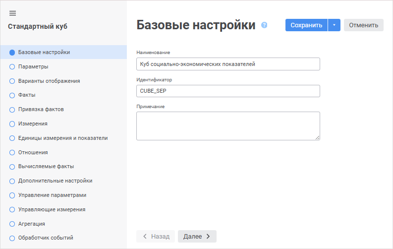

	- Задайте параметры куба на странице «Базовые
	 настройки»:

		- Наименование: Куб социально-экономических
		 показателей;

		- Идентификатор: CUBE_SEP.

	- Перейдите на страницу «Факты»:

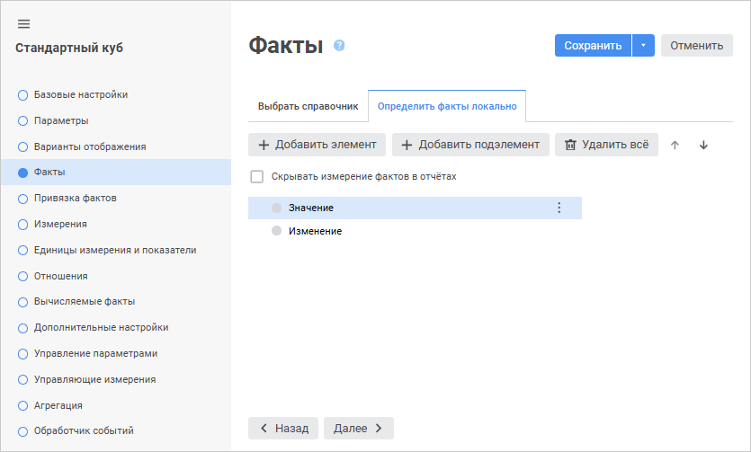

Добавьте два элемента с наименованиями «Значение» и «Изменение»
 с помощью кнопки  «Добавить
 элемент» на вкладке «Определить
 факты локально».

	- Перейдите на страницу «Привязка
	 фактов»:

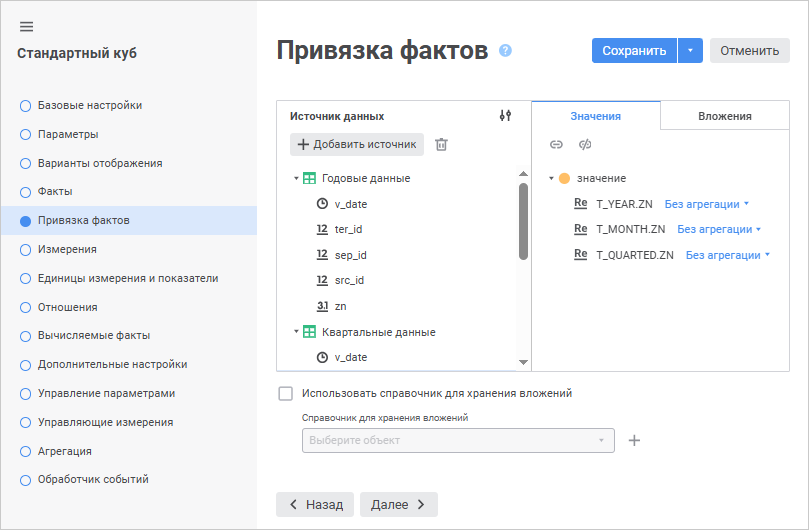

В левой части мастера располагается иерархический
 список всех таблиц и их полей. В правой части мастера располагается список
 фактов куба.

На вкладке «Значение» необходимо
 установить связь фактов с соответствующими полями таблиц данных. Для этого
 в левом списке выберите таблицы: «Годовые
 данные», «Квартальные данные»
 и «Месячные данные». Затем свяжите у
 каждой таблицы поле «Значение»
 на фактор «Значение», используя
 механизм Drag&Drop.

	- Перейдите на страницу «Измерения»:

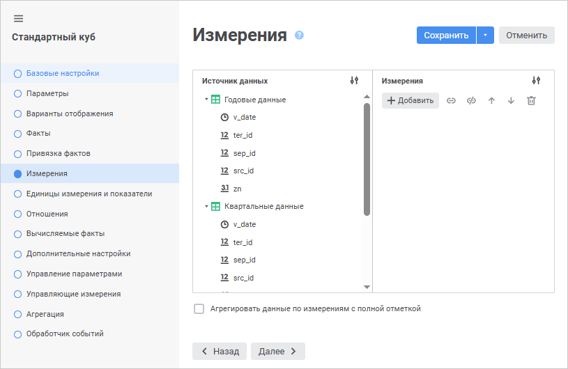

Определите список справочников, из которых
 будет состоять куб, и их привязки к таблицам с данными.

Для добавления справочников нажмите кнопку  «Добавить».
 Будет открыто окно «Выбрать объект»:

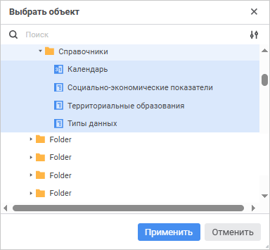

Выберите следующие справочники:

		- Календарь;

		- Социально-экономические показатели;

		- Территориальные образования;

		- Типы данных.

Определите привязку полей таблиц с данными
 к уровням справочников. Для этого необходимо определить для каждого измерения
 связи по индексам и затем привязать к выбранному индексу необходимые поля
 таблиц. Для определения связи по индексу выполните команду «Выберите
 индекс», в раскрывающемся списке выберите индекс.

С помощью механизма Drag&Drop перетащите
 нужное поле таблицы к индексу измерения.

[Привязка
 показателей](javascript:TextPopup(this))

	В данном примере привязка показателей
	 осуществляется следующим образом:

			 Измерения куба
			 Привязка показателей

			 Календарь

			 Ежегодная информация:

			     Первичный ключ блока Годы:
			 T_YEAR.DATE1

			Ежеквартальная информация:

			    Первичный ключ блока Кварталы: T_QUARTER.DATE1

			Ежемесячная информация:

			    Первичный ключ блока Месяцы: T_MONTH.DATE1

			 Территориальные образования

			 Ежегодная информация:

			    Первичный ключ индекса Блок1: T_YEAR.TER_ID

			Ежеквартальная информация:

			    Первичный ключ индекса Блок1: T_QUARTER.TER_ID

			Ежемесячная информация:

			    Первичный ключ индекса Блок1: T_MONTH.TER_ID

			 Социально-экономические показатели

			 Ежегодная информация:

			    Первичный ключ индекса Блок1: T_YEAR.SEP_ID

			Ежеквартальная информация:

			    Первичный ключ индекса Блок1: T_QUARTER.SEP_ID

			Ежемесячная информация:

			    Первичный ключ индекса Блок1: T_MONTH.SEP_ID

			 Типы данных

			 Ежегодная информация:

			    Первичный ключ индекса Блок1: T_YEAR.SRC_ID

			Ежеквартальная информация:

			    Первичный ключ индекса Блок1: T_QUARTER.SRC_ID

			Ежемесячная информация:

			   Первичный ключ индекса Блок1: T_MONTH.SRC_ID

После установки привязки измерений страница
 «Измерения» примет вид:

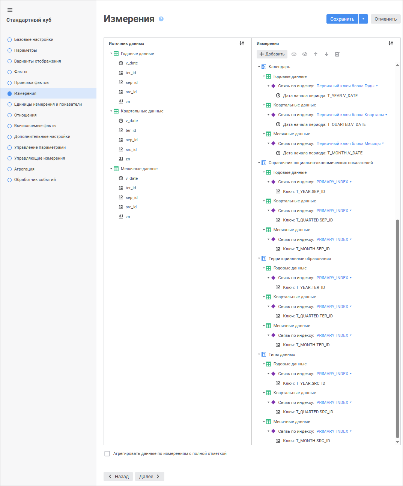

	- Перейдите на страницу «Отношения»:

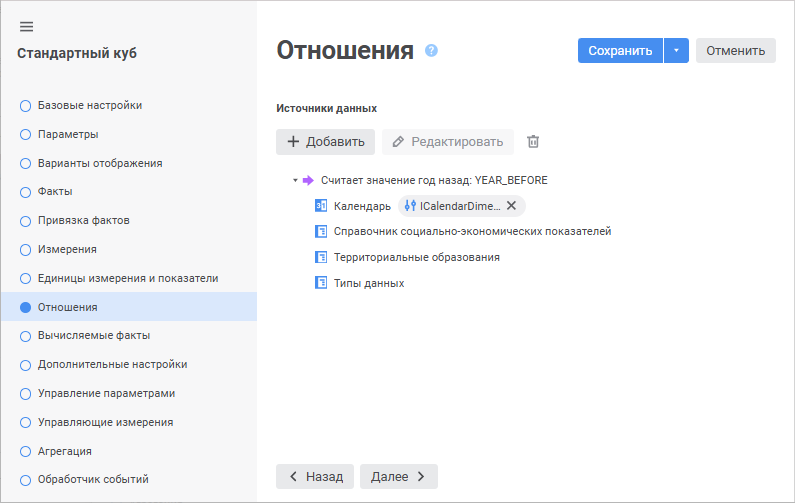

Для создания отношения нажмите кнопку 
 «Добавить». Затем измените наименование
 отношения, для этого нажмите кнопку 
 «Редактировать». Будет открыто
 окно «Свойства отношения»:

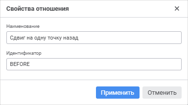

Задайте в окне следующие параметры:

		- Наименование: Сдвиг на
		 одну точку назад;

		- Идентификатор: BEFORE.

Задайте параметры отношения для подуровня
 «Календарь». Для этого выделите
 подуровень «Календарь» и нажмите
 кнопку 
 «Редактировать». Будет открыто
 окно «Формула отношения»:

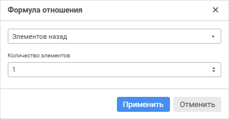

Установите в окне переключатель «Элементов
 назад» и задайте значение «1». При сохранении в области выражения
 автоматически будет сгенерирована формула «ICALENDARDIMENSIONCLASS_DAY.LAG(T)».

	- Перейдите на страницу «Вычисляемые
	 факты»:

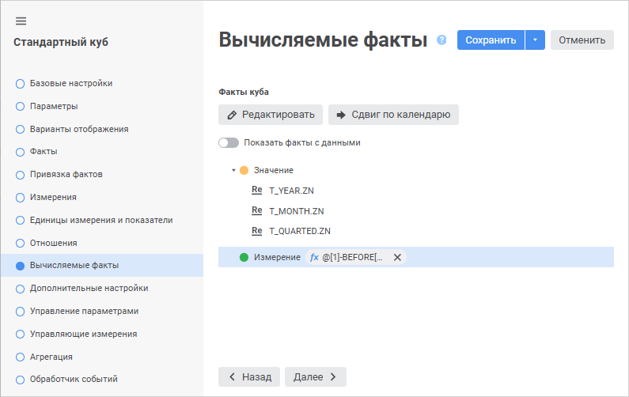

Для факта «Изменение»
 задайте формулу. Для этого выделите данный факт и нажмите кнопку 
 «Редактировать». Будет открыто
 окно «Вычисляемый факт»:

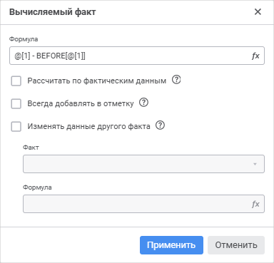

Напротив поля ввода «Формула»
 нажмите кнопку  «Задать
 формулу». Будет открыто окно «[Редактор
 выражения](UiNav.chm::/GUI/ExpressionEditor.htm)». Задайте в нем формулу: @[1]
 - BEFORE[@[1]].

	- Перейдите на страницу «Агрегация»:

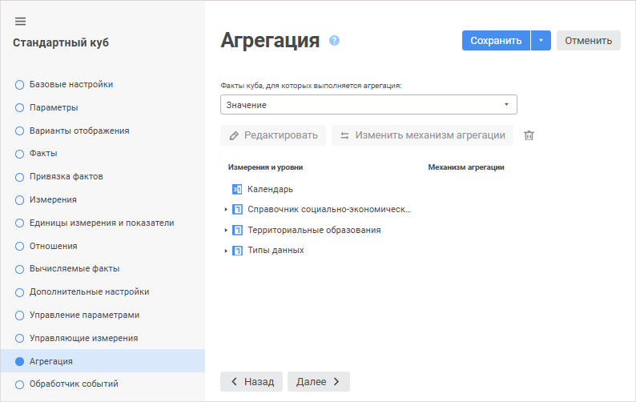

Следующим этапом является настройка агрегации
 данных с более низких уровней справочника на более высокие по измерению
 «Территориальные образования»
 с использованием основного механизма агрегации. Данные, имеющиеся на уровне
 «Области», будут суммироваться
 и записываться на уровень «ФО»
 (Федеральные округа), а данные с уровня «ФО»
 будут суммироваться и записываться на уровень «РФ».

В списке измерений куба выберите «Территориальные
 образования» и нажмите кнопку 
 «Редактировать». Будет открыто
 окно для настройки агрегации выбранного измерения:

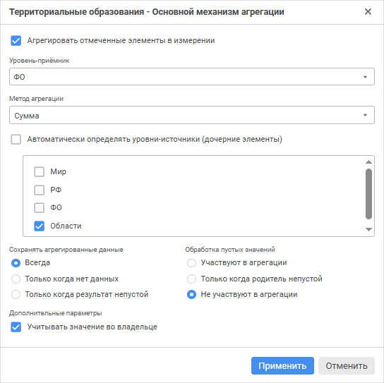

Установите флажок «Агрегировать
 отмеченные элементы в измерении», чтобы агрегация проводилась с
 учетом отметки в измерении.

Последовательно выбирая в раскрывающемся
 списке уровень-приёмник, определите следующие параметры:

		 Уровень - приёмник
		 Метод агрегации
		 Уровень - источник

		 РФ
		 Сумма
		 ФО

		 ФО
		 Сумма
		 Область

Снимите флажок «Учитывать
 значение во владельце», чтобы агрегация осуществлялась без учета
 значения уровня-приёмника. По умолчанию флажок установлен.

В группе «Сохранять
 неагрегированные данные» по умолчанию установлен переключатель
 «Всегда», чтобы агрегированные
 данные всегда записывались на уровень-приёмник. Подробное описание сохранения
 неагрегированных данных приведено в разделе «[Основной
 механизм агрегации](Work_Cube/Tuning_agr/UiMd_Cube_Work_Cube_Tuning_agr_Basic.htm#save_non-aggregated_data)».

Для сохранения настроек агрегации измерения
 нажмите кнопку «Применить».

Вкладка «Агрегация»
 мастера примет вид:

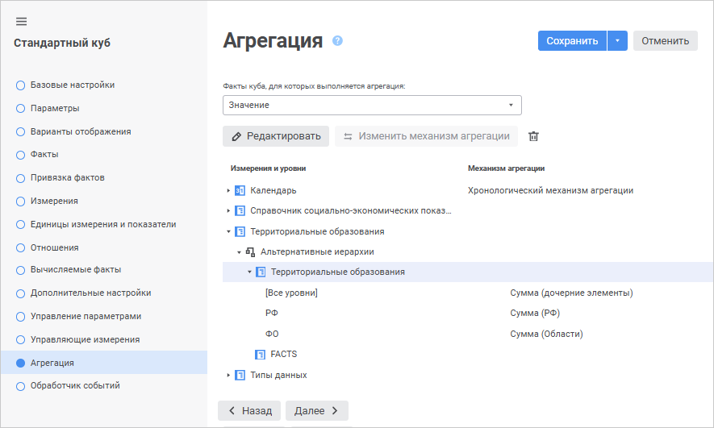

Для завершения работы мастера нажмите кнопку «Сохранить».

Откройте полученный куб и произведите настройки:

	- календарь и измерение фактов расположите по столбцам, в календаре
	 отметьте несколько элементов на уровне Годы, в измерении фактов отметьте
	 все элементы;

	- территориальные образования расположите по строкам, выделите
	 элементы, расположенные на разных уровнях;

	- остальные измерения должны быть расположены в фиксированных,
	 установите по ним единичную отметку.

Если все выполнено правильно и в таблицах есть необходимые данные, то
 при открытии куба таблица будет выглядеть следующим образом:

В таблице будут отображены исходные данные (факт Значение), расчётные
 значения (факт Изменение), а также будет произведена агрегация данных
 с уровня областей на уровень федеральных округов и уровень страны.

См. также:

[Создание
 многомерных структур данных](UiMd_Cube_Type.htm)

		Справочная
		 система на версию 10.9
		 от 18/08/2025,
		 © ООО «ФОРСАЙТ»,
