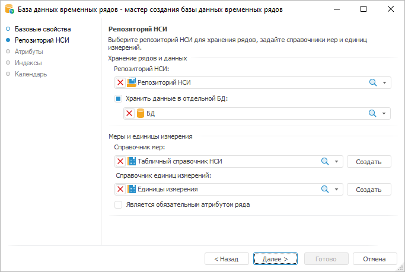

# Создание многомерных структур данных

Создание многомерных структур данных
-

# Создание многомерных структур данных

Создание многомерных структур данных представляет собой многомерную
 модель - логическую организацию данных в виде многомерных кубов
 данных. Каждый куб представляет собой многомерный объект, ячейки которого
 содержат данные (факты), а оси (справочники) определяют измерения (характеристики)
 хранимых в кубе показателей.

В продукте «Форсайт. Аналитическая платформа»
 есть следующие виды многомерных структур данных:

	- [Кубы](CreateCube/UiMd_Cube_CreateCube.htm).
	 Кубы в «Форсайт. Аналитическая платформа»
	 могут быть построены на нескольких источниках данных. Сами источники
	 могут располагаться как в текущем репозитории, так и в других репозиториях
	 или файлах. Измерения кубов также могут быть построены на различных
	 данных, например, одно измерение может быть построено на данных, хранящихся
	 на сервере Microsoft SQL Server, а другое на данных из Microsoft Excel.
	 Для извлечения данных из кубов используются сложные (multi-pass)
	 SQL-запросы, позволяющие минимизировать количество данных, переданных
	 по сети.

Существуют следующие виды кубов:

		- [Стандартный
		 куб](CreateCube/Master_Standart/UiMd_Cube_CreateCube_Master_Standart.htm). Структура куба определяется набором справочников
		 и составом фактов. Факты описывают данные, которые хранятся в
		 измерениях, определяемых набором справочников куба. Можно сказать,
		 что справочники определяют координатные оси в кубе, а факты представляют
		 различные значения в каждой точке полученной системы координат.
		 Помимо фактов, в которых хранятся данные, в кубе можно создавать
		 вычислимые факты и отношения. Значения вычислимых фактов определяются
		 по формуле на основании данных других фактов или отношений. Отношения
		 позволяют получать значения фактов путём смещения относительно
		 текущей точки расчёта. Это позволяет, например, рассчитать разницу
		 между текущим и каким-либо предыдущим или следующим значением.
		 Также в кубе можно настроить различные виды агрегации данных:

	 Веб-приложение Настольное приложение

		

		

		- [Представление-куб](CreateCube/Master_Conception/UiMd_Cube_CreateCube_Master_Conception.htm).
		 Куб, построенный на основе данных другого куба, но с уменьшенной
		 размерностью. Уменьшение размерности происходит за счет фиксации
		 измерений:

	 Веб-приложение Настольное приложение

		

		

		- [Виртуальный
		 куб](CreateCube/Master_Virtual_Cube/UiMd_Cube_CreateCube_Master_Virtual.htm). Куб строится на основе данных других кубов. Измерение
		 фактов куба будет формироваться на основе отмеченных элементов
		 фиксированных измерений. При просмотре данных виртуального куба
		 в экспресс-отчёте на панели измерений будут отображены незафиксированные
		 общие измерения кубов-источников и измерение фактов виртуального
		 куба:

	 Веб-приложение Настольное приложение

		

		

		- [Вычисляемый
		 куб](CreateCube/Master_Calculation/UiMd_Cube_CreateCube_Master_Calculation.htm). Данный куб позволяет, используя заданные формулы,
		 вычислять значения фактов на основе значений фактов других кубов:

	 Веб-приложение Настольное приложение

		

		

		- [Автоматический
		 куб](CreateCube/Master_Auto/UiMd_Cube_CreateCube_Master_Auto.htm). Куб, построенный по принципу сверху вниз. Для
		 создания данного куба достаточно задать набор измерений:

	- [База данных временных рядов
	 (БДВР)](../TimeSeriesDatabase/CreateTimeSeriesDatabase.htm). В БДВР каждый ряд данных описывается определённым набором
	 характеристик (атрибуты). Набор таких характеристик фиксирован и задаётся
	 в структуре БДВР при её создании. При расчётах используются данные
	 всего ряда, а не отдельные ячейки, как это происходит при работе с
	 кубами:

См. также:

[Куб](CreateCube/UiMd_Cube_CreateCube.htm) |
 [Работа
 с кубами](Work_Cube/UiMd_Cube_Work_Cube.htm)

		Справочная
		 система на версию 10.9
		 от 18/08/2025,
		 © ООО «ФОРСАЙТ»,
