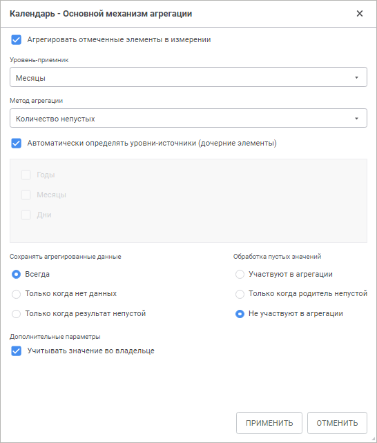

# Основной механизм агрегации

Основной механизм агрегации
-

# Основной механизм агрегации

Для настройки основного механизма агрегации на странице «[Агрегация данных](../../CreateCube/Master_Standart/UiMd_Cube_CreateCube_Master_Standart_7.htm)»:

	- нажмите кнопку «Редактировать».
	 Кнопка доступна, когда выбран один элемент в дереве или элементы дерева,
	 относящиеся к одному измерению;

	- дважды щёлкните по элементу/уровню/измерению.

Откроется диалог настройки агрегации для выбранного измерения.

	 Веб-приложение Настольное приложение

		

		

Диалог настройки агрегации содержит следующие параметры:

	- Агрегировать отмеченные элементы
	 в измерении. Если флажок установлен, то агрегация будет производиться
	 методом, указанным для измерения, и с учетом отметки в измерении.
	 По умолчанию флажок снят;

	- Уровень-приёмник. В
	 раскрывающемся списке выберите уровень, для которого будет производиться
	 настройка агрегации. Если в качестве уровня выбран элемент «[Все уровни]», будет выполнена
	 настройка агрегации для всех уровней, в том числе и для тех, которые
	 могут появиться позже;

	- Метод агрегации. В раскрывающемся
	 списке выберите необходимый метод агрегации:

	-

		- Нет. Агрегация не
		 производится;

		- Сумма. Суммируются
		 элементы уровня-источника;

		- Минимум. На уровне-источнике
		 выбирается минимальное значение;

		- Максимум. На уровне-источнике
		 выбирается максимальное значение;

		- Количество непустых.
		 Определяется количество непустых значений на уровне-источнике;

		- Количество пустых.
		 Определяется количество пустых значений на уровне-источнике;

		- Количество всех дочерних.
		 Определяется количество дочерних элементов на уровне-источнике;

		- Арифметическое среднее.
		 Определяется среднее значение элементов уровня с учетом пустых
		 значений;

		- Фактическое среднее.
		 Определяется среднее значение элементов уровня без учета пустых
		 значений;

		- Первое фактическое.
		 На уровне-источнике берется первое имеющееся (фактическое) значение;

		- Последнее фактическое.
		 На уровне-источнике берется последнее имеющееся (фактическое)
		 значение;

		- Среднеквадратическое отклонение
		 на выборке. Определяется среднеквадратическое отклонение
		 ряда по выборке;

		- Медиана. Определяется
		 медиана для значений на уровне-источнике;

		- Среднеквадратическое отклонение.
		 Определяется среднеквадратическое отклонение ряда по генеральной
		 совокупности;

		- Количество различных значений.
		 Определяется количество различных значений на уровне-источнике;

	- Автоматически определять уровни-источники
	 (дочерние элементы). При снятом флажке становится доступным
	 для редактирования список с уровнями, расположенный под ним. В данном
	 списке отображаются уровни, нижележащие по отношению к выбранному
	 уровню-приёмнику. Для элемента «Все
	 уровни» флажок всегда включен и недоступен для редактирования;

	- Сохранять
	 агрегированные данные. Область содержит переключатели для определения
	 случаев расчета агрегированных данных и их вывод в просматриваемую
	 область в отчетах:

		- Всегда. По умолчанию
		 переключатель включен. Агрегированные данные всегда будут рассчитываться
		 и отображаться на уровне-приёмнике;

		- Только когда нет данных.
		 Агрегированные данные будут рассчитываться и отображаться на уровне-приёмнике,
		 в случае если на уровне-приёмнике нет данных;

		- Только когда результат
		 непустой. Агрегированные данные будут рассчитываться и
		 отображаться на уровне-приёмнике, только если результат агрегации
		 непустой.

Примечание.
 Агрегированные данные не сохраняются в источник данных куба, а производится
 их расчёт и вывод в просматриваемую область.

	- Обработка
	 пустых значений. Область содержит переключатели для определения
	 варианта обработки пустых значений:

		- Участвуют в агрегации.
		 Пустые значения будут участвовать в агрегации;

		- Только когда родитель непустой.
		 Пустые значения будут участвовать в агрегации только в том случае,
		 если родительский элемент непустой. Если результат агрегации по
		 дочерним элементам равен пустому значению и при этом в родительском
		 элементе уже имеется значение, то оно будет заменено пустым значением;

		- Не участвуют в агрегации.
		 Пустые значения не будут участвовать в агрегации. Используется
		 по умолчанию;

	- Дополнительные параметры.
	 Область содержит флажок «Учитывать
	 значение во владельце». По умолчанию флажок установлен, при
	 занесении агрегированных данных на уровень-приёмник учитываются значения
	 на этом уровне.

После настройки основного механизма агрегации в куб будут передаваться
 неагрегированные данные. Агрегация данных будет производиться непосредственно
 в кубе.

## Особенности расчёта агрегации

Если не отмечен родительский элемент, то выделяются:

	- Агрегация на свой уровень.
	 Если не отмечен родительский элемент, то данные по его дочерним элементам
	 не используются в расчете родительских элементов;

	- Агрегация с прыжком на уровень.
	 Используется по умолчанию. Если не отмечен родительский элемент, то
	 данные по его дочерним элементам используются для расчета следующего
	 родительского элемента. Используется, если для агрегируемого измерения
	 свойство IBasicMatrixAggregator.UseSelectionEx
	 имеет значение True.

Например, есть иерархия, в которой отмечены элементы:

Расчёт может выполняться по-разному:

	- при агрегации на свой уровень:

		 Шаг
		 Установлен флажок «Учитывать
		 значение во владельце»
		 Снят флажок «Учитывать значение
		 во владельце»

		 Выполняется расчёт на нижем уровне

		 Item 1.1 = Item 1.1 + item 1.1.1 + item 1.1.2
		 Item 1.1 = item 1.1.1 + item 1.1.2

		 Вычисляется значение верхнего уровня

		 Item 2 = Item 2
		 Item 2 = Item 2

		 Item 3 = Item 3
		 Item 3 = Item 3

		 Вычисляется значение для корневого
		 элемента

		 Root = Root + item 2 + item 3
		 Root = item 2 + item 3

	- при агрегации с прыжком на уровень:

		 Шаг
		 Установлен флажок «Учитывать
		 значение во владельце»
		 Снят флажок «Учитывать значение
		 во владельце»

		 Выполняется расчёт на нижем уровне

		 Item 1.1 = Item 1.1 + item 1.1.1 + item 1.1.2
		 Item 1.1 = item 1.1.1 + item 1.1.2

		 Вычисляется значение верхнего уровня

		 Item 2 = Item 2+ item 2.1.1 + 2.1.2
		 Item 2 = item 2.1.1 + 2.1.2

		 Item 3 = Item 3 + item 3.1.1
		 Item 3 = item 3.1.1

		 Вычисляется значение для корневого
		 элемента

		 Root = Root + item 1.1 + item 1.3 + item 2 + item 3
		 Root = item 1.1 + item 1.3 + item 2 + item 3

См. также:

[Агрегация
 данных](../../Agregation.htm)

		Справочная
		 система на версию 10.9
		 от 18/08/2025,
		 © ООО «ФОРСАЙТ»,
