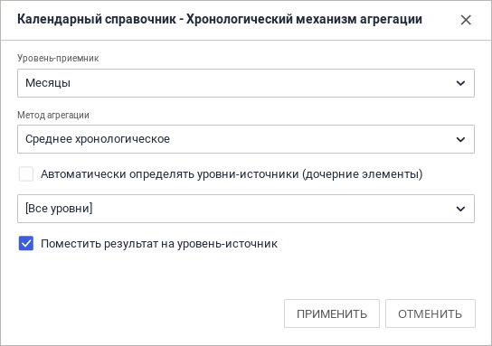
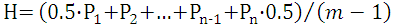
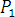
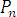

# Хронологический механизм агрегации

Хронологический механизм агрегации
-

# Хронологический механизм агрегации

Хронологический механизм доступен для выбора, если на странице «[Агрегация данных](../../CreateCube/Master_Standart/UiMd_Cube_CreateCube_Master_Standart_7.htm)» в поле «Измерение
 куба» выбрано календарное измерение, для которого установлен хронологический
 механизм агрегации.

Для настройки данного механизма агрегации на странице «[Агрегация
 данных](../../CreateCube/Master_Standart/UiMd_Cube_CreateCube_Master_Standart_7.htm)»:

	- нажмите кнопку «Редактировать».
	 Кнопка доступна, когда выбран один элемент в дереве или элементы дерева,
	 относящиеся к одному измерению;

	- дважды щёлкните по элементу/уровню/измерению.

Откроется диалог настройки агрегации для выбранного измерения.

	 Веб-приложение Настольное приложение

		

		

Диалог настройки агрегации содержит следующие параметры:

	- Уровень-приёмник. В
	 раскрывающемся списке необходимо выбрать уровень, для которого будет
	 производиться настройка агрегации. Если в качестве уровня выбран элемент
	 «[Все уровни]», будет выполнена
	 настройка агрегации для всех уровней, в том числе и для тех, которые
	 могут появиться позже;

	- Метод. В раскрывающемся
	 списке необходимо выбрать один из возможных методов:

		- Нет. Агрегация не
		 производится;

		- Хронологическое среднее.
		 При использовании данного метода значения рассчитываются по следующей
		 формуле:

где:

H - хронологическое среднее ряда;

n - количество точек (дней, месяцев
 и т.д.) ряда, участвующих в расчете;

m - количество точек (дней, месяцев
 и т.д.) ряда, в которых есть данные;

 - значение ряда на начало периода,
 за который считается хронологическое среднее;

 - значение ряда на конец периода, за
 который считается хронологическое среднее.

Если в точках  и  отсутствуют данные, то
 коэффициент 0,5 умножается на значение в ближайшей точке с имеющимися
 данными к  и 
 соответственно.

Хронологическое среднее значение может быть
 рассчитано в рамках месяца (уровень-источник дни), в рамках квартала (уровень-источник
 дни, месяцы), в рамках года (уровень-источник дни, месяцы или кварталы).
 При использовании хронологического среднего в качестве 
 берётся точка ряда на начало периода, в качестве  -
 текущая точка, для которой производится расчёт;

	-

		- Равномерная дезагрегация.
		 При использовании данного метода значение элемента уровня-источника
		 делится на количество элементов уровня-приёмника. При использовании
		 данного метода следует выбирать в качестве уровня-источника -
		 уровень-родитель, а в качестве уровня-приёмника - дочерний уровень.
		 Например, равномерная дезагрегация может быть рассчитана в рамках
		 дня (уровень-источник месяцы, кварталы или годы), в рамках месяца
		 (уровень-источник годы, кварталы), в рамках квартала (уровень-источник
		 годы);

	- Автоматически определять уровень-источник
	 (дочерний элемент). Если флажок снят, становится доступным
	 для редактирования раскрывающийся список уровней источников. В список
	 включаются все уровни, нижележащие по отношению к выбранному. Для
	 элемента «[Все уровни]» флажок
	 всегда включен и недоступен;

	- Поместить результат на уровень-источник.
	 Результат агрегации будет записан для каждой точки уровня-источника.
	 Расчёт для каждой точки ряда осуществляется в соответствии с выбранным
	 методом. При снятии флага значение хронологического среднего будет
	 записано в уровень-приёмник. Флажок недоступен при выборе метода «Равномерная дезагрегация».

После настройки хронологического механизма агрегации, в куб будут передаваться
 неагрегированные данные. Агрегация данных будет производиться непосредственно
 в кубе.

См. также:

[Агрегация
 данных](../../Agregation.htm)

		Справочная
		 система на версию 10.9
		 от 18/08/2025,
		 © ООО «ФОРСАЙТ»,
