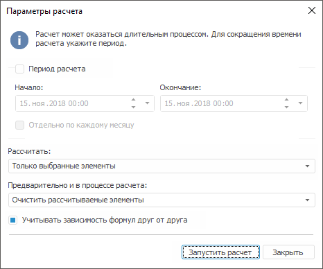
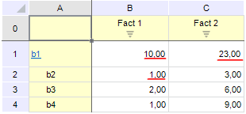
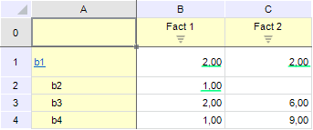
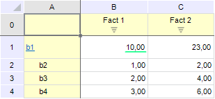
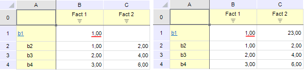
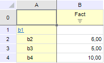
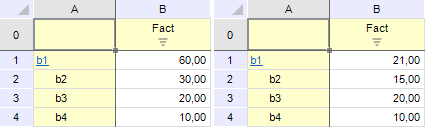

# Параметры расчета

Параметры расчета
-

# Параметры расчета

Окно «Параметры расчета» запускается:

	- из окна [редактора
	 формул](UiMd_CubeWork_MultivariateAccount_EditFormula.htm) для многомерного расчета;

	- из окна навигатора объектов при выполнении для многомерного
	 расчета:

	-

		- команды «Выполнить»
		 контекстного меню;

		- команды «Объект >
		 Выполнить» главного меню;

		- двойного щелчка.

В данном окне определяются параметры расчета на сервере БД.

При установке флажка «Период расчета»
 следует указать начало и окончание периода расчета. По умолчанию будет
 предложен последний введенный период. Также будет доступен для установки
 флаг «Oтдельно по каждому месяцу»,
 который позволяет выполнять расчет отдельно по каждому месяцу, что ускорит
 процесс расчета. Например, при выборе периода 01.01.2007-01.06.2007 будет
 генерироваться не одна процедура на весь период, а несколько процедур
 сроками 01.01.2007-31.01.2007, 01.02.2007-28.02.2007 и т.д.

В поле «Рассчитать» определяется
 набор элементов, которые необходимо рассчитать:

	- Все элементы. Расчет
	 будет произведен по всем координатам куба;

	- Только выбранные элементы.
	 Расчет будет произведен только по координатам, которые соответствуют
	 выделенным элементам в активном измерении-назначении. Данный пункт
	 будет выбран автоматически, если в активном измерении-назначении была
	 сделана [множественная
	 отметка](UiMd_CubeWork_MultivariateAccount_EditFormula.htm).

Примечание.
 Если диалог был вызван из навигатора объектов, то данное поле будет недоступно
 для редактирования, расчет будет произведен по всем координатам куба (вариант
 «Все элементы»).

В поле «Предварительно и в процессе
 расчета» определяется способ выполнения расчета:

	- Очистить рассчитываемые элементы.
	 Перед началом вычисления все рассчитываемые координаты куба-назначения
	 будут очищены;

Примечание.
 При наличии в кубе нескольких фактов значения для рассчитываемой координаты
 будут очищены по всем фактам, даже если формула расчета была задана не
 для всех фактов.

	- Очистить все элементы за указанный
	 период. Перед началом расчета будут очищены все значения координат
	 куба-назначения по всем фактам за указанный период;

	- Обновлять рассчитываемые элементы.
	 Перед началом вычисления рассчитываемые координаты куба-назначения
	 не будут очищены. Значение рассчитываемой координаты будет обновлено
	 только после получения результата.

Примечание.
 При наличии в кубе нескольких фактов значения для рассчитываемой координаты
 будут обновляться по всем фактам, даже если формула расчета была задана
 не для всех фактов.

Установка флажка «Учитывать зависимость
 формул друг от друга» позволяет при расчете учитывать зависимость
 формул друг от друга методом рекурсии. Перед вычислением значения координаты
 сначала вычисляются все значения координат, которые используются в ее
 выражении и для которых заданы формулы. При снятом флаге зависимости формул
 учитываться не будут: для вычисления выражений будут использоваться имеющиеся
 значения координат.

Примечание.
 Зависимости формул друг от друга в многомерных расчетах будут работать
 только тогда, когда куб-источник и куб-назначение это один и тот же куб.
 Если источник и назначение разные, то зависимость формул работать не будет.

## Пример расчета

Для многомерного расчета в качестве источника и приёмника используется
 один и тот же куб. Данный куб состоит из рекурсивного измерения и содержит
 2 факта. В редакторе формул многомерного расчета для координат куба были
 заданы следующие формулы:

		 Координата куба-назначения
		 Заданная для нее формула

		 b1(факт1)
		 b3(факт1)

		 b1(факт2)
		 b3(факт1)

		 b2(факт1 )
		 b4(факт1)

До расчета куб содержал следующие данные:

Рассчитываемые значения подчеркнуты красным цветом. После расчета данным
 методом были получены следующие результаты:

Рассчитанные значения подчеркнуты зеленым. Несмотря на то что значение
 для элемента b2 по Факт1
 не изменилось после расчета, значение для данной координаты по Факт2
 стало пустым, так как не было задано формулы для данного факта.

	- Обновлять рассчитываемые элементы
	 непустыми значениями. Перед началом вычисления рассчитываемые
	 координаты куба-назначения не будут очищены. Значение рассчитываемой
	 координаты будет обновлено только после получения результата и только
	 если результат не равен NULL. В случае использования данного метода
	 необходимо, чтобы формулы для координат куба-назначения были заданы
	 по всем фактам. В противном случае имеющиеся до расчета значения координат
	 по таким фактам после расчета будут пустые. При наличии в кубе нескольких
	 фактов рекомендуется использовать метод, описанный ниже;

	- Обновлять рассчитываемые элементы
	 непустыми значениями по показателям. Перед началом вычисления
	 рассчитываемые координаты куба-назначения не будут очищены. Значение
	 рассчитываемой координаты будет обновлено только после получения результата
	 и только если результат не равен NULL. Значение координаты будет обновляться
	 только по тому факту координаты, для которого была задана формула.
	 Данный метод следует применять, когда в кубе-назначении несколько
	 фактов, а формулы расчета для координат куба заданы не по всем фактам.

Для сравнения рассмотрим использование двух разных методов расчета:

Для многомерного расчета в качестве источника и приёмника используется
 один и тот же куб. Данный куб состоит из рекурсивного измерения и содержит
 2 факта. В редакторе формул многомерного расчета для координаты куба «b1(Факт1)»
 (подчеркнута зеленым) используется формула «b2(Факт1)». До расчета куб
 содержал следующие данные:

Ниже приведены данные, которые были получены при расчете методами «Обновлять изменившиеся элементы непустыми
 значениями» (слева) и «Обновлять
 изменившиеся элементы непустыми значениями по показателям» (справа):

Результат применения формулы одинаков в обоих случаях (подчеркнуты красным):
 значение «b1(Факт1)» равно значению «b2(Факт1)». При использовании метода
 «Обновлять изменившиеся элементы непустыми
 значениями» (слева) значение для координаты b1
 по Факт2 стало пустым, так как
 не было задано формулы по данному факту координаты; при использовании
 метода «Обновлять изменившиеся элементы
 непустыми значениями по показателям» (справа) изменение значения
 происходит только по тем фактам координаты, для которых была задана формула.

Рассмотрим пример:

Для многомерного расчета в качестве источника и приёмника используется
 один и тот же куб. Данный куб состоит из рекурсивного измерения и содержит
 1 факт. В редакторе формул многомерного расчета для координат куба были
 заданы следующие формулы:

		 Координата куба-назначения
		 Заданная для нее формула

		 b1
		 b2 + b3 + b4

		 b2
		 b3 +10

		 b3
		 b4 +10

Все выражения заданы по имеющемуся факту куба. До расчета куб содержал
 следующие данные:

Для этих данных был произведен расчет, используя метод «Обновлять
 изменившиеся элементы», с установленным (слева) и снятым (справа)
 флагом «Учитывать зависимость формул
 друг от друга»:

При установленном флаге (результат слева) перед вычислением значения
 координаты b1 сначала вычисляются значения координат b2 и b3, так как
 для них заданы формулы. Для получения значения координаты b2 будет вычислено
 значение координаты b3 и так далее. После того как получены значения всех
 входящих в формулу координат будет вычислено значение координаты b1.

При снятом флаге (результат справа) для вычисления координаты b1 берутся
 имеющиеся значения координат b2, b3 и b4: «6», «5» и «10» соответственно.
 Для вычисления координаты b2 берется имеющееся значение координаты b3
 — «5» и так далее.

Примечание.
 В случае использования в формулах функции [Shift](UiMd_CubeWork_MultivariateAccount_Functions.htm)
 следует помнить, что данная функция не будет участвовать в рекурсии, то
 есть при ее расчете всегда будут использованы имеющиеся значения координат,
 которые находятся в ее выражении. Данная особенность является ограничением
 разработки.

После нажатия на кнопку «Запустить
 расчет» будет запущен многомерный расчет на сервере БД. Во время
 расчета внизу окна будет видна индикация процесса с указанием времени
 расчета. По окончании расчета будет выдано сообщение о результатах расчета.

См. также:

[Редактирование
 формул](UiMd_CubeWork_MultivariateAccount_EditFormula.htm) | [Многомерный
 расчет на сервере БД](UiMd_CubeWork_MultivariateAccount.htm)

		Справочная
		 система на версию 10.9
		 от 18/08/2025,
		 © ООО «ФОРСАЙТ»,
