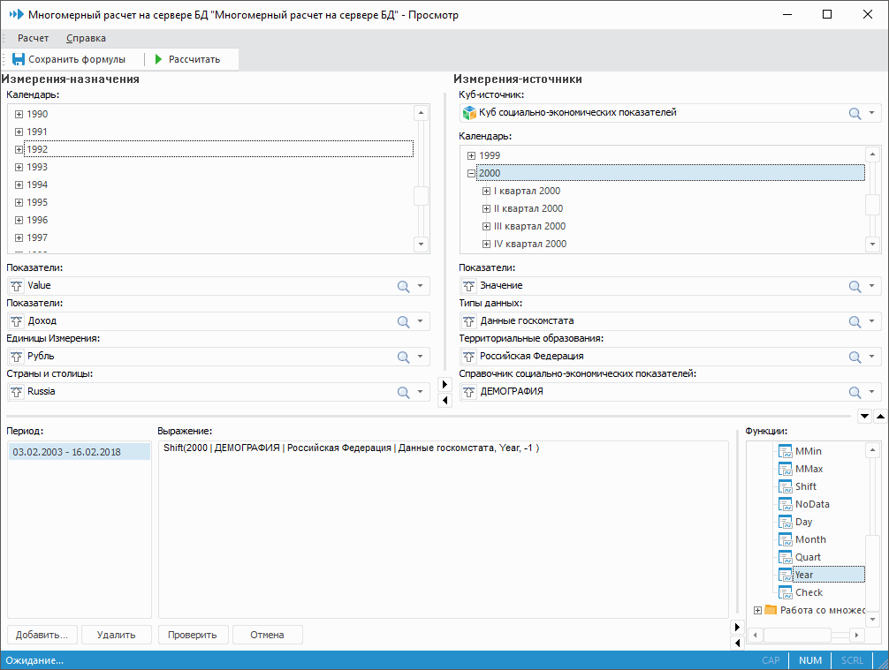

# Редактор формул многомерного расчета на сервере БД

Редактор формул многомерного расчета на сервере БД
-

# Редактор формул многомерного расчета

Для редактирования формул многомерного расчета на сервере БД выполните
 команду «Редактировать формулы»
 в контекстном меню многомерного расчета в навигаторе объектов. Будет открыт
 редактор формул:

Окно редактора формул многомерного расчета на сервере БД включает в
 себя несколько областей, полей и списков:

[Измерения-назначения/Измерения-источники](javascript:TextPopup(this))

	В областях «Измерения-назначения»
	 и «Измерения-источники» отображаются
	 незафиксированные измерения куба-назначения и куба-источника соответственно.
	 Одно из измерений кубов является активным. Для него отображается полный
	 список элементов. Остальные измерения отображаются под областью дерева
	 элементов активного измерения. Для каждого предусмотрен раскрывающийся
	 список элементов с кнопкой  «Сделать активным», при нажатии которой
	 измерение становится активным.

	Примечание.
	 В активных измерениях доступна множественная отметка с зажатой клавишей
	 CTRL/SHIFT. В активном измерении-назначении множественная отметка
	 используется для обозначения только тех координат куба, которые необходимо
	 рассчитать. Более подробное описание представлено в разделе «[Параметры расчета](UiMd_CubeWork_MultivariateAccount_Account.htm)». В активном измерении-источнике
	 множественная отметка используется для ввода в выражение суммы по
	 координатам, соответствующим выделенным элементам.

[Выражение](javascript:TextPopup(this))

	В поле «Выражение» формируется
	 выражение для выбранной координаты куба-назначения.

[Функции](javascript:TextPopup(this))

	Список «Функции» содержит
	 все функции, которые можно использовать при задании формул.

[Период](javascript:TextPopup(this))

	Список «Период» содержит
	 все периоды действия формул для выбранной координаты куба-назначения.

	Примечание.
	 Список «Период» отображается,
	 если для многомерного расчета включена [зависимость
	 формул от времени](UiMd_CubeWork_MultivariateAccount_Tables.htm#depend_on_time).

## Создание формулы

Важно. Перед
 созданием формулы убедитесь, что [куб-источник](UiMd_CubeWork_MultivariateAccount_Source.htm)
 содержит данные. Если формула для многомерного расчета не зависит от данных
 в источнике, но при этом куб-источник не содержит данных, то расчёт не
 будет выполняться. Для выполнения расчёта таблица источника данных должна
 содержать хотя бы одну строку.

Для создания формулы многомерного расчета выполните последовательность
 действий:

	- В поле «Измерения-назначения»
	 щёлкните по измерению (координате) куба-назначения, для которого требуется
	 задать формулу расчета, с зажатой клавишей CTRL.

	- В поле «Период» установите
	 период действия формулы для выбранной координаты куба-назначения.

Примечание.
 Задание периода действия формулы доступно, если для многомерного расчета
 включена [зависимость
 формул от времени](UiMd_CubeWork_MultivariateAccount_Tables.htm#depend_on_time).

[Работа
 с периодами действия формул](javascript:TextPopup(this))

	Поле «Период»
	 содержит все периоды действия формул для выбранной координаты куба-назначения.
	 Для каждого периода задается своя формула расчета значения.

	Для добавления периода:

			- нажмите кнопку «Добавить»;

			- выполните команду «Добавить»
			 контекстного меню.

	После выполнения одного из действий будет
	 открыто окно для создания периода:

	

	Примечание.
	 Если указанный период пересекается с уже существующими периодами,
	 то будет предложено скорректировать выбранный период.

	При необходимости создания нового периода
	 с формулой, которая уже была задана для какого-либо другого периода,
	 создайте копию такого периода. Для этого выполните команду «Создать копию» в контекстном
	 меню. В открывшемся окне задайте новые даты начала и окончания периода.

	Для редактирования выбранного периода
	 выполните команду «Редактировать» в контекстном
	 меню. Будет открыто окно, аналогичное созданию периода.

	Для удаления выбранного периода:

			- нажмите кнопку «Удалить»;

			- выполните команду «Удалить»
			 контекстного меню.

	После выполнения одного из действий будет
	 выдан диалог подтверждения выполняемого действия.

	Если на странице «[Таблица
	 формул](UiMd_CubeWork_MultivariateAccount_Tables.htm)» мастера многомерного расчета на
	 сервере БД установлен флажок «[Формулы
	 зависят от времени](UiMd_CubeWork_MultivariateAccount_Tables.htm#depend_on_time)», а измерение-назначение «Календарь»
	 не является фиксированным в кубе-источнике, то при создании формулы
	 с настроенным периодом действия данные будут извлекаться по периоду
	 действия формулы. Например: если в измерении «Календарь»
	 выделить элемент «2016»,
	 а в формуле задать период действия «2014-2015»,
	 то будут извлечены данные, соответствующие 2014-2015 годам. Для 2016
	 года значения не будут рассчитаны, хотя для данного года установлена
	 формула расчета.

	Таким образом, для корректного извлечения
	 данных:

			- если необходимо произвести расчет на разные периоды
			 по разным формулам, то перед выполнением расчета требуется
			 зафиксировать измерение «Календарь»
			 и задать период расчета;

			- если необходимо добавить разные формулы для каждой
			 точки измерения «Календарь»,
			 то перед выполнением расчета не требуется зафиксировать измерение
			 «Календарь» и использовать
			 период расчета.

	- В поле «Выражение» сформируйте
	 выражение для выбранной координаты куба-назначения, используя измерения
	 куба-источника и доступные функции.

[Добавление
 координаты куба-источника в выражение](javascript:TextPopup(this))

	Для добавления координаты куба-источника
	 в выражение для координаты куба-назначения:

			- дважды щёлкните по элементу активного измерения-источника;

			- выполните команду «Добавить
			 в формулу» в контекстном меню элемента активного
			 измерения-источника.

	После выполнения одного из действий в
	 текущей позиции в поле «Выражение»
	 появится элемент выражения, соответствующий координате куба-источника.

	Для добавления в выражение суммы координат
	 куба-источника:

			- Выполните множественную отметку в измерении-источнике.

			- Выполните команду «Добавить
			 в формулу» в контекстном меню выбранных координат
			 куба-источника.

	После выполнения последовательности действий
	 в выражение будет добавлена сумма координат, соответствующих выделенным
	 элементам в измерении.

[Добавление
 функций](javascript:TextPopup(this))

	Для добавления [специальных
	 функций](UiMd_CubeWork_MultivariateAccount_Functions.htm):

			- выберите функцию из списка «Функции»
			 и дважды щелкните по ее наименованию. Функция будет добавлена
			 в текущую позицию выражения;

			- в поле «Выражение»
			 введите наименование функции с помощью клавиатуры.

	- Проверьте корректность созданной формулы. Для этого нажмите
	 кнопку «Проверить». В случае
	 если выражение имеет ошибки, будет выдано соответствующее сообщение.

	- Сохраните созданные формулы.

[Для
 сохранения формулы](javascript:TextPopup(this))

			- выполните команду «Расчет >
			 Сохранить формулы» главного меню;

			- нажмите кнопку «Сохранить
			 формулы»;

			- нажмите сочетание клавиш CTRL+S.

	- Запустите многомерный расчет.

[Для
 запуска расчета](javascript:TextPopup(this))

			- выполните команду «Расчет >
			 Рассчитать» главного меню;

			- нажмите кнопку «Рассчитать»;

			- нажмите клавишу F9.

	После выполнения одного из действий будет
	 открыто окно «[Параметры расчета](UiMd_CubeWork_MultivariateAccount_Account.htm)».

## Операции в редакторе формул

В окне редактора формул доступны следующие возможности:

[Поиск элемента
 измерения](javascript:TextPopup(this))

	Для поиска элементов измерения-назначения или измерения-источника:

		- выполните команду «Найти»
		 в контекстном меню измерения;

		- нажмите сочетание клавиш CTRL+F.

	После выполнения одного из действий будет открыто стандартное окно
	 поиска:

	

	Для отображения дополнительных параметров нажмите кнопку «Дополнительно». Станут доступны
	 дополнительные параметры поиска:

		- Учитывать регистр.
		 При установленном флажке при поиске будет учитываться регистр
		 букв, заданный в строке поиска. Например, если в строке поиска
		 указано «Январь», то не будут найдены элементы, содержащие в соответствующих
		 атрибутах «январь» и «ЯНВАРЬ»;

		- Только строка целиком.
		 При установленном флажке поиск будет осуществляться только по
		 тем элементам, которые содержат в соответствующих атрибутах строку
		 полностью и точно совпадающую со строкой, введенной в поле строке
		 поиска;

		- Учитывать заданные окончания.
		 При установленном флажке поиск будет осуществляться без учета
		 склонений слов, то есть для поиска будут использованы слова строки
		 поиска целиком. Например, при указании в строке поиска «Пермский»
		 в результирующем списке будут отображены все элементы, у которых
		 значения атрибутов включают в себя слова «Пермский». Если флажок
		 снят, то будут найдены элементы, у которых значения атрибутов
		 включают в себя слова «Пермский», «Пермская», «Пермские» и т.д.

	Примечание.
	 При установке флажка «Только строка
	 целиком» флажок «Учитывать
	 заданные окончания» недоступен.

		- Атрибуты. В области
		 «Атрибуты» установите
		 флажки напротив наименований тех атрибутов, по которым необходимо
		 осуществить поиск. По умолчанию флажки установлены напротив наименований
		 всех атрибутов. Также установить/снять отметку для всех атрибутов
		 элементов можно с помощью кнопок «Отметить
		 все», «Сбросить все».

	Для последовательного перехода по найденным элементам нажмите кнопку
	 «Найти далее».

	Для вывода всех результатов поиска нажмите кнопку «Найти
	 все».

[Настройка суммирования
 значений элементов формулы](javascript:TextPopup(this))

	Для координат, добавленных в формулу, можно настроить суммирование
	 значений элементов по всем свободным (незафиксированным) измерениям.
	 Суммирование будет производиться в процессе расчета. Для настройки
	 выполните команду «Суммировать»
	 в контекстное меню элемента выражения и установите один из переключателей:

		- Не производить.
		 Суммирование не производится;

		- Дочерние элементы с владельцем.
		 Суммируются значения дочерних элементов, включая значение владельца.
		 Если флажок для элемента выражения установлен, то он помечается
		 в формуле значком суммирования «∑»;

		- Дочерние элементы без владельца.
		 Суммируются значения дочерних элементов, не включая значения владельца.
		 Если флажок для элемента выражения установлен, то он помечается
		 в формуле значком суммирования «ς»;

	Примечание.
	 При суммировании дочерних элементов суммироваться будут только значения
	 непосредственных дочерних элементов, т.е. элементов, расположенных
	 на один уровень ниже. Элементы, расположенные на два и более уровня
	 ниже, не учитываются.

		- По маске. Суммируются
		 значения элементов, идентификаторы (коды) которых в измерении
		 совпадают. Под совпадением понимается положение и значение кода.
		 Если флажок для элемента выражения установлен, то он помечается
		 в формуле символом «М».
		 Пример суммирования по маске:

	Измерение:

	a1 (код 1 - родитель)

	a2 (код 10 - дочерний элемент a1)

	a3 (код 11 - дочерний элемент a1)

	a4 (код 21 дочерний элемент a1)

	b1 (код 2 - родитель)

	b2 (код 20 дочерний элемент b1)

	b3 (код 12 дочерний элемент b1)

	Если для элемента a1 записать следующую
	 формулу:

	M(a1)(Факт)

	Рассчитав куб, получим сумму по следующим
	 элементам:

	a1 + a2 + a3 + b3

	Примечание.
	 Данные пункты контекстного меню недоступны, если для расчета на сервере
	 была запрещена данная операция: установлен флажок «Запретить
	 суммирование» на странице мастера «[Структура](UiMd_CubeWork_MultivariateAccount_Structure.htm)».

	Выполнение команды меню «Суммировать»
	 для нескольких выделенных координат приводит к установке выбранного
	 типа суммирования у всех выделенных координат, для которых возможно
	 установить суммирование (если не было запрещено в соответствующих
	 кубах-источниках).

	Дополнительная информация представлена в разделе «[Особенности
	 и примеры использования суммирования](UiMd_CubeWork_MultivariateAccount_Example.htm)».

[Показать в
 источнике элемент формулы](javascript:TextPopup(this))

	Для просмотра элемента формулы в измерении-источнике выполните команду
	 «Показать в источнике» в контекстном
	 меню выбранного элемента выражения.

	После выполнения команды в кубе-источнике будет показан соответствующий
	 элемент. При выполнении команды дерево элементов прокручивается таким
	 образом, чтобы искомый элемент оказался в середине списка.

[Отметить элемент
 формулы в источнике](javascript:TextPopup(this))

	Для отметки элементов формулы в измерении-источнике выполните команду
	 «Отметить все элементы в источнике»
	 в контекстном меню выбранного элемента выражения.

	Примечание.
	 Команда доступна, если в формуле есть термы-элементы из текущего куба-источника.

	При выполнении команды по всем элементам из формулы, относящимся
	 к текущему кубу-источнику, определяются и выделяются элементы текущего
	 развернутого дерева измерения-источника.

[Работа с буфером
 обмена](javascript:TextPopup(this))

	В поле «Выражение» доступна
	 работа с буфером обмена:

		- для копирования выделенного элемента формулы в буфер обмена
		 выполните команду «Копировать»
		 в контекстном меню;

		- для перемещения выделенного элемента формулы в буфер обмена
		 выполните команду «Вырезать»
		 в контекстном меню;

		- для вставки элемента выражения из буфера обмена в формулу
		 выполните команду «Вставить»
		 в контекстном меню.

[Изменение значения
 параметра](javascript:TextPopup(this))

	При наличии у куба-назначения параметров можно переоткрыть его с
	 новыми значениями этих параметров. Для этого выполните команду «Расчет > Изменить значения параметров»
	 главного меню. Будет открыто окно «[Установка значений параметров](uinav.chm::/02_Navigator/General_Principles_of_Work.htm#open_param_object)».
	 Если у куба-назначения нет параметров, то куб будет просто переоткрыт.

См. также:

[Многомерный расчет на
 сервере БД](UiMd_CubeWork_MultivariateAccount.htm) | [Примеры суммирования
 элементов](UiMd_CubeWork_MultivariateAccount_Example.htm)

		Справочная
		 система на версию 10.9
		 от 18/08/2025,
		 © ООО «ФОРСАЙТ»,
