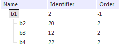
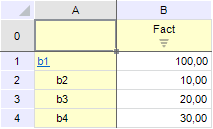
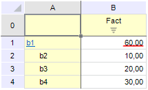
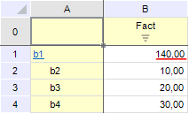
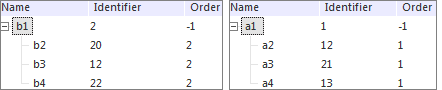
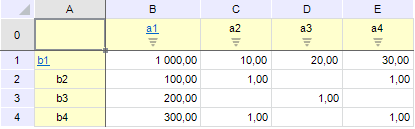
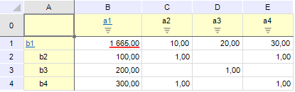
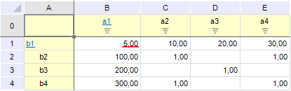
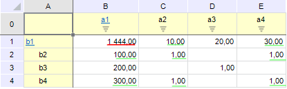

# Особенности и примеры суммирования

Особенности и примеры суммирования
-

# Особенности и примеры использования различных типов суммирования

Необходимо помнить, что суммирование элементов может быть применимо
 не для всех измерений куба-источника.

Для выполнения суммирования необходимо, чтобы выполнялись следующие
 условия:

	- для измерения:

	-

		- должно быть [табличным](../../reference_book/Create.htm);

		- должно иметь [уникальный
		 индекс](../../reference_book/Master_Table_reference_book/UiMd_reference_book_Master_Table_page2.htm);

		- индексы блоков измерения должны быть привязаны только к
		 одному атрибуту;

	- для куба:

	-

		- значения куба должны храниться в 1 таблице.

В случае если какое -либо из условий не выполняется, то расчет произведен
 не будет.

Примечание.
 Рекомендуется использовать рекурсивные измерения.

Ниже рассмотрены примеры использования различных типов суммирования
 в [формулах](UiMd_CubeWork_MultivariateAccount_EditFormula.htm)
 [многомерного расчета на
 сервере БД](UiMd_CubeWork_MultivariateAccount.htm) для кубов с одним и с двумя рекурсивным измерениями.

## Суммирование для куба с 1 рекурсивным измерением

Для многомерного расчета в качестве источника и приёмника используется
 один и тот же куб. Данный куб состоит из факта и одного рекурсивного измерения:

До расчета куб содержал следующие данные:

В редакторе формул многомерного расчета была задана следующая формула:

		 Координата куба-назначения
		 Заданная для нее формула

		 b1
		 b1

где b1 - элемент выбранный в измерениях. Выражение задано по имеющемуся
 факту куба.

Далее для этих исходных данных и заданной формулы будут рассмотрены
 разные типы суммирования.

	- Суммирование с владельцем.
	 Для терма в поле формулы следует вызвать контекстное меню и установить
	 флаг «Суммировать - Дочерние элементы с владельцем».
	 Сохранить формулу. Рассчитать куб, выбрав «Обновлять рассчитываемые
	 элементы» в диалоге параметров расчета в поле «Предварительно и в
	 процессе расчета». После расчета куб будет содержать следующие данные:

Рассчитанное значение подчеркнуто красным
 цветом. Видно, что в полученном результате было учтено значение для элемента
 измерения b1, который является владельцем.

	- Суммирование без владельца.
	 Для терма в поле формулы следует вызвать контекстное меню и установить
	 флаг «Суммировать - Дочерние элементы без владельца».
	 Сохранить формулу. Рассчитать куб, выбрав «Обновлять рассчитываемые
	 элементы» в диалоге параметров расчета в поле «Предварительно и в
	 процессе расчета». После расчета куб будет содержать следующие данные:

Рассчитанное значение подчеркнуто красным
 цветом. Видно, что в полученном результате не было учтено значение для
 элемента измерения b1, который является владельцем.

	- По маске. Для терма
	 в поле формулы следует вызвать контекстное меню и установить флаг
	 «Суммировать - По
	 маске». Сохранить формулу. Рассчитать куб, выбрав «Обновлять
	 рассчитываемые элементы» в диалоге параметров расчета в поле «Предварительно
	 и в процессе расчета». После расчета куб будет содержать следующие
	 данные:

Рассчитанное значение подчеркнуто красным
 цветом. Для понимания расчета следует обратиться к идентификаторам элементов
 измерений. У элемента b1 идентификатор "2", поэтому были взяты
 элементы, идентификаторы которых начинаются с "2" - это b2 и
 b4, значение для элемента, заданного в формуле, также учитывается при
 расчете (в данном случае b1). Следовательно: 100 + 10 + 30 = 140.

Примечание.
 Следует помнить, что идентификаторы будут проверяться у всех элементов
 измерения.

## Суммирование для куба с 2 рекурсивными измерениями

Для многомерного расчета в качестве источника и приёмника используется
 один и тот же куб. Данный куб состоит из факта и двух рекурсивных измерений
 (слева - Измерение1, справа - Измерение2):

До расчета куб содержал следующие данные:

В редакторе формул многомерного расчета была задана следующая формула:

		 Координата куба-назначения
		 Заданная для нее формула

		 b1|a1
		 b1|a1

где b1 и a1 - элементы выбранные в измерениях. Выражение задано по имеющемуся
 факту куба.

Далее для этих исходных данных и заданной формулы будут рассмотрены
 разные типы суммирования.

	- Суммирование
	 с владельцем. Для терма в поле формулы следует вызвать контекстное
	 меню и установить флаг «Суммировать
	 - Дочерние элементы с владельцем».
	 Сохранить формулу. Рассчитать куб, выбрав «Обновлять рассчитываемые
	 элементы» в диалоге параметров расчета в поле «Предварительно и в
	 процессе расчета». После расчета куб будет содержать следующие данные:

Рассчитанное значение подчеркнуто красным
 цветом. Родительские элементы находятся в ячейках B1:B4 и C1:E1, дочерние
 элементы - в диапазоне C2:E4. Видно, что в полученном результате присутствуют
 все родительские и дочерние значения.

	- Суммирование
	 без владельца. Для терма в поле формулы следует вызвать контекстное
	 меню и установить флаг «Суммировать
	 - Дочерние элементы без владельца».
	 Сохранить формулу. Рассчитать куб, выбрав «Обновлять рассчитываемые
	 элементы» в диалоге параметров расчета в поле «Предварительно и в
	 процессе расчета». После расчета куб будет содержать следующие данные:

Рассчитанное значение подчеркнуто красным
 цветом. Родительские элементы находятся в ячейках B1:B4 и C1:E1, дочерние
 элементы - в диапазоне C2:E4. Видно, что в полученном результате не были
 учтены родительские значения.

	- По маске. Для терма
	 в поле формулы следует вызвать контекстное меню и установить флаг
	 «Суммировать - По
	 маске». Сохранить формулу. Рассчитать куб, выбрав «Обновлять
	 рассчитываемые элементы» в диалоге параметров расчета в поле «Предварительно
	 и в процессе расчета». После расчета куб будет содержать следующие
	 данные:

Рассчитанное значение подчеркнуто красным
 цветом. Для понимания расчета следует обратиться к идентификаторам элементов
 измерений. У элемента b1 идентификатор "2", поэтому в «Измерении1»
 были взяты элементы, идентификаторы которых начинаются с "2"
 - это b2 и b4. У элемента a1 идентификатор "1", поэтому в «Измерении2»
 были взяты элементы, идентификаторы которых начинаются с "1"
 - это a2 и a4. Также в результат попадают значения дочерних элементов,
 которые находятся на пересечении родительских элементов, удовлетворяющих
 условию (совпадение идентификаторов). Значение для элемента, заданного
 в формуле, учитывается при расчете (в данном случае b1|a1). Следовательно:
 1000 + 100 + 300 + 10 + 30 + 1 + 1 + 1 + 1 = 1444. Для наглядности вошедшие
 в результат значения, кроме значения b1|a1, подчеркнуты зеленым цветом.

См. также:

[Редактирование
 формул](UiMd_CubeWork_MultivariateAccount_EditFormula.htm)

		Справочная
		 система на версию 10.9
		 от 18/08/2025,
		 © ООО «ФОРСАЙТ»,
