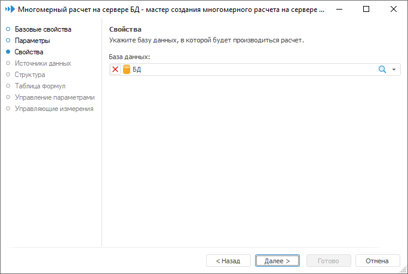

# Страница «Свойства»: Многомерный расчет на сервере БД

Страница «Свойства»: Многомерный расчет на сервере БД
-

# Свойства

На странице «Свойства» определяется
 соединение с базой данных, на сервере которой будет производиться расчет:

Многомерный расчет доступен для базы данных, основанных на одном из
 типов клиента СУБД:

	- Microsoft SQL Server;

	- Oracle;

	- PostgreSQL;

	- SQLite.

Совет. Для получения
 подробной информации о поддерживаемых версиях СУБД обратитесь к статье
 «[Поддерживаемые
 СУБД](Setup.chm::/01_SysReq/database_Support.htm)».

См. также:

[Многомерный расчет на
 сервере БД](UiMd_CubeWork_MultivariateAccount.htm)

		Справочная
		 система на версию 10.9
		 от 18/08/2025,
		 © ООО «ФОРСАЙТ»,
