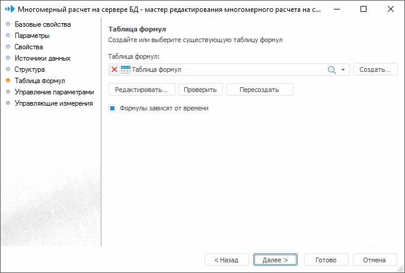

# Таблица формул

Таблица формул
-

# Таблица формул

На странице «Таблица формул»
 задаётся таблица, в которой будут храниться формулы, заданные для расчета
 фактов куба:

На странице доступны операции:

[Задание
 таблицы формул](javascript:TextPopup(this))

	Из раскрывающегося списка выберите таблицу формул, расположенную
	 в текущем репозитории, или создайте новую таблицу формул.

	Для создания новой таблицы формул нажмите кнопку «Создать».
	 В открывшемся окне определите свойства таблицы формул:
	 наименование и идентификатор. При нажатии на кнопку «ОК»
	 будет автоматически создана таблица с настроенной [структурой](UiMd_CubeWork_MultivariateAccount_TablesFormul.htm).
	 Таблица будет сохранена в каталоге, в котором расположен данный многомерный
	 расчет.

[Редактирование
 таблицы формул](javascript:TextPopup(this))

	Для редактирования указанной таблицы формул нажмите кнопку «Редактировать». Будет открыт [мастер таблицы](../../Table/UiDb_relational_table.htm#master).

[Проверка
 таблицы формул](javascript:TextPopup(this))

	Для проверки выбранной таблицы на соответствие необходимым условиям
	 нажмите кнопку «Проверить».

	После выполнения проверки будет выдано соответствующее информационное
	 сообщение.

[Пересоздание
 таблицы формул](javascript:TextPopup(this))

	Для пересоздания указанной таблицы нажмите кнопку «Пересоздать».

	Следует учитывать тот факт, что таблица не всегда может быть пересоздана,
	 так как данная команда позволяет только добавлять новые поля и не
	 удаляет не используемые. В большинстве случаев рекомендуется создавать
	 новую таблицу формул или редактировать имеющуюся с помощью мастера
	 кнопкой «Редактировать».

[Настройка
 зависимости таблицы формул от времени](javascript:TextPopup(this))

	Если для разных периодов расчета значения факторов куба должны быть
	 вычислены по разным формулам, то перед созданием таблицы формул установите
	 флажок «Формулы зависят от времени».

См. также:

[Многомерный расчет на
 сервере БД](UiMd_CubeWork_MultivariateAccount.htm) | [Расшифровка
 таблицы формул](UiMd_CubeWork_MultivariateAccount_TablesFormul.htm)

		Справочная
		 система на версию 10.9
		 от 18/08/2025,
		 © ООО «ФОРСАЙТ»,
