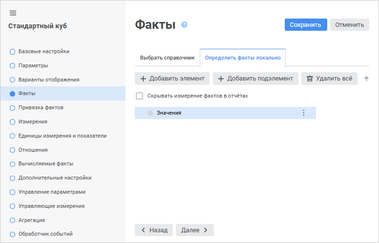
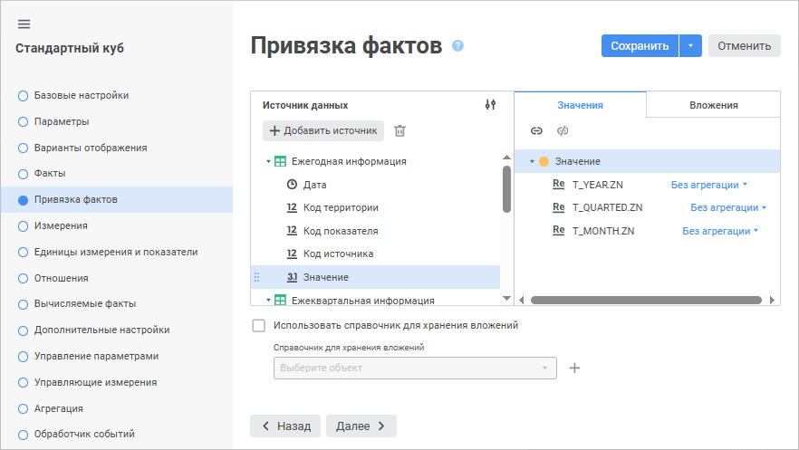
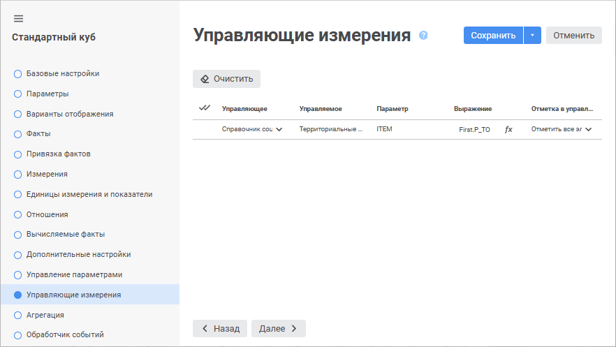
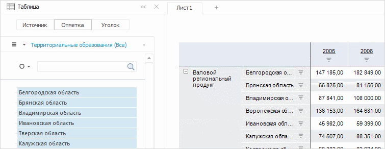
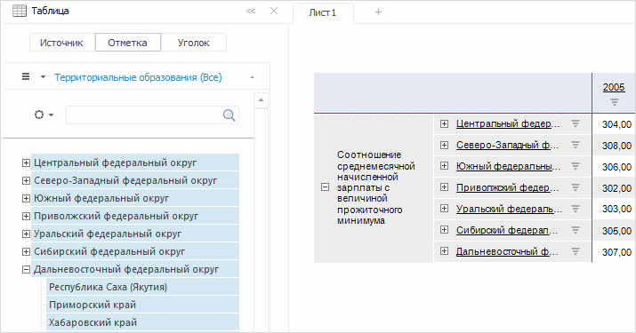

# Пример создания куба с управляемым измерением

Пример создания куба с управляемым измерением
-

# Пример создания куба с управляемым измерением

Управляющие и управляемые измерения
 предназначены для изменения отметки элементов в управляемом измерении
 при изменении отметки в управляющем измерении.

Управление отметкой осуществляется с помощью передачи в управляемое
 измерение значения параметра, которое задается с помощью выражения управления
 на странице мастера «Управляющие измерения».

Для создания куба в [навигаторе
 объектов](GetStarted.chm::/Interface/Interface_Navigator.htm):

	- Убедитесь, что в репозитории созданы справочники:

		- [Календарь](../../reference_book/Calendar.htm);

		- [Территориальные образования](../../reference_book/UiMd_reference_book_example_Terr.htm);

		- [Социально-экономические
		 показатели](../../reference_book/UiMd_reference_book_example.htm);

		- [Типы данных](../../reference_book/UiMd_reference_book_example_Type.htm).

	- Нажмите кнопку  «Создать» в главном меню и выберите
	 «Стандартный куб» на боковой
	 панели «[Новый
	 объект](UiNav.chm::/02_Navigator/General_Principles_of_Work.htm#add_object)».

	- Задайте стандартные параметры справочника на странице «Базовые свойства»:

		- Наименование: Куб с управляемым
		 измерением;

		- Идентификатор: CUBE.

	- Перейдите на страницу «Факты
	 куба»:

Перейдите на вкладку «Определить
 факты локально».

Нажмите кнопку  «Добавить элемент». Переименуйте
 добавленный элемент в «Значения».

	- Перейдите на страницу «Привязка
	 фактов». Данная страница предназначена для привязки фактов
	 куба к полям из набора данных. В левой части окна располагается иерархический
	 список всех таблиц и их полей. В правой части окна располагается список
	 фактов куба.

В списке «Таблицы
 и запросы» выберите таблицы: «Ежегодная
 информация», «Ежеквартальная информация»
 и «Ежемесячная информация». Затем
 свяжите у каждой таблицы поле «Значение»
 с фактом «Значение» в списке «Факты куба»:

	- Перейдите на страницу «Измерения».
	 На данной странице определите список справочников, из которых будет
	 состоять куб. Для этого нажмите кнопку  «Добавить».
	 В открывшемся стандартном окне выберите справочники:

		- Типы данных;

		- Территориальные измерения;

		- Социально-экономические показатели;

		- Календарь.

Подробное описание создания справочников
 приведено в разделе «[Примеры создания справочников](../../reference_book/UiMd_reference_book_Examples.htm)».

После добавления справочников определите
 привязку полей таблиц с данными к уровням справочников. Для каждого измерения
 куба определите связи по индексам и затем привяжите к выбранному индексу
 необходимые поля таблиц. Подробное описание
 приведено в разделе «[Пример
 создания куба](../UiMd_Cube_Example.htm)».

	- Перейдите на страницу «Управляющие
	 измерения» для настройки параметров управления измерением «Территориальные образования» с помощью
	 измерения «Социально-экономические
	 показатели».

На странице определите следующие параметры:

		- Управляющее измерение.
		 В раскрывающемся списке выберите справочник «Социально-экономические
		 показатели»;

		- Выражение управления.
		 С помощью клавиатуры или [редактора выражения](UiNav.chm::/GUI/ExpressionEditor.htm)
		 задайте выражение: First.P_TO.
		 Это означает, что в параметр управляемого измерения («Территориальные
		 образования») будет передаваться параметр первого элемента
		 в отметке управляющего измерения («Социально-экономические
		 показатели»);

		- Отметка в управляемом измерении.
		 В раскрывающемся списке выберите стратегию управления отметкой
		 «Отметить все элементы в управляемом
		 измерении».

Страница «Управляющие
 измерения» примет вид:

Для завершения работы мастера нажмите кнопку «Сохранить».

Для просмотра результатов откройте куб с помощью инструмента «Аналитические запросы» или другого
 инструмента продукта «Форсайт. Аналитическая платформа».

В результате смены отметки в управляющем измерении «Социально-экономические
 показатели» изменится количество элементов в управляемом измерении
 «Территориальные образования».

Например, если установить отметку на элемент «Валовой
 региональный продукт» в измерении «Социально-экономические
 показатели», то в измерении «Территориальные
 образования» установится отметка на все элементы по уровню «Центральный федеральный округ»:

При установке отметки на элемент «Соотношение
 среднемесячной начисленной зарплаты с величиной прожиточного минимума»
 в измерении «Социально-экономические
 показатели» в измерении «Территориальные
 образования» установится отметка на все элементы по уровню «Российская Федерация» и подчиненные
 элементы уровней:

См. также:

[Пример
 создания куба](../UiMd_Cube_Example.htm) │ [Управляющие
 измерения](../CreateCube/Master_Standart/UiMd_Cube_CreateCube_Master_Standart_managed_dim.htm)

		Справочная
		 система на версию 10.9
		 от 18/08/2025,
		 © ООО «ФОРСАЙТ»,
