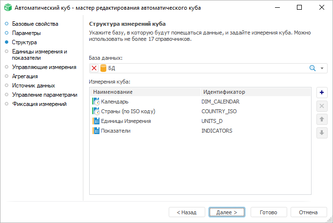

# Страница «Структура»

Страница «Структура»
-

# Структура измерений куба

На странице «Структура измерений куба»
 определяется соединение с базой данных, в которой содержатся системные
 таблицы репозитория, предназначенные для хранения данных автоматических
 кубов. Также здесь задается список измерений, формирующих многомерную
 структуру куба:

База данных выбирается из раскрывающегося списка всех объектов репозитория.

Важно. Для
 корректного создания экспресс-отчета на основе автоматического куба необходимо,
 чтобы в базе данных был создан репозиторий НСИ.

Для добавления измерений куба:

	- нажмите кнопку  «Добавить»;

	- выполните команду «Добавить
	 измерение» контекстного меню.

Для удаления выбранного справочника:

	- нажмите кнопку  «Удалить»;

	- выполните команду «Удалить
	 измерение» контекстного меню.

При формировании списка измерений куба важен их порядок, так как от
 этого будет зависеть представление данных в отчётах. Также порядок влияет
 на сохранение данных. Для изменения порядка расположения измерений:

	- используйте кнопки  «Переместить выше» и  «Переместить
	 ниже»;

	- используйте команды «Переместить
	 измерение выше» и «Переместить
	 измерение ниже» контекстного меню.

При изменении порядка измерений будет выдано подтверждение на соответствующее
 преобразование данных.

При выполнении команды «Перейти к объекту»
 в контекстном меню измерения фокус в окне навигатора объектов будет перемещён
 к данному измерению.

См. также:

[Автоматический куб](UiMd_Cube_CreateCube_Master_Auto.htm)

		Справочная
		 система на версию 10.9
		 от 18/08/2025,
		 © ООО «ФОРСАЙТ»,
