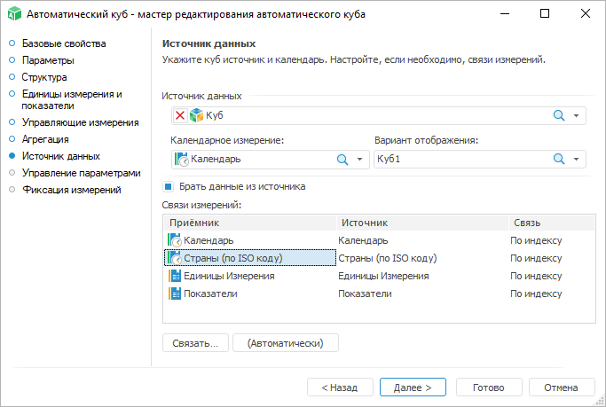
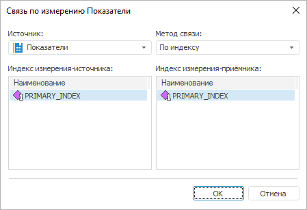

# Страница «Источник данных»

Страница «Источник данных»
-

# Источник данных

Автоматический куб - это куб, построенный по принципу сверху вниз.
 Для создания данного куба достаточно задать набор измерений, на основе
 которого строится куб. Все привязки полей измерений и таблиц, а также
 добавление системных таблиц с данными нужной структуры выполняются автоматически.
 При необходимости загрузки данных в автокуб из какого-либо источника,
 следует просто выбрать источник и привязать его измерения к измерениям
 автокуба, данные автоматически будут помещены в автокуб.

Для задания источника данных предназначена страница «Источник
 данных»:

Задайте параметры:

	- Источник данных. Позволяет
	 выбрать источник данных для автокуба, возможны следующие варианты:

	-

		- База данных временных рядов;

		- Переменные моделирования;

		- Все виды кубов;

	- Календарный срез. Раскрывающийся
	 список содержит календарные срезы выбранного источника данных;

	- Вариант отображения.
	 Раскрывающийся список содержит все доступные выходы выбранного источника;

	- Брать данные из источника.
	 При установке флажка автокуб будет содержать данные куба-источника.
	 Флаг по умолчанию снят, то есть будет создан куб, не содержащий данных;

	- Связи измерений. В поле
	 формируется связь измерений куба-источника с кубом-приёмником. Если
	 в кубе -источнике и кубе-приёмнике имеются одинаковые измерения, то
	 между ними автоматически устанавливается связь по индексу;

	- Связать.
	 Кнопка предназначена для редактирования связи, при ее нажатии открывается
	 окно «Связь по измерению»:

В данном окне необходимо определить следующие
 параметры:

	-

		- Источник. В раскрывающемся
		 списке представлены все измерения источника, необходимо выбрать,
		 с каким измерением будет связано измерение приёмника, для которого
		 редактируется связь;

		- Метод связи. Из
		 раскрывающегося списка необходимо выбрать один из методов связи.
		 Доступны методы «По идентификатору»
		 и «По индексу». При выборе
		 метода связи по индексу необходимо указать:

			- Индекс измерения-источника. В данном поле
			 отображаются все индексы измерения источника. При наличии
			 у измерения нескольких индексов в поле необходимо выбрать
			 один из индексов, по которому будет осуществляться связь;

			- Индекс измерения-приёмника. В данном поле
			 отображаются все индексы измерения приёмника. При наличии
			 у измерения нескольких индексов в поле необходимо выбрать
			 один из индексов, по которому будет осуществляться связь;

	- Автоматически. Команда
	 устанавливает связь измерения-приёмника с измерением-источника. При
	 совпадении идентификаторов измерений связь устанавливается, в противном
	 случае, даже если связь была установлена, то она будет разорвана.

См. также:

[Автоматический куб](UiMd_Cube_CreateCube_Master_Auto.htm)

		Справочная
		 система на версию 10.9
		 от 18/08/2025,
		 © ООО «ФОРСАЙТ»,
