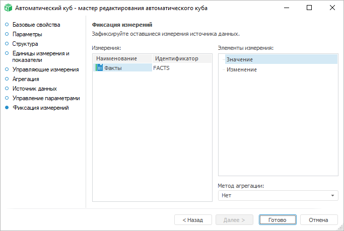

# Страница «Фиксация измерений»

Страница «Фиксация измерений»
-

# Фиксация измерений

На странице «Фиксация измерений»
 необходимо зафиксировать элементы измерений источника данных, которые
 не были сопоставлены с измерениями автоматического куба:

В поле «Измерения» необходимо
 выбрать справочник, элементы которого необходимо зафиксировать.

В поле «Элементы измерения»
 осуществляется отметка элементов. По умолчанию доступна единичная отметка
 элементов. Если в раскрывающемся списке «Метод
 агрегации» выбрать один из методов, то будет доступна множественная
 отметка элементов. Для выбранных элементов будет применяться [агрегация
 фиксированных измерений](../../Agregation.htm) с использованием указанного метода.

См. также:

[Автоматический куб](UiMd_Cube_CreateCube_Master_Auto.htm)

		Справочная
		 система на версию 10.9
		 от 18/08/2025,
		 © ООО «ФОРСАЙТ»,
