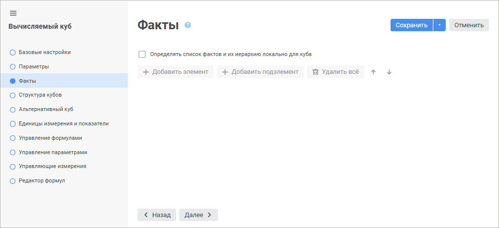

# Страница «Факты»: Вычисляемый куб

Страница «Факты»: Вычисляемый куб
-

# Факты куба

На странице «Факты» определяется
 список и иерархия фактов куба. Измерение фактов может быть задано локально
 или как измерение фактов куба-источника.

	 Веб-приложение Настольное приложение

		

		

[Использование
 локального измерения фактов](javascript:TextPopup(this))

	Для создания локального измерения фактов:

		- Установите флажок «Определять
		 список фактов и их иерархию локально для куба».

		- Добавьте элементы с помощью кнопок 
		 «Добавить элемент»/ «Добавить подэлемент»
		 в веб-приложении или «Добавить
		 элемент»/«Добавить подэлемент»
		 в настольном приложении.

	Если флажок «Определять список
	 фактов и их иерархию локально для куба» снят, то в качестве
	 измерения фактов будет использоваться измерение фактов куба-источника.

[Переименование
 фактов](javascript:TextPopup(this))

	Для переименования выбранного факта:

		- в веб-приложении:

			- выполните команду «Переименовать»
			 в раскрывающемся меню кнопки  «Действия»;

			- дважды щёлкните по факту;

		- в настольном приложении нажмите кнопку «Переименовать».

[Удаление фактов](javascript:TextPopup(this))

	Для удаления выбранного факта:

		- в веб-приложении выполните команду «Удалить»
		 в раскрывающемся меню кнопки  «Действия»;

		- в настольном приложении нажмите кнопку «Удалить».

	Для удаления всех фактов:

		- в веб-приложении нажмите кнопку  «Удалить всё»;

		- в настольном приложении выберите факт и выполните команду
		 «Удалить все элементы»
		 в раскрывающемся меню кнопки «Удалить».

[Изменение порядка
 фактов](javascript:TextPopup(this))

	Для перемещения выбранного факта на одну позицию вверх:

		- в веб-приложении нажмите кнопку 
		 «Вверх»;

		- в настольном приложении нажмите кнопку «Переместить
		 выше».

	Для перемещения выбранного факта на одну позицию вниз:

		- в веб-приложении нажмите кнопку 
		 «Вниз»;

		- в настольном приложении нажмите кнопку «Переместить
		 ниже».

См. также:

[Вычисляемый куб](UiMd_Cube_CreateCube_Master_Calculation.htm)

		Справочная
		 система на версию 10.9
		 от 18/08/2025,
		 © ООО «ФОРСАЙТ»,
