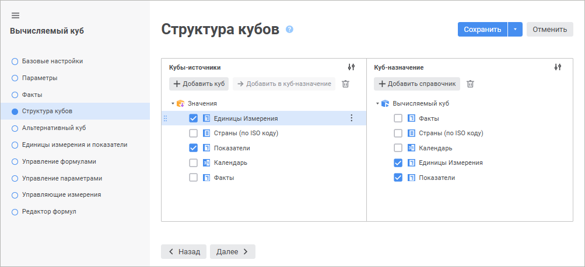
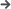

# Страница «Структура кубов»: Вычисляемый куб

Страница «Структура кубов»: Вычисляемый куб
-

# Структура кубов

На странице «Структура кубов»
 определяется структура вычисляемого куба. Выбираются кубы-источники и
 определяются измерения вычисляемого куба.

	 Веб-приложение Настольное приложение

		

		

[Добавление куба-источника](javascript:TextPopup(this))

	Для добавления куба-источника:

		- в веб-приложении нажмите кнопку  «Добавить куб», расположенную
		 в области «Кубы-источники»;

		- в настольном приложении нажмите кнопку «Добавить»,
		 расположенную ниже области «Кубы-источники».

	Будет открыто окно «Выберите куб-источник».

Для быстрого выбора объекта в поле для поиска введите его название/идентификатор/ключ,
 в зависимости от настроек отображения. Поиск будет выполняться автоматически
 по мере ввода текста. Список будет содержать объекты, наименования/идентификаторы/ключи
 которых содержат вводимый текст.

Для настройки отображения объектов репозитория в списке нажмите кнопку
  «Отображение
 объекта» и выберите в раскрывающемся меню вариант отображения:

	- Наименование. Объекты
	 отображаются под своими наименованиями. Вариант по умолчанию;

	- Идентификатор. Объекты
	 отображаются под своими идентификаторами;

	- Ключ. Объекты отображаются
	 под своими ключами.

Выбрать можно несколько вариантов. Идентификатор и ключ будут указаны
 в скобках.

Для сброса отметки выбранных объектов нажмите кнопку 
 «Очистить».

	Примечание.
	 Настройка отображения объекта доступна в веб-приложении.

	После выполнения действия будет добавлен куб в области «Кубы-источники».
	 Координаты ячеек добавленного куба используются для составления уравнений
	 вычисляемого куба. Данные куба используются для расчёта при построении
	 вычисляемого куба.

[Удаление куба-источника](javascript:TextPopup(this))

	Для удаления выбранного куба-источника:

		- в веб-приложении нажмите кнопку  «Удалить»;

		- в настольном приложении нажмите кнопку «Удалить».

[Организация
 многомерной структуры](javascript:TextPopup(this))

	Для организации многомерной структуры вычисляемого куба добавьте
	 справочники, каждый из которых представляет собой отдельное измерение
	 вычисляемого куба.

	Для добавления справочника:

		- в веб-приложении:

			- нажмите кнопку  «Добавить
			 справочник», расположенную в области «Куб-назначение»;

			- выберите справочник в области
			 «Кубы-источники» и
			 нажмите кнопку  «Добавить
			 в куб-назначение»;

		- в настольном приложении:

			- нажмите кнопку «Добавить»,
			 расположенную ниже области «Куб-назначение»;

			- нажмите кнопку «Добавить
			 в куб-назначение» в контекстном меню справочника.

	Примечание.
	 Во всех измерениях кубов-источников и куба-назначения должен содержаться
	 [первичный
	 индекс](../../../reference_book/Master_Table_reference_book/UiMd_reference_book_Master_Table_page2.htm#indexes).

[Удаление справочника](javascript:TextPopup(this))

	Для удаления выбранного справочника в области «Куб-назначение»:

		- в веб-приложении нажмите кнопку  «Удалить»;

		- в настольном приложении:

			- нажмите кнопку «Удалить»;

			- выполните команду «Удалить
			 измерение» в контекстном меню справочника.

	Примечание.
	 Удаление измерения из куба-назначения доступно, если данное измерение
	 [не
	 зафиксировано](UiMd_Cube_CreateCube_Master_Calculation_2.htm#fixing_measurements) в кубе-источнике.

[Открытие и редактирование
 справочника](javascript:TextPopup(this))

	Для открытия справочника выполните команду  «Открыть объект» в раскрывающемся
	 меню кнопки  «Действия». После чего на отдельной
	 вкладке браузера будет открыт справочник на просмотр.

	Для редактирования справочника выполните команду  «Редактировать
	 объект» в раскрывающемся меню кнопки  «Действия». После чего на отдельной
	 вкладке браузера будет открыт мастер справочника.

	Примечание.
	 Открытие и редактирование справочника доступно только в веб-приложении.

[Настройка отображения
 объектов](javascript:TextPopup(this))

	Для настройки отображения объектов в областях «Кубы-источники», «Куб-назначение»:

		- в веб-приложении выберите способ отображения объектов в
		 раскрывающемся меню кнопки  «Отображение объекта»:

			- Наименование.
			 По умолчанию. Отображаются только наименования объектов;

			- Идентификатор.
			 Отображаются только идентификаторы объектов;

			- Наименование
			 и идентификатор. Отображаются наименования и идентификаторы
			 объектов;

		- в настольном приложении выберите способ отображения объектов
		 в контекстном меню области:

			- Отображать наименования.
			 По умолчанию. Отображаются только наименования объектов;

			- Отображать идентификаторы.
			 Отображаются только идентификаторы объектов;

			- Отображать наименования
			 и идентификаторы. Отображаются наименования и идентификаторы
			 объектов.

[Фиксация
 измерений](javascript:TextPopup(this))

	Фиксация измерений позволяет уменьшить в дальнейшем количество измерений,
	 используемых для составления координат ячеек куба в формулах. Фиксация
	 подразумевает прямое соответствие между элементами справочника-источника
	 и справочника-назначения. Соответствие между элементами измерений
	 устанавливается по индексу.

	Примечание.
	 Фиксация измерений в области «Кубы-источники»
	 доступна, если измерения [добавлены](#organization_of_multidimensional_structure)
	 в куб-назначение.

	Для фиксации измерений:

		- в веб-приложении отметьте справочники;

		- в настольном приложении дважды щёлкните по справочникам.
		 Наименования зафиксированных справочников выделяются полужирным
		 начертанием шрифта.

	Для снятия фиксации измерений:

		- в веб-приложении снимите отметку;

		- в настольном приложении дважды щёлкните по справочникам,
		 наименования которых выделены полужирным начертанием шрифта.

[Изменение порядка
 измерений](javascript:TextPopup(this))

	Для перемещения измерения вверх или вниз используйте механизм Drag&Drop.

	Также в настольном приложении доступно перемещение измерения на
	 одну позицию вверх или вниз с помощью команд контекстного меню «Переместить измерение выше», «Переместить измерение ниже».

[Переход к объекту
 репозитория](javascript:TextPopup(this))

	Переход к объекту позволяет выделить в навигаторе объектов справочник,
	 который является измерением куба. Для этого выполните команду «Перейти к объекту» в контекстном
	 меню справочника.

	Примечание.
	 Переход к объекту репозитория доступен только в настольном приложении.

[Задание
 лагов](javascript:TextPopup(this))

	Лаг определяет какое количество соседних значений относительно текущей
	 точки расчёта будет загружено при вычислении формул. Задание лага
	 может потребоваться, если формула предполагает использование значения
	 по элементу, который исключён из отметки, а также для корректного
	 расчёта функции [LAGVAL](../../../equation_editor/UiMd_Equation_editor_CalculationCube.htm).

	Примечание.
	 Задание лагов доступно только в настольном приложении для измерений
	 куба-источника и куба-назначения.

	Для задания лага выполните команду «Изменить
	 лаги» в контекстном меню измерения. Будет открыто окно «Лаги cреза»:

	

	Задайте параметры:

		- Лаг назад. Указывает
		 для скольких предшествующих элементов, не входящих в отметку,
		 будет извлечено значение (по умолчанию 0);

		- Лаг вперед. Указывает
		 для скольких следующих элементов, не входящих в отметку, будет
		 извлечено значение (по умолчанию 0).

См. также:

[Вычисляемый куб](UiMd_Cube_CreateCube_Master_Calculation.htm)

		Справочная
		 система на версию 10.9
		 от 18/08/2025,
		 © ООО «ФОРСАЙТ»,
