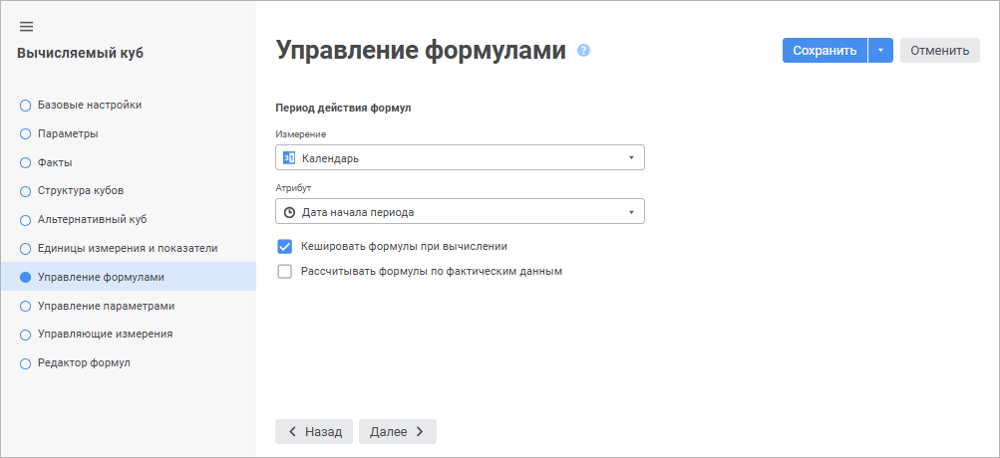

# Страница «Управление формулами»: Вычисляемый куб

Страница «Управление формулами»: Вычисляемый куб
-

# Управление формулами

На странице «Управление формулами»
 укажите атрибут измерения, который будет управлять выбором периода действия
 формул.

	Веб-приложение Настольное приложение

		

		

Задайте параметры:

	- Измерение. Выберите
	 из раскрывающегося списка измерение, атрибут которого будет управлять
	 выбором периода действия формул;

	- Атрибут. Выберите из
	 раскрывающегося списка управляющий атрибут;

	- Кешировать формулы при вычислении.
	 Установите флажок при необходимости кеширования формул при первом
	 вычислении куба. Это позволит быстрее выполнять последующие пересчёты
	 куба;

	- Рассчитывать формулы по фактическим
	 данным. Установите флажок при необходимости расчёта формул
	 по фактическим данным. Это позволит рассчитывать формулы не по всей
	 отметке, а только по фактическим данным, что приведёт к повышению
	 скорости расчёта.

При использовании данного флажка учитывайте
 следующее ограничение: если в формуле используется выражение, в котором
 значение сдвигается на несколько точек назад или вперёд, то будут рассчитаны
 те значения в отметке, для которых в матрице есть данные для отметки,
 из которой выполняется сдвиг. То есть значение не будет рассчитано, если:

		- какое-либо значение исходной матрицы после сдвига не попадает
		 в текущую отметку;

		- значение в текущей отметке должно посчитаться из исходной
		 матрицы, выходящей за текущую отметку.

См. также:

[Вычисляемый куб](UiMd_Cube_CreateCube_Master_Calculation.htm) |
 [Редактор
 формул для вычисляемого куба](../../../equation_editor/UiMd_Equation_editor_CalculationCube.htm)

		Справочная
		 система на версию 10.9
		 от 18/08/2025,
		 © ООО «ФОРСАЙТ»,
