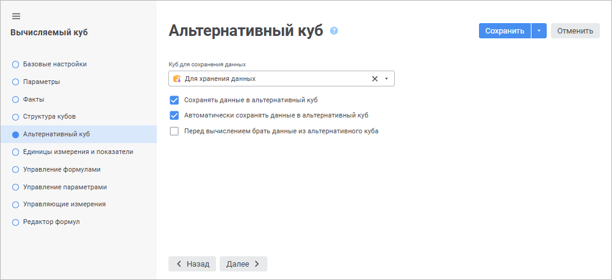

# Страница «Альтернативный куб»: Вычисляемый куб

Страница «Альтернативный куб»: Вычисляемый куб
-

# Альтернативный куб

В случае необходимости на странице «Альтернативный
 куб» можно задать куб, в который будут сохраняться вычисляемые
 данные.

	Веб-приложение Настольное приложение

		

		

Данные, рассчитываемые в вычисляемом кубе, по умолчанию нигде не сохраняются,
 для их сохранения следует определить альтернативный куб.

	- Куб для сохранения данных.
	 Выберите в раскрывающемся списке куб, в который будут сохраняться
	 вычисляемые данные.

Для быстрого выбора объекта в поле для поиска введите его название/идентификатор/ключ,
 в зависимости от настроек отображения. Поиск будет выполняться автоматически
 по мере ввода текста. Список будет содержать объекты, наименования/идентификаторы/ключи
 которых содержат вводимый текст.

Для настройки отображения объектов репозитория в списке нажмите кнопку
  «Отображение
 объекта» и выберите в раскрывающемся меню вариант отображения:

	- Наименование. Объекты
	 отображаются под своими наименованиями. Вариант по умолчанию;

	- Идентификатор. Объекты
	 отображаются под своими идентификаторами;

	- Ключ. Объекты отображаются
	 под своими ключами.

Выбрать можно несколько вариантов. Идентификатор и ключ будут указаны
 в скобках.

Для сброса отметки выбранных объектов нажмите кнопку 
 «Очистить».

Примечание.
 Настройка отображения объекта доступна в веб-приложении.

При выборе куба следует установить один из
 флажков, связанных с сохранением данных.

Примечание.
 Структура выбранного альтернативного куба должна полностью соответствовать
 структуре вычисляемого куба: порядок измерений и их ключи должны совпадать,
 то есть должны использоваться одни и те же измерения. В том числе и измерение
 фактов, которое следует создать отдельным справочником и добавить в кубы
 на соответствующих страницах: для вычисляемого куба - страница «[Структура
 кубов](UiMd_Cube_CreateCube_Master_Calculation_2.htm)», для альтернативного куба - страница «[Факты](../Master_Standart/UiMd_Cube_CreateCube_Master_Standart_1.htm)». В противном случае при
 сохранении данных будут возникать ошибки.

	- Сохранять данные в альтернативный
	 куб. Если флажок установлен, можно редактировать данные в вычисляемом
	 кубе и сохранять их в альтернативный куб. Если флажок не установлен,
	 данные в вычисляемом кубе нельзя редактировать;

	- Автоматически сохранять данные
	 в альтернативный куб. При установке флажка в куб, заданный
	 в поле выше, будут сохраняться все данные;

	- Перед вычислением брать данные
	 из альтернативного куба. При установке данного флажка данные
	 для расчета будут браться из кубов-источников. Из альтернативного
	 источника будут браться все остальные данные. То есть в ячейках, содержащих
	 формулы, будут выводиться значения, а в ячейках, где нет формул, будут
	 отображаться пустые ячейки (если флажок не установлен) или данные
	 из альтернативного источника (если флажок установлен).

См. также:

[Вычисляемый куб](UiMd_Cube_CreateCube_Master_Calculation.htm)

		Справочная
		 система на версию 10.9
		 от 18/08/2025,
		 © ООО «ФОРСАЙТ»,
