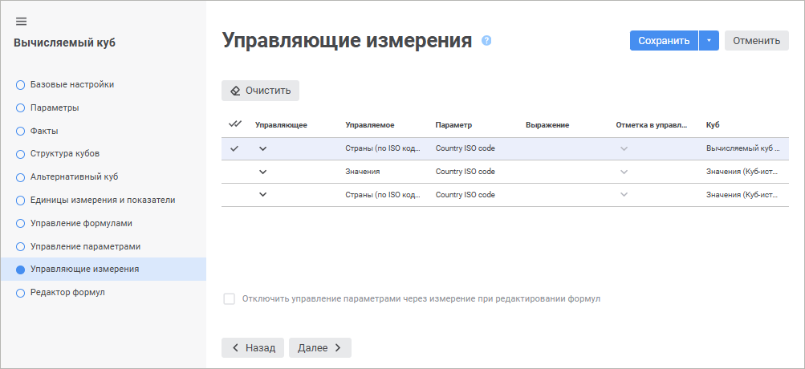
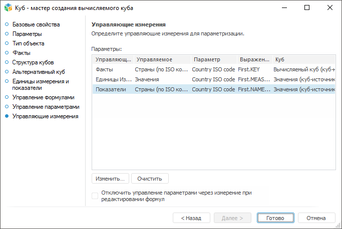
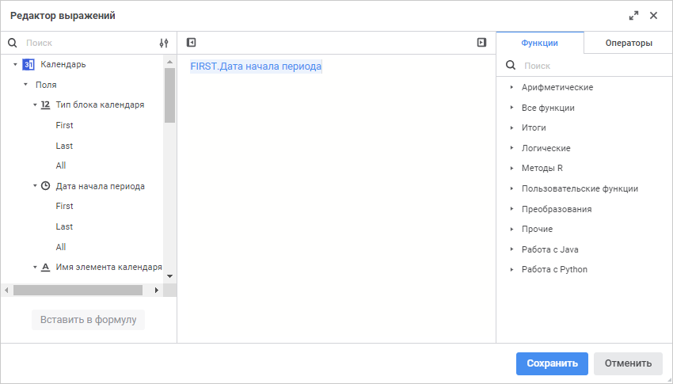
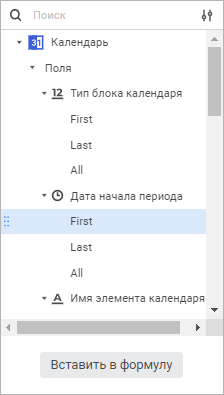

# Страница «Управляющие измерения»: Вычисляемый куб

Страница «Управляющие измерения»: Вычисляемый куб
-

# Управляющие измерения

Если в кубе имеются параметрические измерения, то можно настроить управление
 параметрами данных измерений с помощью других измерений куба. При этом
 в качестве значений параметров будут передаваться значения определенных
 атрибутов.

Совет. Если куб
 используется в качестве [показателя](DataEntryForms.chm::/Desktop/Table/AreaTable.htm#indicator)
 в форме ввода, имеет параметризованные измерения и необходимо управление
 этими измерениями с помощью других измерений куба, то для куба нужно использовать
 данную настройку.

Все параметрические измерения отображаются на странице «Управляющие
 измерения».

	 Веб-приложение Настольное приложение

		

		

Для настройки управляющего измерения:

	- в веб-приложении задайте требуемые параметры в соответствующих
	 столбцах на странице «Управляющие
	 измерения»;

	- в настольном приложении:

		- выберите один из параметров управляемого измерения и нажмите
		 кнопку «Изменить»;

		- дважды щёлкните по параметру управляемого измерения.

Откроется окно «Свойства
 параметра управления»:

Определите параметры:

	- Управляющее/Управляющее измерение.
	 Выберите в раскрывающемся списке справочник, значения атрибутов которого
	 будут передаваться в качестве значения параметра;

	- Выражение/Выражение управления.
	 Задайте выражение, с помощью которого будет рассчитываться значение
	 параметра. Для этого откройте редактор выражения с помощью кнопки
	  «Редактор
	 выражения» в веб-приложении или кнопки  «Редактор выражения» в настольном
	 приложении;

	- Отметка в управляемом измерении.
	 Выберите стратегию управления отметкой:

	-

		- Отметить
		 все элементы в управляемом измерении;

		- Сбросить
		 отметку в управляемом измерении;

		- Отметить
		 те элементы, которые были отмечены до управления;

		- Отметить
		 первый элемент;

		- Отметить
		 последний элемент.

При нажатии кнопки  «Очистить»
 для выделенного управляемого параметра будут очищены управляющее измерение
 и выражение.

[Управление
 параметрами куба-источника](javascript:TextPopup(this))

	Для управления параметрами куба-источника с помощью механизма управляющих
	 измерений в вычисляемом кубе:

		- Убедитесь, что куб-источник содержит параметр, который передаётся
		 в запрос.

		- Выберите измерение, которое будет являться управляющим.

		- Задайте выражение управления, посредством которого будет
		 осуществляться управление параметром куба-источника. Например,
		 выражение «FIRST.ID» означает,
		 что в параметр управляемого куба-источника будет передаваться
		 идентификатор первого элемента в отметке управляющего измерения.

		- Установите флажок «Отключить
		 управление параметрами через измерение при редактировании формул»
		 при необходимости. При установленном флажке отключается управление
		 параметрами через управляющее измерение для всех измерений, у
		 которых передача параметра осуществляется одновременно двумя способами
		 при редактировании формул. По умолчанию флажок снят.

	Примечание.
	 Флажок доступен, если в кубе настроено задание значений параметров
	 через выражение в управлении вложенными объектами и одновременно через
	 механизм управляющего измерения.

## Редактор выражения

Настройка формул выполняется с помощью редактора выражения:

	- редактор выражения в настольном приложении универсален для всех
	 инструментов и объектов платформы. Описание универсального редактора
	 выражения приведено в разделе «[Создание формул и выражений](uinav.chm::/GUI/ExpressionEditor.htm)»;

	- редактор выражения в веб-приложении отличается в зависимости
	 от настраиваемого инструмента или объекта.

Окно редактора выражения для настройки параметра управляющего измерения
 вычисляемого куба в веб-приложении имеет вид:

Сформируйте формулу, по которой будет рассчитываться значение параметра
 измерения.

В формуле допускается использование операндов, арифметических операций,
 функций, цифр, знаков сравнения и круглых скобок. При этом имеются некоторые
 особенности:

	- вставка всех типов элементов, кроме цифр, может осуществляться
	 как с помощью клавиатуры, так и с помощью специальных панелей;

	- вставка цифр осуществляется только с помощью клавиатуры.

[Вставка операндов](javascript:TextPopup(this))

	Операнды отображаются на панели операндов редактора выражения:

	

	В качестве операндов используются атрибуты управляющего справочника,
	 для каждого из которых отображены функции:

		- First. Параметру
		 будет передаваться значение атрибута первого элемента в имеющейся
		 отметке управляющего измерения;

		- Last. Параметру
		 будет передаваться значение атрибута последнего элемента в имеющейся
		 отметке управляющего измерения;

		- All. Функция передает
		 массив значений атрибута всех элементов, имеющихся в отметке управляющего
		 измерения. Данную функцию не следует использовать в чистом виде.
		 Необходимо передавать массив значений в пользовательскую функцию,
		 в которой определенным образом будет вычисляться значение, которое
		 и будет передано параметру управляемого измерения.

Для вставки операнда в область формул выполните одно из действий:

	- с помощью панели операндов:

		- выделите операнд и нажмите кнопку «Вставить
		 в формулу»;

		- дважды щёлкните по операнду;

		- перенесите операнд в область формул с помощью механизма
		 Drag&Drop;

	- с помощью области формул:

		- введите наименование операнда в области формул;

		- щёлкните в области формул в том месте, куда нужно вставить
		 операнд, нажмите сочетание клавиш CTRL+SHIFT и выберите на всплывающей
		 панели требуемый операнд.

Для быстрого поиска операнда начните вводить его наименование частично
 или целиком в строке поиска. После выполнения действия на панели операндов
 будут отображены те операнды, наименования которых удовлетворяют условиям
 поиска.

Для настройки отображения списка операндов используйте команды в раскрывающемся
 меню кнопки  «Настройки
 отображения»:

	- Наименование. По умолчанию.
	 Отображение только наименований операндов;

	- Идентификатор. Отображение
	 только идентификаторов операндов;

	- Наименование и идентификатор.
	 Отображение наименований и идентификаторов операндов в формате: <наименование> (<идентификатор>).

Для скрытия панели операндов нажмите кнопку  «Скрыть панель операндов», для отображения -
 нажмите кнопку  «Отобразить
 панель операндов».

[Вставка функций
 и операторов](javascript:TextPopup(this))

	Функции и операторы отображаются на панели функций и операторов
	 на соответствующих вкладках:

	

	Для вставки функции или оператора в область формул выполните одно
	 из действий:

		- с помощью панели функций и операторов:

			- выделите функцию/оператор. Отобразится панель с описанием:

	

	Нажмите кнопку «Вставить
	 в формулу»;

			- дважды щёлкните по функции/оператору;

			- перенесите функцию/оператор в область формул с помощью
			 механизма Drag&Drop;

		- с помощью области формул:

			- введите функцию/оператор в области формул;

			- щёлкните в области формул в том месте, куда нужно вставить
			 функцию/оператор, нажмите сочетание клавиш CTRL+SHIFT и выберите
			 на всплывающей панели требуемую функцию/оператор.

	Для быстрого поиска функции или оператора начните вводить функцию/оператор
	 частично или целиком в строке поиска. После выполнения действия на
	 панели функций и операторов будут отображены функции/операторы, удовлетворяющие
	 условиям поиска.

	Для скрытия панели функций и операторов нажмите кнопку  «Скрыть
	 панель функций и операторов», для отображения - нажмите
	 кнопку  «Отобразить
	 панель функций и операторов».

См. также:

[Вычисляемый куб](UiMd_Cube_CreateCube_Master_Calculation.htm)

		Справочная
		 система на версию 10.9
		 от 18/08/2025,
		 © ООО «ФОРСАЙТ»,
