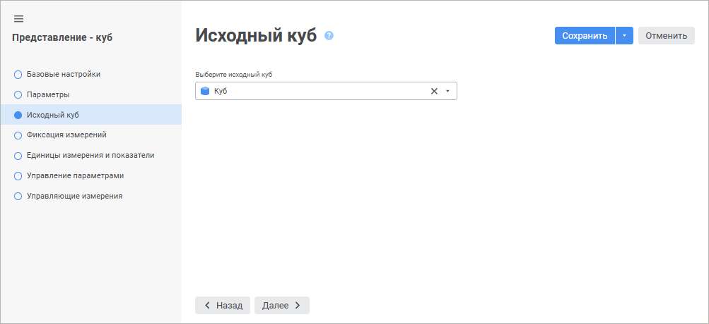

# Страница «Исходный куб»: Представление-куб

Страница «Исходный куб»: Представление-куб
-

# Исходный куб

На странице «Исходный куб» выбирается
 куб, на основе которого будет построен представление-куб.

Примечание.
 Если в качестве исходного куба был выбран куб с [настроенной
 возможностью привязки вложений](../Master_Standart/UiMd_Cube_CreateCube_Master_Standart_2.htm), то и представление-куб тоже будет
 иметь такую возможность.

	 Веб-приложение Настольное приложение

		

		

Выберите исходный куб в раскрывающемся списке.

Для быстрого выбора объекта в поле для поиска введите его название/идентификатор/ключ,
 в зависимости от настроек отображения. Поиск будет выполняться автоматически
 по мере ввода текста. Список будет содержать объекты, наименования/идентификаторы/ключи
 которых содержат вводимый текст.

Для настройки отображения объектов репозитория в списке нажмите кнопку
  «Отображение
 объекта» и выберите в раскрывающемся меню вариант отображения:

	- Наименование. Объекты
	 отображаются под своими наименованиями. Вариант по умолчанию;

	- Идентификатор. Объекты
	 отображаются под своими идентификаторами;

	- Ключ. Объекты отображаются
	 под своими ключами.

Выбрать можно несколько вариантов. Идентификатор и ключ будут указаны
 в скобках.

Для сброса отметки выбранных объектов нажмите кнопку 
 «Очистить».

Примечание.
 Настройка отображения объекта доступна в веб-приложении.

При изменении состава измерений в кубе-источнике произойдет обновление
 состава измерений в кубе-представлении.

См. также:

[Представление-куб](UiMd_Cube_CreateCube_Master_Conception.htm)

		Справочная
		 система на версию 10.9
		 от 18/08/2025,
		 © ООО «ФОРСАЙТ»,
