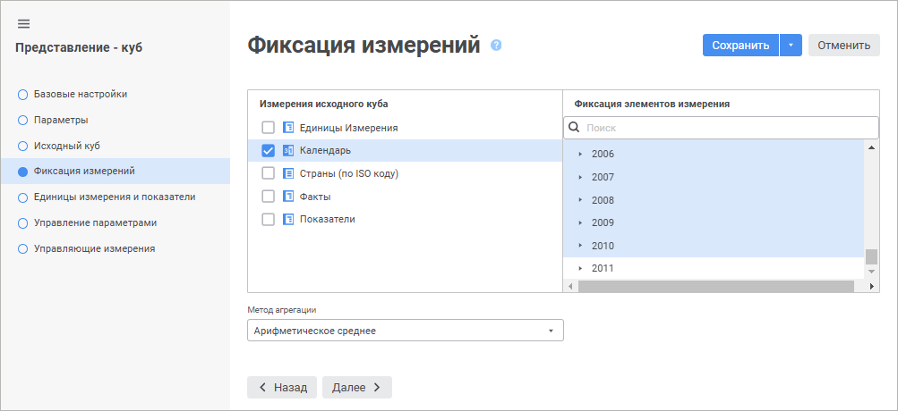

# Страница «Фиксация измерений»: Представление-куб

Страница «Фиксация измерений»: Представление-куб
-

# Фиксация измерений

Представление-куб является способом отображения данных исходного куба
 путём фиксации одного или нескольких его измерений. Фиксация измерений
 заключается в выборе элемента, по которому будут извлекаться данные. При
 необходимости для фиксации измерения выделите несколько его элементов.
 В этом случае будет настроена агрегация данных по этим элементам.

	 Веб-приложение Настольное приложение

		

		В поле «Измерения исходного
		 куба» выберите справочник, элементы которого необходимо
		 зафиксировать. Затем для выбранного справочника установите флажок
		 и установите отметку на необходимом элементе справочника в поле
		 «Фиксация элементов измерения».

		Примечание.
		 После создания куба-представления все измерения с элементом по
		 умолчанию, добавленные в куб-источник, автоматически попадут в
		 куб-представление с отметкой «Зафиксировать
		 измерение» на элементе по умолчанию.

		Если в раскрывающемся списке «Метод
		 агрегации» выбрать один из методов, то будет доступна множественная
		 отметка элементов. Для выбранных элементов будет применяться [агрегация фиксированных измерений](../../Agregation.htm)
		 с использованием указанного метода.

		Зафиксированные справочники при построении отчёта на основе
		 представления-куба будут скрыты.

		

		В поле «Измерения исходного
		 куба» выберите справочник, элементы которого необходимо
		 зафиксировать. Затем для выбранного справочника установите флажок
		 «Зафиксировать измерение»
		 и установите отметку на необходимом элементе справочника.

		Примечание.
		 После создания куба-представления все измерения с элементом по
		 умолчанию, добавленные в куб-источник, автоматически попадут в
		 куб-представление с отметкой «Зафиксировать
		 измерение» на элементе по умолчанию.

		Если в раскрывающемся списке «Метод
		 агрегации» выбрать один из методов, то будет доступна множественная
		 отметка элементов. Для выбранных элементов будет применяться [агрегация фиксированных измерений](../../Agregation.htm)
		 с использованием указанного метода.

		Зафиксированные справочники при построении отчёта на основе
		 представления-куба будут скрыты.

		Для изменения порядка расположения измерений используйте кнопки
		 «Выше» и «Ниже».
		 Данный порядок влияет на расположение измерений при построении
		 куба. Первое измерение, не зафиксированное в данном списке, при
		 построении будет расположено по столбцам, второе - по строкам.
		 Все остальные измерения, не зафиксированные в списке, в отчете
		 попадут в группу «Фиксированные».

См. также:

[Представление-куб](UiMd_Cube_CreateCube_Master_Conception.htm)

		Справочная
		 система на версию 10.9
		 от 18/08/2025,
		 © ООО «ФОРСАЙТ»,
