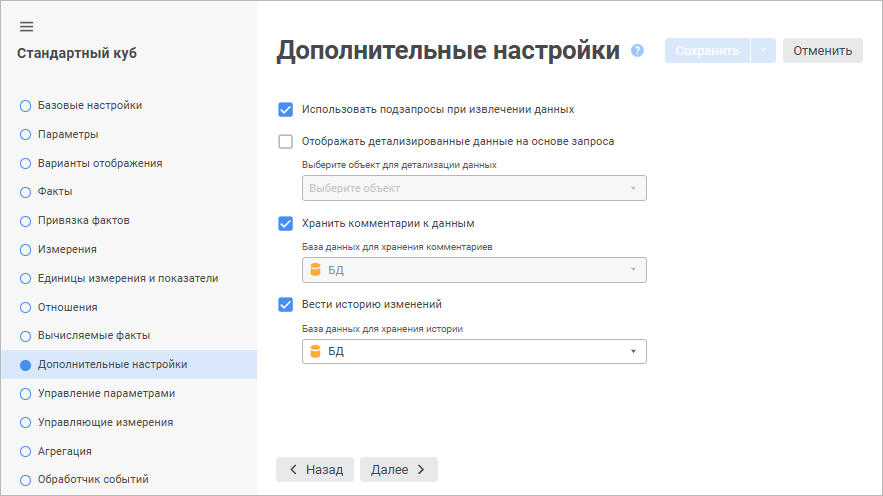

# Страница «Дополнительные настройки»: Стандартный куб

Страница «Дополнительные настройки»: Стандартный куб
-

# Дополнительные настройки

На странице «Дополнительные настройки»
 в веб-приложении настраиваются параметры для работы с данными стандартного
 куба.

Примечание.
 Страница «Дополнительные настройки»
 доступна только в веб-приложении.

[Использование
 подзапросов при извлечении данных](javascript:TextPopup(this))

	При использовании куба на основе запроса флажок «Использовать
	 подзапросы при извлечении данных» необходим для реализации
	 агрегации фактов. По умолчанию флажок «Использовать
	 подзапросы при извлечении данных» установлен.

	Подзапросы актуальны для использования в тех случаях, когда источники
	 куба построены на сложных запросах, оперирующих большим количеством
	 полей и производящим какие-либо вычисления. В кубе при этом требуется
	 использовать только часть полей источника и производить собственные
	 вычисления или агрегацию данных.

	Для извлечения данных при построении куба формируется запрос вида:

		- с использованием подзапросов:

	select
	 a.* from (select
	 a.ID,a.VALUE,a.VDATE,... from
	 <TableName> a) a where
	 ((a.VDATE in (TO_DATE('1995-01-01','YYYY-MM-DD'),...))) and
	 ((a.ID in (1,...))) and ...

		- без использования подзапросов:

	select
	 a.ID,a.VALUE,a.VDATE,... from
	 <TableName> a where
	 ((a.VDATE in (TO_DATE('1995-01-01','YYYY-MM-DD'),...)))
	 and ((a.ID in (1,...)))...

	При использовании подзапросов необходимо помнить о том, что каждый
	 дополнительный уровень вложенности подзапросов увеличивает время выполнения
	 всего запроса. Общая вложенность и количество подзапросов зависит
	 от количества источников и измерений в кубе.

[Отображение
 детализированные данные на основе запроса](javascript:TextPopup(this))

	Если для фактов настроена [агрегация](UiMd_Cube_CreateCube_Master_Standart_2.htm),
	 то при работе с данными в различных инструментах платформы «Форсайт. Аналитическая платформа»
	 также будет доступна операция [детализации](UiAnalyticalArea.chm::/Working_with_table_data/Drill_down.htm#agregation)
	 данных. Если агрегация не настроена, то [детализация](UiAnalyticalArea.chm::/Working_with_table_data/Drill_down.htm#query)
	 может быть организована с использованием пользовательского SQL-запроса.

	Для включения возможности детализации до реляционных данных выполните
	 действия:

		- Установите флажок «Отображать
		 детализированные данные на основе запроса».

		- Выберите необходимый запрос в раскрывающемся списке.

Для быстрого выбора объекта в поле для поиска введите его название/идентификатор/ключ,
 в зависимости от настроек отображения. Поиск будет выполняться автоматически
 по мере ввода текста. Список будет содержать объекты, наименования/идентификаторы/ключи
 которых содержат вводимый текст.

Для настройки отображения объектов репозитория в списке нажмите кнопку
  «Отображение
 объекта» и выберите в раскрывающемся меню вариант отображения:

	- Наименование. Объекты
	 отображаются под своими наименованиями. Вариант по умолчанию;

	- Идентификатор. Объекты
	 отображаются под своими идентификаторами;

	- Ключ. Объекты отображаются
	 под своими ключами.

Выбрать можно несколько вариантов. Идентификатор и ключ будут указаны
 в скобках.

Для сброса отметки выбранных объектов нажмите кнопку 
 «Очистить».

	Запрос должен отвечать требованиям:

		- наименования полей, которые будут получены в результате
		 выполнения запроса, должны совпадать с идентификаторами полей,
		 которые привязаны к атрибутам справочников и фактам в кубе;

		- количество полей, которые будут получены в результате выполнения
		 запроса, должно быть не меньше чем количество полей источника
		 данных, которые привязаны к атрибутам справочников и фактам в
		 кубе.

	Если используется параметрический запрос, то его параметры можно
	 связывать с параметрами куба. Привязка осуществляется на странице
	 «[Управление параметрами](UiMd_Cube_CreateCube_Master_Standart_manage_param.htm)».

[Хранение
 комментариев к данным](javascript:TextPopup(this))

	Для включения возможности оставлять комментарии к ячейкам:

		- Установите флажок «Хранить
		 комментарии к данным».

		- Выберите в раскрывающемся списке базу данных для хранения
		 комментариев. По умолчанию выбрана база данных, установленная
		 в репозитории [по
		 умолчанию](UiNav.chm::/02_Navigator/Repo_Default.htm).
		 Выбрать базу данных для хранения можно только один раз при первой
		 установке флажка.

	Примечание.
	 Если для репозитория не установлена [база данных по умолчанию](UiNav.chm::/02_Navigator/Repo_Default.htm), выбор базы данных для хранения комментариев
	 будет недоступен.

Для быстрого выбора объекта в поле для поиска введите его название/идентификатор/ключ,
 в зависимости от настроек отображения. Поиск будет выполняться автоматически
 по мере ввода текста. Список будет содержать объекты, наименования/идентификаторы/ключи
 которых содержат вводимый текст.

Для настройки отображения объектов репозитория в списке нажмите кнопку
  «Отображение
 объекта» и выберите в раскрывающемся меню вариант отображения:

	- Наименование. Объекты
	 отображаются под своими наименованиями. Вариант по умолчанию;

	- Идентификатор. Объекты
	 отображаются под своими идентификаторами;

	- Ключ. Объекты отображаются
	 под своими ключами.

Выбрать можно несколько вариантов. Идентификатор и ключ будут указаны
 в скобках.

Для сброса отметки выбранных объектов нажмите кнопку 
 «Очистить».

	После сохранения настроек при использовании куба в качестве источника
	 для [регламентных
	 отчётов](uireport.chm::/Web/Table/Work/Comment.htm) и [форм ввода](dataentryforms.chm::/Web/Common/Comment.htm)
	 будет доступно добавление комментариев.

	Для отключения возможности добавления комментариев снимите флажок
	 «Хранить комментарии к данным».
	 После подтверждения действия комментарии будут удалены во всех объектах
	 которые использовали куб в качестве источника.

	При добавлении, удалении или изменении типа [фактов
	 куба](UiMd_Cube_CreateCube_Master_Standart_1.htm), изменении [привязки
	 полей источников](UiMd_Cube_CreateCube_Master_Standart_3.htm#bind_dims) данных к измерениям, изменении количества [измерений куба](UiMd_Cube_CreateCube_Master_Standart_3.htm)
	 и изменении [свойств
	 измерения](UiMd_Cube_CreateCube_Master_Standart_3.htm#properties) появится окно подтверждения действия. После подтверждения
	 действия все комментарии будут удалены, флажок «Хранить
	 комментарии к данным» будет снят.

	При копировании куба настройки хранения комментариев к данным и
	 добавленные ранее комментарии не копируются.

	Возможность хранить комментарии одновременно с использованием [единиц измерения](UiMd_Cube_CreateCube_Master_Standart_unit_dim.htm)
	 не поддерживается.

[Ведение
 истории изменений](javascript:TextPopup(this))

	Для отслеживания истории изменений значений ячейки:

		- Откройте существующий куб на [редактирование](../../Work_Cube/UiMd_Cube_Work_Cube.htm#edit).

		- Установите флажок «Вести
		 историю изменений». Флажок доступен, если все изменения
		 структуры куба сохранены,

		- Выберите в раскрывающемся списке базу данных для ведения
		 истории изменений. По умолчанию выбрана база данных, установленная
		 в репозитории [по
		 умолчанию](UiNav.chm::/02_Navigator/Repo_Default.htm).

Для быстрого выбора объекта в поле для поиска введите его название/идентификатор/ключ,
 в зависимости от настроек отображения. Поиск будет выполняться автоматически
 по мере ввода текста. Список будет содержать объекты, наименования/идентификаторы/ключи
 которых содержат вводимый текст.

Для настройки отображения объектов репозитория в списке нажмите кнопку
  «Отображение
 объекта» и выберите в раскрывающемся меню вариант отображения:

	- Наименование. Объекты
	 отображаются под своими наименованиями. Вариант по умолчанию;

	- Идентификатор. Объекты
	 отображаются под своими идентификаторами;

	- Ключ. Объекты отображаются
	 под своими ключами.

Выбрать можно несколько вариантов. Идентификатор и ключ будут указаны
 в скобках.

Для сброса отметки выбранных объектов нажмите кнопку 
 «Очистить».

	После сохранения настроек в кубе будет доступно отслеживание истории
	 изменений.

	Для отключения отслеживания истории изменений снимите флажок «Вести историю изменений». После
	 подтверждения действия история будет удалена во всех объектах которые
	 использовали куб в качестве источника.

	При изменении: выбранной базы данных, [справочника
	 фактов](UiMd_Cube_CreateCube_Master_Standart_1.htm#exist), [типа
	 фактов](UiMd_Cube_CreateCube_Master_Standart_1.htm), [привязки
	 фактов](UiMd_Cube_CreateCube_Master_Standart_2.htm#bind_facts), [привязки
	 полей источников](UiMd_Cube_CreateCube_Master_Standart_3.htm#bind_dims) данных к измерениям; [удалении
	 факта](UiMd_Cube_CreateCube_Master_Standart_1.htm#delete) или [источника](UiMd_Cube_CreateCube_Master_Standart_2.htm#delete),
	 для которого задана связь с фактом, [настройке
	 агрегации фактов](UiMd_Cube_CreateCube_Master_Standart_2.htm#agregation) появится окно подтверждения действия. После подтверждения
	 действия история будет удалена, флажок «Вести
	 историю изменений» будет снят.

	При копировании куба настройки отслеживания истории изменений и
	 сама история не копируются.

	Возможность ведения истории изменений одновременно с использованием
	 [единиц
	 измерения](UiMd_Cube_CreateCube_Master_Standart_unit_dim.htm) не поддерживается.

См. также:

[Стандартный куб](UiMd_Cube_CreateCube_Master_Standart.htm)

		Справочная
		 система на версию 10.9
		 от 18/08/2025,
		 © ООО «ФОРСАЙТ»,
