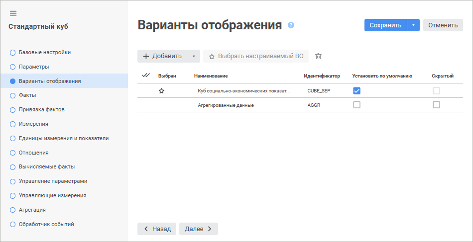

# Страница «Варианты отображения»: Стандартный куб

Страница «Варианты отображения»: Стандартный куб
-

# Варианты отображения

На странице «Варианты отображения»
 настраиваются параметры отображения куба. По умолчанию у куба есть один
 вариант отображения, наименование и идентификатор которого совпадают с
 наименованием и идентификатором самого куба. Выбранный вариант отображения
 используется при открытии куба на просмотр в инструменте «Аналитические
 запросы (OLAP)» и доступен для переключения на вкладке «[Параметры
 источников данных](UiExpress.chm::/purpose/DataSourceParam.htm)» боковой панели.

Примечание.
 Страница «Варианты отображения»
 доступна только в веб-приложении. В настольном приложении варианты отображения
 куба настраиваются на странице «[Агрегация](UiMd_Cube_CreateCube_Master_Standart_7.htm#agr)».

Для каждого варианта отображения задаются соответствующие настройки
 на страницах: «[Факты](UiMd_Cube_CreateCube_Master_Standart_1.htm)»,
 «[Привязка
 фактов](UiMd_Cube_CreateCube_Master_Standart_2.htm)», «[Измерения](UiMd_Cube_CreateCube_Master_Standart_3.htm)»,
 «[Единицы
 измерения и показатели](UiMd_Cube_CreateCube_Master_Standart_unit_dim.htm)», «[Отношения](UiMd_Cube_CreateCube_Master_Standart_4.htm)»,
 «[Вычисляемые
 факты](UiMd_Cube_CreateCube_Master_Standart_5.htm)», «[Управление
 параметрами](UiMd_Cube_CreateCube_Master_Standart_manage_param.htm)», «[Управляющие
 измерения](UiMd_Cube_CreateCube_Master_Standart_managed_dim.htm)», «[Агрегация](UiMd_Cube_CreateCube_Master_Standart_7.htm)»,
 «[Обработчик
 событий](uimd_cube_createcube_master_standart_8.htm)». В зависимости от выбранного настраиваемого варианта
 отображения настройки отличаются.

[Добавление варианта
 отображения](javascript:TextPopup(this))

	Для добавления варианта отображения:

		- Нажмите кнопку 
		 «Добавить» или выберите
		 существующий вариант отображения в раскрывающемся меню кнопки.
		 После чего в списке вариантов отображения будет добавлена новая
		 строка. При выборе существующего варианта отображения будет добавлена
		 его копия.

		- Задайте параметры:

			- Наименование.
			 Введите краткое описание варианта отображения куба. По умолчанию
			 задано наименование «ITEM1»;

			- Идентификатор.
			 Введите последовательность букв латинского алфавита, цифр
			 и знаков подчёркивания, начинающуюся с буквы. Идентификатор
			 должен быть уникальным. По умолчанию задан идентификатор ITEM;

			- Установить по умолчанию.
			 Установите флажок для использования варианта отображения по
			 умолчанию. Данный вариант отображения будет использоваться
			 при открытии куба на просмотр в инструменте «Аналитические
			 запросы (OLAP)». По умолчанию флажок установлен напротив
			 варианта отображения, наименование и идентификатор которого
			 совпадают с наименованием и идентификатором самого куба;

			- Скрытый. Установите
			 флажок для скрытия варианта отображения. Данный вариант отображения
			 будет недоступен для выбора при работе с кубом в инструменте
			 «Аналитические запросы (OLAP)».
			 По умолчанию флажок снят.

	После выполнения действий будет добавлен вариант отображения.

[Изменение настраиваемого
 варианта отображения](javascript:TextPopup(this))

	Для изменения настраиваемого варианта отображения:

		- Выберите вариант отображения.

		- Нажмите кнопку 
		 «Выбрать настраиваемый ВО».

	После выполнения действий будет изменён настраиваемый вариант отображения.
	 Для текущего настраиваемого варианта отображения в столбце «Выбран» содержится пиктограмма .

[Редактирования
 варианта отображения](javascript:TextPopup(this))

	Для редактирования варианта отображения измените значения параметров
	 в соответствующих столбцах.

[Удаление варианта
 отображения](javascript:TextPopup(this))

	Для удаления выбранного варианта отображения нажмите кнопку  «Удалить».

	Примечание.
	 Удаление доступно, если в кубе содержится два или более варианта отображения.

См. также:

[Стандартный куб](UiMd_Cube_CreateCube_Master_Standart.htm)

		Справочная
		 система на версию 10.9
		 от 18/08/2025,
		 © ООО «ФОРСАЙТ»,
