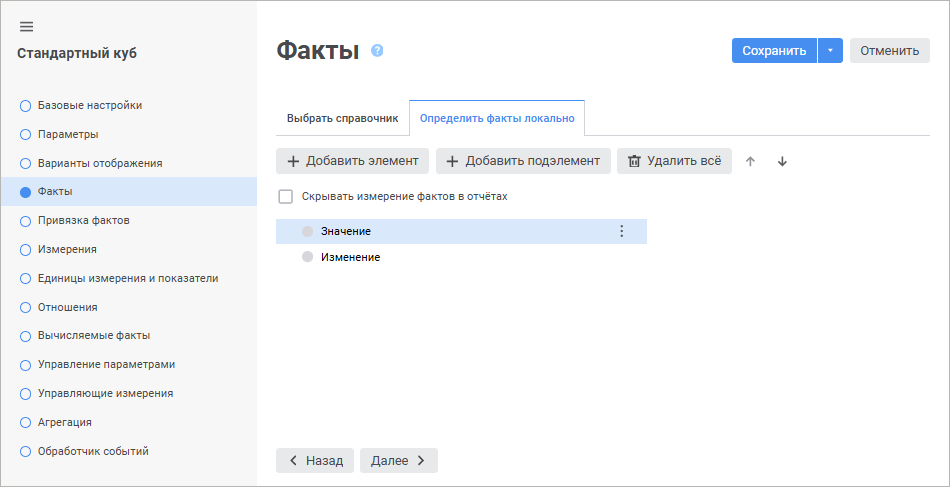

# Страница «Факты»: Стандартный куб

Страница «Факты»: Стандартный куб
-

# Факты куба

Факты описывают те данные, которые
 пользователь увидит при построении куба. Например, это может быть набор
 каких-либо фактических и эталонных значений по каким-либо показателям,
 или значения, полученные при расчете по заданным формулам.

[Измерения
 куба](UiMd_Cube_CreateCube_Master_Standart_3.htm) определяют координатные оси в кубе, а факты
 представляют различные значения в каждой точке полученной системы координат.
 Именно эти значения будет видеть и редактировать пользователь.

Измерение фактов можно создать вручную или использовать в качестве него
 существующий [справочник](../../../reference_book/Create.htm)
 репозитория.

Для определения списка и иерархии фактов куба перейдите на страницу
 «Факты» [мастера
 стандартного куба](UiMd_Cube_CreateCube_Master_Standart.htm).

	 Веб-приложение Настольное приложение

		

		

[Использование
 существующего справочника](javascript:TextPopup(this))

	Для использования существующего справочника в качестве измерения
	 фактов куба:

		- в веб-приложении:

			- Выберите вкладку «Выбрать
			 справочник».

			- Выберите справочник в раскрывающемся списке с доступными
			 источниками фактов.

Для быстрого выбора объекта в поле для поиска введите его название/идентификатор/ключ,
 в зависимости от настроек отображения. Поиск будет выполняться автоматически
 по мере ввода текста. Список будет содержать объекты, наименования/идентификаторы/ключи
 которых содержат вводимый текст.

Для настройки отображения объектов репозитория в списке нажмите кнопку
  «Отображение
 объекта» и выберите в раскрывающемся меню вариант отображения:

	- Наименование. Объекты
	 отображаются под своими наименованиями. Вариант по умолчанию;

	- Идентификатор. Объекты
	 отображаются под своими идентификаторами;

	- Ключ. Объекты отображаются
	 под своими ключами.

Выбрать можно несколько вариантов. Идентификатор и ключ будут указаны
 в скобках.

Для сброса отметки выбранных объектов нажмите кнопку 
 «Очистить»;

		- в настольном приложении:

			- Установите переключатель «Использовать
			 существующий справочник».

			- Выберите справочник репозитория в раскрывающемся списке.
			 Если был выбран справочник, который содержит параметры, будет
			 открыт диалог «[Установка значений параметров](uinav.chm::/02_Navigator/General_Principles_of_Work.htm#open_param_object)»,
			 в котором следует задать их значения. После задания значений
			 выбранный справочник будет открыт и его элементы будут использоваться
			 в качестве фактов куба. Для изменения значений параметров
			 справочника нажмите кнопку «Значения
			 параметров».

	Если список фактов для куба ранее был задан локально, то будет выдано
	 предупреждение.

[Использование
 локального измерения фактов](javascript:TextPopup(this))

	Для создания локального измерения фактов:

		- Используйте локальное измерение фактов:

			- в веб-приложении выберите вкладку «Определить
			 факты локально»;

			- в настольном приложении установите переключатель «Определить список фактов и их иерархию
			 локально для куба».

		- Добавьте элементы с помощью кнопок «Добавить
		 элемент»/«Добавить подэлемент».

[Переименование
 фактов](javascript:TextPopup(this))

	Для переименования выбранного факта:

		- в веб-приложении:

			- выполните команду «Переименовать» в раскрывающемся
			 меню кнопки  «Действия»;

			- дважды щёлкните по факту;

		- в настольном приложении нажмите кнопку «Переименовать».

[Удаление
 фактов](javascript:TextPopup(this))

	Для удаления выбранного факта:

		- в веб-приложении выполните команду «Удалить»
		 в раскрывающемся меню кнопки  «Действия»;

		- в настольном приложении нажмите кнопку «Удалить».

	Для удаления всех фактов:

		- в веб-приложении нажмите кнопку  «Удалить всё»;

		- в настольном приложении выберите факт и выполните команду
		 «Удалить все элементы»
		 в раскрывающемся меню кнопки «Удалить».

[Изменение порядка
 фактов](javascript:TextPopup(this))

	Для перемещения выбранного факта на одну позицию вверх:

		- в веб-приложении нажмите кнопку 
		 «Вверх»;

		- в настольном приложении нажмите кнопку «Вверх».

	Для перемещения выбранного факта на одну позицию вниз:

		- в веб-приложении нажмите кнопку 
		 «Вниз»;

		- в настольном приложении нажмите кнопку «Вниз».

[Скрытие измерений
 фактов](javascript:TextPopup(this))

	Для скрытия измерений фактов при построении куба установите флажок
	 «Скрывать измерение фактов в отчетах».
	 При этом фактические значения будут отображаться/редактироваться по
	 первому факту.

	Примечание.
	 Настройка актуальна, если в измерении фактов имеется только один элемент.

См. также:

[Стандартный куб](UiMd_Cube_CreateCube_Master_Standart.htm)

		Справочная
		 система на версию 10.9
		 от 18/08/2025,
		 © ООО «ФОРСАЙТ»,
