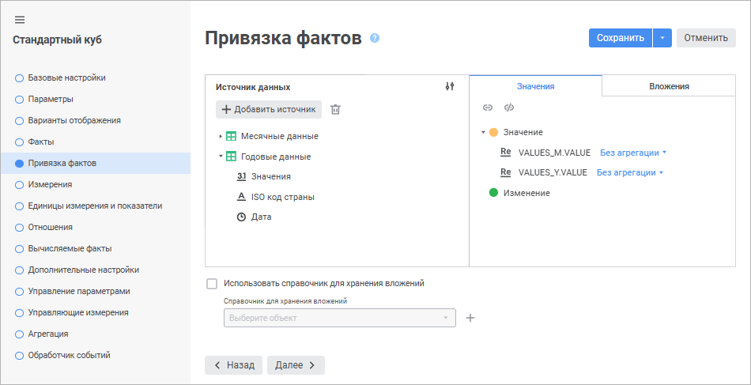
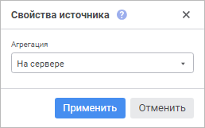
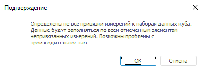
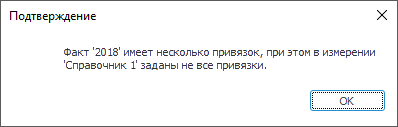

# Страница «Привязка фактов»: Стандартный куб

Страница «Привязка фактов»: Стандартный куб
-

# Привязка фактов куба

На странице «Привязка фактов»
 происходит привязка полей источников данных к фактам куба.

Данные куба хранятся в реляционных источниках данных. Источник содержит
 записи о ячейках куба: набор полей, однозначно идентифицирующих положение
 ячейки в кубе, и поля, содержащие данные фактов.

Примечание.
 При работе с [инструментами
 анализа данных и построения отчётов](DataAnalysis.chm::/DataAnalysis_Title.htm) для сохранения
 данных в справочник НСИ, имеющий [множественные
 значения](../../../reference_book/Master_RDS_reference_book/Attributes/Attribute.htm#multiple_values) атрибутов, выберите справочник в качестве источника и свяжите
 атрибуты справочника с фактами куба. Атрибут «Ключ»
 необходимо связать с [измерением
 куба](UiMd_Cube_CreateCube_Master_Standart_3.htm).

Для проецирования структуры куба на источник данных сопоставьте факты
 куба и поля источника. Разные факты куба могут быть связаны с полями различных
 источников данных и различными календарными уровнями.

	Веб-приложение Настольное приложение

		

		

[Добавление источника
 данных](javascript:TextPopup(this))

	Для добавления реляционного источника в область «Источники
	 данных»:

		- в веб-приложении нажмите кнопку  «Добавить источник» и выберите
		 в открывшемся окне необходимый источник данных.

Для быстрого выбора объекта в поле для поиска введите его название/идентификатор/ключ,
 в зависимости от настроек отображения. Поиск будет выполняться автоматически
 по мере ввода текста. Список будет содержать объекты, наименования/идентификаторы/ключи
 которых содержат вводимый текст.

Для настройки отображения объектов репозитория в списке нажмите кнопку
  «Отображение
 объекта» и выберите в раскрывающемся меню вариант отображения:

	- Наименование. Объекты
	 отображаются под своими наименованиями. Вариант по умолчанию;

	- Идентификатор. Объекты
	 отображаются под своими идентификаторами;

	- Ключ. Объекты отображаются
	 под своими ключами.

Выбрать можно несколько вариантов. Идентификатор и ключ будут указаны
 в скобках.

Для сброса отметки выбранных объектов нажмите кнопку 
 «Очистить».

		- в настольном приложении:

			- нажмите кнопку «Добавить»
			 и выберите необходимый источник данных;

			- выполните команду «Добавить
			 источник» в контекстном меню области «Источники
			 данных» и выберите необходимый источник данных;

			- перетащите необходимый источник данных из [навигатора
			 объектов](GetStarted.chm::/Interface/Interface_Navigator.htm) в данную область с помощью метода
			 Drag&Drop.

[Удаление
 источника данных](javascript:TextPopup(this))

	Для удаления выбранного источника данных из области «Источники
	 данных»:

		- в веб-приложении нажмите кнопку  «Удалить»;

		- в настольном приложении:

			- нажмите кнопку «Удалить»;

			- выполните команду «Удалить
			 источник» в контекстном меню источника;

			- нажмите сочетание клавиш CTRL+DELETE.

	Примечание.
	 Если одно из полей источника данных связано с фактом куба, то при
	 удалении будет выдан запрос на подтверждение операции.

[Управление отображением
 источников](javascript:TextPopup(this))

	Для настройки отображения дерева объектов в поле «Источник
	 данных»/«Источники данных»:

		- в веб-приложении выберите способ отображения источников
		 в раскрывающемся меню кнопки  «Отображение источников» поля
		 «Источник данных»:

			- Наименование.
			 По умолчанию. Отображаются только наименования объектов;

			- Идентификатор.
			 Отображаются только идентификаторы объектов;

			- Наименование и идентификатор.
			 Отображаются наименования и идентификаторы объектов;

		- в настольном приложении выберите способ отображения источников
		 в контекстном меню поля «Источники
		 данных»:

			- Отображать наименования.
			 По умолчанию. Отображаются только наименования объектов;

			- Отображать идентификаторы.
			 Отображаются только идентификаторы объектов;

			- Отображать наименования
			 и идентификаторы. Отображаются наименования и идентификаторы
			 объектов.

[Привязка
 фактов к полям источников](javascript:TextPopup(this))

	Для определения привязки полей:

		- Выберите реляционный источник данных в области «Источники
		 данных», разверните его структуру и выделите поле, которое
		 необходимо сопоставить факту куба.

		- Выполните одно из действий:

			- выделите факт куба, к которому необходимо произвести
			 привязку поля, в области «Значения»
			 в веб-приложении или в списке «Значения»
			 области «Факты куба»
			 в настольном приложении и нажмите кнопку 
			 «Связать»;

			- перетащите поле из области «Источники
			 данных» на факт куба в области «Значения»
			 в веб-приложении или в списке «Значения»
			 области «Факты куба»
			 в настольном приложении с помощью механизма Drag&Drop.

	Будет выполнена привязка полей к фактам куба.

	Для удаления привязки факта куба выберите факт в списке и нажмите
	 кнопку  «Отвязать».

	Если куб будет использоваться как источник для таблицы, в ячейках
	 которой будут [прикрепляться
	 вложения](UiAnalyticalArea.chm::/Attachments.htm), то сначала выберите справочник для хранения
	 вложений, а затем дополнительно выполните привязку поля источника
	 к факту куба в области «Вложения»
	 в веб-приложении или в списке «Вложения»
	 области «Факты куба» в настольном
	 приложении. Привязка поля вложения доступна, если к факту уже привязано
	 поле значения. Если для фактов настроена агрегация, то привязка полей
	 вложений недоступна.

	Примечание.
	 В реляционном источнике данных должно быть предусмотрено поле для
	 хранения ссылок на вложения. Поле должно быть числовым.

[Настройка вычисляемых
 выражений для привязанных фактов](javascript:TextPopup(this))

	Для настройки выражений для привязанных фактов:

		- В области «Факты куба»
		 выполните одно из действий:

			- в веб-приложении:

				- нажмите кнопку  «Редактор выражения»
				 около необходимого привязанного факта;

				- дважды щёлкните по необходимому привязанному факту;

			- в настольном приложении дважды щёлкните по необходимому
			 привязанному факту.

		- В [редакторе выражения](#formula) настройте формулу
		 для вычисления факта.

	В результате для привязанных фактов будут настроены выражения.

[Настройка
 агрегации измерения фактов](javascript:TextPopup(this))

	Если в кубе какие-либо поля источника [не
	 привязаны к измерениям](UiMd_Cube_CreateCube_Master_Standart_3.htm), то может возникнуть ситуация, когда по
	 одной координате куба будут доступны несколько значений факта. В этом
	 случае для однозначного представления данных по факту можно задать
	 [агрегацию](UiMd_Cube_CreateCube_Master_Standart_7.htm),
	 которая будет применяться для получения какого-либо одного значения.
	 Агрегация предназначена для объединения нескольких значений с использованием
	 различных математических функций, например, суммы, среднего арифметического
	 и т.д.

	Для каждой привязки фактов можно настроить свой метод агрегации.
	 Для этого в области «Значения»
	 в веб-приложении или в области «Факты
	 куба» в настольном приложении:

		- Выделите привязку факта.

		- Выберите в раскрывающемся списке метод агрегации:

			- Без агрегации.
			 Агрегация не производится, выбирается последнее непустое значение
			 (порядок возврата значений выбирается самой СУБД);

			- Сумма. Суммируются
			 значения факта;

			- Количество значений.
			 Определяется количество значений факта;

			- Арифметическое среднее.
			 Определяется среднее значение факта;

			- Минимум. Выбирается
			 минимальное значение факта;

			- Максимум. Выбирается
			 максимальное значение факта;

			- Стандартное отклонение
			 по выборке. Рассчитывается стандартное отклонение для
			 значений факта;

			- Медиана. Определяется
			 медиана для значений факта;

			- Стандартное отклонение
			 по генеральной совокупности. Рассчитывается стандартное
			 отклонение для всех значений факта;

			- Количество различных
			 значений. Определяется количество уникальных значений
			 факта.

	Для настройки агрегации данных по иерархии различных уровней измерений
	 куба перейдите на страницу «[Агрегация
	 данных](UiMd_Cube_CreateCube_Master_Standart_7.htm)» мастера стандартного куба.

	Примечание.
	 Для использования [методов
	 агрегации](../../Agregation.htm#fix_method), определенных для фактов куба, в фиксированных измерениях
	 установите флажок «[Агрегировать
	 данные по измерениям с полной отметкой](UiMd_Cube_CreateCube_Master_Standart_3.htm)» на странице
	 «[Измерения](UiMd_Cube_CreateCube_Master_Standart_3.htm)».

	[Агрегация](../../Agregation.htm) измерения фактов может
	 производиться:

		- На сервере. По умолчанию.
		 Производится сервером СУБД на этапе извлечения данных из источников
		 куба;

		- На клиенте. Выполняется
		 с помощью «Форсайт. Аналитическая платформа»
		 на клиентском компьютере после извлечения всех данных с сервера.

	Для изменения места вычисления агрегации:

		- в веб-приложении:

			- Выполните команду 
			 «Свойства источника»
			 в раскрывающемся меню кнопки  «Действия»,
			 расположенной напротив источника данных. После чего будет
			 открыто окно «Свойства источника»:

	

			- Выберите в раскрывающемся списке способ агрегации.

			- Нажмите кнопку «Применить».

		- в настольном приложении:

			- Нажмите кнопку  «Показать свойства источника»
			 в области «Источники данных».

			- Выберите способ агрегации с помощью соответствующих
			 переключателей в области «Свойства
			 источника».

	По умолчанию область «Свойства
	 источника» скрыта.

	Особенности работы при настроенной агрегации измерения фактов:

		- в таблице доступна [детализация](UiAnalyticalArea.chm::/Working_with_table_data/Drill_down.htm#agregation)
		 в реляционные данные, отображающая все поля источника данных,
		 которые использовались для получения значения ячейки;

		- при настройке вывода [итоговых
		 значений](uireport.chm::/desktop/AreaData/Param/UiReport_AreaData_Param_Totals.htm) по строкам/столбцам на основании данных
		 источника для области данных регламентного отчета будет доступен
		 метод вычисления итогов «Общий
		 итог»;

		- при использовании куба, построенного на основе запроса,
		 необходимо установить флажок «Использовать
		 подзапросы при извлечении данных».

[Использование
 подзапросов при извлечении данных](javascript:TextPopup(this))

	При использовании куба на основе запроса флажок «Использовать
	 подзапросы при извлечении данных» необходим для реализации
	 агрегации фактов. По умолчанию флажок «Использовать
	 подзапросы при извлечении данных» установлен.

	Примечание.
	 На странице «Привязка фактов»
	 мастера стандартного куба флажок «Использовать
	 подзапросы при извлечении данных» доступен только в настольном
	 приложении. В веб-приложении возможность использования подзапросов
	 при извлечении данных задаётся на странице «[Дополнительные настройки](Additional_Settings.htm)»
	 мастера стандартного куба.

	Подзапросы актуальны для использования в тех случаях, когда источники
	 куба построены на сложных запросах, оперирующих большим количеством
	 полей и производящим какие-либо вычисления. В кубе при этом требуется
	 использовать только часть полей источника и производить собственные
	 вычисления или агрегацию данных.

	Для извлечения данных при построении куба формируется запрос вида:

		- с использованием подзапросов:

	select
	 a.* from (select
	 a.ID,a.VALUE,a.VDATE,... from
	 <TableName> a) a where
	 ((a.VDATE in (TO_DATE('1995-01-01','YYYY-MM-DD'),...))) and
	 ((a.ID in (1,...))) and ...

		- без использования подзапросов:

	select
	 a.ID,a.VALUE,a.VDATE,... from
	 <TableName> a where
	 ((a.VDATE in (TO_DATE('1995-01-01','YYYY-MM-DD'),...)))
	 and ((a.ID in (1,...)))...

	При использовании подзапросов необходимо помнить о том, что каждый
	 дополнительный уровень вложенности подзапросов увеличивает время выполнения
	 всего запроса. Общая вложенность и количество подзапросов зависит
	 от количества источников и измерений в кубе.

[Отображение
 детализированных данных на основе запроса](javascript:TextPopup(this))

	Если для фактов настроена [агрегация](UiMd_Cube_CreateCube_Master_Standart_2.htm),
	 то при работе с данными в различных инструментах платформы «Форсайт. Аналитическая платформа»
	 также будет доступна операция [детализации](UiAnalyticalArea.chm::/Working_with_table_data/Drill_down.htm#agregation)
	 данных. Если агрегация не настроена, то [детализация](UiAnalyticalArea.chm::/Working_with_table_data/Drill_down.htm#query)
	 может быть организована с использованием пользовательского SQL-запроса.

	Для включения возможности детализации до реляционных данных выполните
	 действия:

		- Установите флажок «Отображать
		 детализированные данные на основе запроса».

	Примечание.
	 На странице «Привязка фактов»
	 мастера стандартного куба флажок «Отображать
	 детализированные данные на основе запросы» доступен только
	 в настольном приложении. В веб-приложении возможность отображения
	 детализированных данных на основе запроса задаётся на странице «[Дополнительные
	 настройки](Additional_Settings.htm)» мастера стандартного куба.

		- Из раскрывающегося списка выберите необходимый запрос.

	Запрос должен отвечать требованиям:

		- наименования полей, которые будут получены в результате
		 выполнения запроса, должны совпадать с идентификаторами полей,
		 которые привязаны к атрибутам справочников и фактам в кубе;

		- количество полей, которые будут получены в результате выполнения
		 запроса, должно быть не меньше чем количество полей источника
		 данных, которые привязаны к атрибутам справочников и фактам в
		 кубе.

	Если используется параметрический запрос, то его параметры можно
	 связывать с параметрами куба. Привязка осуществляется на странице
	 «[Управление параметрами](UiMd_Cube_CreateCube_Master_Standart_manage_param.htm)».

[Хранение
 комментариев к данным](javascript:TextPopup(this))

	Для добавления комментариев к данным у пользователя должны быть
	 [права](Admin.chm::/03_Admin/Admin_AdminObjects.htm)
	 на чтение и редактирование данных:

		- если у пользователя есть права только на чтение, то ему
		 доступен просмотр комментариев;

		- если у пользователя есть права на редактирование, то ему
		 доступно добавление и просмотр комментариев.

	Для добавления возможности задавать комментарии к данным с автоматической
	 привязкой фактов установите флажок «Хранить
	 комментарии к данным». Будет создан объект для хранения комментариев.

	Примечание.
	 На странице «Привязка фактов»
	 мастера стандартного куба флажок «Хранить
	 комментарии к данным» доступен только в настольном приложении.
	 В веб-приложении возможность задавать комментарии к данным настраивается
	 на странице «[Дополнительные
	 настройки](Additional_Settings.htm)» мастера стандартного куба.

	Для удаления всех комментариев к данным снимите флажок «Хранить
	 комментарии к данным». После подтверждения действия все комментарии
	 будут удалены вместе с объектом для хранения комментариев.

	При добавлении или удалении [фактов
	 куба](UiMd_Cube_CreateCube_Master_Standart_1.htm), изменении [привязки](UiMd_Cube_CreateCube_Master_Standart_2.htm)
	 полей источников данных к измерениям, изменении количества [измерений
	 куба](UiMd_Cube_CreateCube_Master_Standart_3.htm) и изменении [свойств
	 измерения](UiMd_Cube_CreateCube_Master_Standart_3.htm#properties) появится окно подтверждения действия. После подтверждения
	 действия все комментарии будут удалены вместе с объектом хранения
	 комментариев, флажок «Хранить комментарии
	 к данным» будет снят.

	При копировании куба настройки хранения комментариев к данным и
	 добавленные ранее комментарии не копируются.

[Выбор справочника
 для хранения вложений](javascript:TextPopup(this))

	Если куб будет использоваться как источник для таблицы, в ячейках
	 которой будут [прикрепляться
	 вложения](UiAnalyticalArea.chm::/Attachments.htm) (файлы, ссылки или документы репозитория),
	 то создайте новый справочник НСИ или выберите существующий справочник
	 в раскрывающемся списке.

	Важно.
	 Для привязки вложений могут использоваться только те справочники,
	 которые созданы с помощью мастера стандартного куба. Создание и редактирование
	 такого справочника в навигаторе объектов недопустимо.

	Для создания нового справочника НСИ, в котором будут храниться вложения,
	 нажмите кнопку  «Создать».

	Справочник должен содержать системные атрибуты и следующие обязательные
	 атрибуты:

		- FILE_NAME. Имя файла
		 вложения;

		- URL. URL прикрепленной
		 ссылки;

		- TYPE. Тип вложения;

		- TIMESTAMP. Дата
		 загрузки или обновления вложения;

		- COMMENT. Комментарий
		 к вложению;

		- FILE_SIZE. Размер
		 файла вложения;

		- USER_ID. Идентификатор
		 пользователя, который добавил или обновил вложение.

	Если предполагается хранить ссылки на документы репозитория, то
	 создайте дополнительный атрибут с любым идентификатором и целым типом
	 данных.

	После выбора справочника свяжите факты с полями источника, в которых
	 будут храниться ключи элементов справочника НСИ с вложениями. Для
	 этого в области «Источники данных»
	 выделите целочисленное поле, а в области «Вложения»
	 в веб-приложении или в подгруппе «Вложения»
	 области «Факты куба» в настольном
	 приложении выделите факты и нажмите кнопку «Связать».

	Примечание.
	 Поле, привязываемое для вложения, не должно использоваться в привязках
	 значений фактов и измерений куба.

	Справочник заполняется автоматически при прикреплении вложений.

	Если в кубе настроено несколько фактов, то для хранения вложений
	 задаётся один справочник для вложений.

	Один справочник можно использовать для нескольких кубов.

	Дальнейшая работа с вложениями будет осуществляться в таблице различных
	 инструментов «Форсайт. Аналитическая платформа».
	 Более подробно читайте в подразделе «[Прикрепление вложений
	 к ячейкам](UiAnalyticalArea.chm::/Attachments.htm)».

[Отсутствие
 привязки измерений к таблице фактов](javascript:TextPopup(this))

	В случае, если факт связан не более чем с одним полем источника,
	 то есть возможность не привязывать измерения к источникам данных.
	 Измерения, которые не привязаны к полям источника, не используются
	 при выборке, но при этом могут использоваться при настройке куба,
	 например, выступать в качестве управляющих измерений для других измерений.

	Примечание.
	 Отсутствие привязок приводит к тому, что данные по всему измерению
	 размножатся. Это связано с тем, что отметка в измерении не влияет
	 на выборку данных. Данные, полученные по отметке из других измерений,
	 будут помещены на каждый элемент непривязанного измерения. По непривязанному
	 измерению данные будут одинаковы для каждого элемента.

	Если в кубе имеются непривязанные измерения, то при переходе со
	 страницы «[Измерения](UiMd_Cube_CreateCube_Master_Standart_3.htm)»
	 на следующую страницу мастера отобразится сообщение о том, что в измерениях
	 заданы не все привязки. Пример сообщения в настольном приложении:

	

	Если имеются непривязанные измерения, то рекомендуется для фактов
	 определить метод агрегации.

	Если у фактов несколько привязок, а измерения привязаны не все,
	 то сохранить куб нельзя, при этом отобразится соответствующее сообщение.
	 Пример сообщения в настольном приложении:

	

Примечание.
 При изменении [типа
 данных](../../../Table/Master/UiDb_relational_table_master_field.htm) в столбцах, которые участвуют в привязках фактов, рекомендуется
 выполнить [перепривязку фактов к полям источников](#bind_facts)
 в кубе.

## Редактор выражения

Настройка формул выполняется с помощью редактора выражения:

	- редактор выражения в настольном приложении универсален для всех
	 инструментов и объектов платформы. Описание универсального редактора
	 выражения приведено в разделе «[Создание формул и выражений](uinav.chm::/GUI/ExpressionEditor.htm)»;

	- редактор выражения в веб-приложении отличается в зависимости
	 от настраиваемого инструмента или объекта.

Окно редактора выражения для задания вычисляемых выражений для привязанных
 фактов стандартного куба в веб-приложении имеет вид:

Сформируйте формулу вычисляемого выражения для привязанного факта куба.

В формуле допускается использование операндов, арифметических операций,
 функций, цифр, знаков сравнения и круглых скобок. При этом имеются некоторые
 особенности:

	- вставка всех типов элементов, кроме цифр, может осуществляться
	 как с помощью клавиатуры, так и с помощью специальных панелей;

	- вставка цифр осуществляется только с помощью клавиатуры.

[Вставка операндов](javascript:TextPopup(this))

	Операнды отображаются на панели операндов редактора выражения:

	

	В качестве операндов используются источники данных и [параметры](../../../reference_book/Master_Table_reference_book/parameters.htm)
	 куба.

Для вставки операнда в область формул выполните одно из действий:

	- с помощью панели операндов:

		- выделите операнд и нажмите кнопку «Вставить
		 в формулу»;

		- дважды щёлкните по операнду;

		- перенесите операнд в область формул с помощью механизма
		 Drag&Drop;

	- с помощью области формул:

		- введите наименование операнда в области формул;

		- щёлкните в области формул в том месте, куда нужно вставить
		 операнд, нажмите сочетание клавиш CTRL+SHIFT и выберите на всплывающей
		 панели требуемый операнд.

Для быстрого поиска операнда начните вводить его наименование частично
 или целиком в строке поиска. После выполнения действия на панели операндов
 будут отображены те операнды, наименования которых удовлетворяют условиям
 поиска.

Для настройки отображения списка операндов используйте команды в раскрывающемся
 меню кнопки  «Настройки
 отображения»:

	- Наименование. По умолчанию.
	 Отображение только наименований операндов;

	- Идентификатор. Отображение
	 только идентификаторов операндов;

	- Наименование и идентификатор.
	 Отображение наименований и идентификаторов операндов в формате: <наименование> (<идентификатор>).

Для скрытия панели операндов нажмите кнопку  «Скрыть панель операндов», для отображения -
 нажмите кнопку  «Отобразить
 панель операндов».

[Вставка функций
 и операторов](javascript:TextPopup(this))

	Функции и операторы отображаются на панели функций и операторов
	 на соответствующих вкладках:

	

	Для вставки функции или оператора в область формул выполните одно
	 из действий:

		- с помощью панели функций и операторов:

			- выделите функцию/оператор. Отобразится панель с описанием:

	

	Нажмите кнопку «Вставить
	 в формулу»;

			- дважды щёлкните по функции/оператору;

			- перенесите функцию/оператор в область формул с помощью
			 механизма Drag&Drop;

		- с помощью области формул:

			- введите функцию/оператор в области формул;

			- щёлкните в области формул в том месте, куда нужно вставить
			 функцию/оператор, нажмите сочетание клавиш CTRL+SHIFT и выберите
			 на всплывающей панели требуемую функцию/оператор.

	Для быстрого поиска функции или оператора начните вводить функцию/оператор
	 частично или целиком в строке поиска. После выполнения действия на
	 панели функций и операторов будут отображены функции/операторы, удовлетворяющие
	 условиям поиска.

	Для скрытия панели функций и операторов нажмите кнопку  «Скрыть
	 панель функций и операторов», для отображения - нажмите
	 кнопку  «Отобразить
	 панель функций и операторов».

См. также:

[Стандартный куб](UiMd_Cube_CreateCube_Master_Standart.htm)

		Справочная
		 система на версию 10.9
		 от 18/08/2025,
		 © ООО «ФОРСАЙТ»,
