# Страница «Измерения»: Стандартный куб

Страница «Измерения»: Стандартный куб
-

# Измерения куба

На странице «Измерения» выполняется
 связь полей источников данных с измерениями куба.

Многомерная структура куба состоит из отдельных измерений. Каждое измерение
 каким-либо образом характеризует ячейку куба. В качестве измерений выступают
 справочники репозитория. Каждое измерение связывается с источником данных,
 в котором содержится информация о координатах ячеек куба. Различные блоки
 измерения можно привязать к различным источникам данных.

Примечание.
 При работе с [инструментами
 анализа данных и построения отчётов](DataAnalysis.chm::/DataAnalysis_Title.htm) для сохранения
 данных в справочник НСИ, имеющий [множественные
 значения атрибутов](../../../reference_book/Master_RDS_reference_book/Attributes/Attribute.htm#multiple_values), выберите справочник в качестве измерения куба
 и привяжите атрибут «Ключ» источника
 данных к индексу измерения куба.

Измерения должны быть связаны с теми же источниками, с которыми были
 [связаны](UiMd_Cube_CreateCube_Master_Standart_2.htm) факты
 куба.

	 Веб-приложение Настольное приложение

		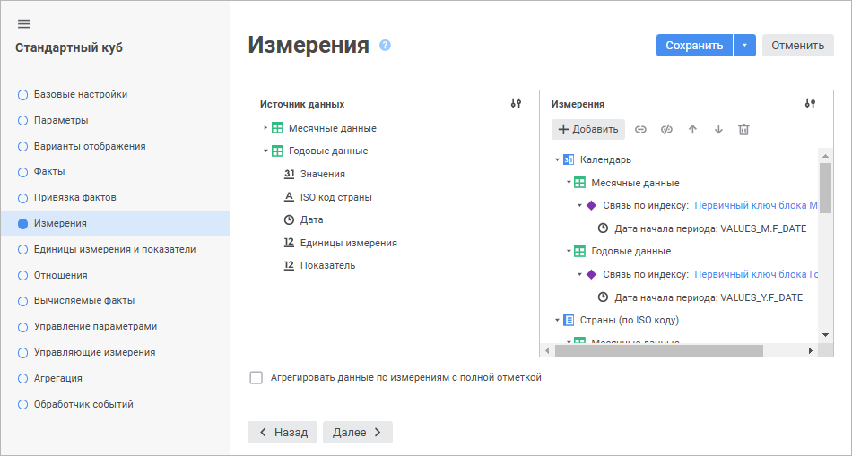

		

[Добавление
 измерения](javascript:TextPopup(this))

	При добавлении измерения в куб его структура будет представлена
	 в виде дерева в области «Измерения»/«Измерения куба». Вершиной дерева
	 является выбранный справочник. Дочерними элементами справочника являются
	 все источники данных, с которыми была установлена [связь](UiMd_Cube_CreateCube_Master_Standart_2.htm)
	 фактов куба. Значения из источников будут использоваться для получения
	 координат ячеек куба по данному измерению.

	Примечание.
	 Если привязка фактов куба установлена только для одного источника
	 данных, то этот источник не будет отображаться в структуре измерений
	 куба.

	Для добавления измерения в области «Измерения»/«Измерения куба»:

		- в веб-приложении:

			- Нажмите кнопку  «Добавить».

			- Выберите справочник
			 в окне «Выбрать объект».

Для быстрого выбора объекта в поле для поиска введите его название/идентификатор/ключ,
 в зависимости от настроек отображения. Поиск будет выполняться автоматически
 по мере ввода текста. Список будет содержать объекты, наименования/идентификаторы/ключи
 которых содержат вводимый текст.

Для настройки отображения объектов репозитория в списке нажмите кнопку
  «Отображение
 объекта» и выберите в раскрывающемся меню вариант отображения:

	- Наименование. Объекты
	 отображаются под своими наименованиями. Вариант по умолчанию;

	- Идентификатор. Объекты
	 отображаются под своими идентификаторами;

	- Ключ. Объекты отображаются
	 под своими ключами.

Выбрать можно несколько вариантов. Идентификатор и ключ будут указаны
 в скобках.

Для сброса отметки выбранных объектов нажмите кнопку 
 «Очистить»;

		- в настольном приложении:

			- нажмите кнопку «Добавить»
			 и выберите необходимый справочник;

			- перетащите справочник из [навигатора
			 объектов](GetStarted.chm::/Interface/Interface_Navigator.htm) в область «Измерения
			 куба» с помощью метода Drag&Drop;

			- выполните команду «Добавить
			 измерение» в контекстном меню области «Измерения
			 куба» и выберите необходимый справочник.

[Удаление измерения](javascript:TextPopup(this))

	Для удаления выбранного измерения в области «Измерения»/«Измерения куба»:

		- в веб-приложении нажмите кнопку  «Удалить»;

		- в настольном приложении:

			- нажмите кнопку «Удалить»;

			- выполните команду «Удалить
			 измерение» в контекстном меню измерения;

			- нажмите сочетание клавиш CTRL+DELETE.

	Примечание.
	 Если одно из полей источника данных связано с измерением куба, то
	 при нажатии кнопки «Удалить»
	 будет выдан запрос на подтверждение операции.

[Переименование
 измерения](javascript:TextPopup(this))

	Для переименования измерения в области «Измерения»/«Измерения куба»:

		- в веб-приложении откройте окно «[Свойства измерения](#properties)» и измените наименование
		 измерения в поле «Наименование»;

		- в настольном приложении:

			- выполните команду «Переименовать
			 измерение» в контекстном меню необходимого измерения;

			- щёлкните по наименованию выделенного измерения.

[Изменение порядка
 измерений](javascript:TextPopup(this))

	Для перемещения выбранного измерения на одну позицию вверх:

		- в веб-приложении нажмите кнопку  «Вверх»;

		- в настольном приложении:

			- нажмите кнопку  «Переместить
			 выше»;

			- выполните команду «Переместить
			 измерение выше» в контекстном меню измерения.

	Для перемещения выбранного измерения на одну позицию вниз:

		- в веб-приложении нажмите кнопку  «Вниз»;

		- в настольном приложении:

			- нажмите кнопку  «Переместить
			 ниже»;

			- выполните команду «Переместить
			 измерение ниже» в контекстном меню измерения.

[Переход к объекту
 репозитория](javascript:TextPopup(this))

	Переход к объекту позволяет выделить в навигаторе объектов справочник,
	 который является измерением куба. Для этого выполните команду «Перейти к объекту» в контекстном
	 меню выбранного измерения.

	Примечание.
	 Переход к объекту репозитория доступен только в настольном приложении.

[Открытие и
 редактирование объекта](javascript:TextPopup(this))

	Для открытия объекта, расположенного в области «Измерения»,
	 выполните команду 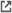 «Открыть объект» в раскрывающемся
	 меню кнопки 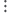
	 «Действия». После чего на
	 отдельной вкладке браузера будет открыт объект на просмотр.

	Для редактирования объекта выполните команду 
	 «Редактировать объект» в раскрывающемся
	 меню кнопки 
	 «Действия». После чего на
	 отдельной вкладке браузера будет открыт мастер объекта.

	Примечание.
	 Открытие и редактирование объекта доступно только в веб-приложении.

[Настройка отображения
 объектов](javascript:TextPopup(this))

	Для настройки отображения объектов в областях «Источник
	 данных», «Измерения»
	 в веб-приложении и «Источники данных»,
	 «Измерения куба» в настольном
	 приложении:

		- в веб-приложении выберите способ отображения объектов в
		 раскрывающемся меню кнопки  «Отображение объекта»:

			- Наименование.
			 По умолчанию. Отображаются только наименования объектов;

			- Идентификатор.
			 Отображаются только идентификаторы объектов;

			- Наименование и идентификатор.
			 Отображаются наименования и идентификаторы объектов;

		- в настольном приложении выберите способ отображения объектов
		 в контекстном меню области:

			- Отображать наименования.
			 По умолчанию. Отображаются только наименования объектов;

			- Отображать идентификаторы.
			 Отображаются только идентификаторы объектов;

			- Отображать наименования
			 и идентификаторы. Отображаются наименования и идентификаторы
			 объектов.

[Изменение
 свойств измерения](javascript:TextPopup(this))

	Для изменения свойств измерения:

		- в веб-приложении выполните команду 
		 «Свойства измерения» в
		 раскрывающемся меню кнопки  «Действия»,
		 расположенной напротив измерения. После чего будет открыто окно
		 «Свойства измерения»:

	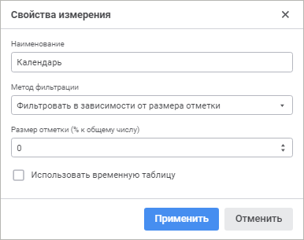

		- в настольном приложении нажмите
		 кнопку 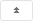 «Показать
		 свойства измерения» в области «Измерения
		 куба». После чего будет открыта дополнительная панель «Свойства измерения»:

	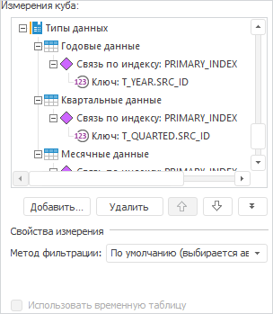

	Задайте параметры:

		- Наименование.
		 Измените наименование измерения при необходимости. Доступно только
		 в веб-приложении;

		- Метод
		 фильтрации. Метод фильтрации позволяет определить, каким
		 образом будет формироваться та часть запроса, которая отвечает
		 за фильтрацию элементов по измерению (часть запроса, которая идет
		 после предложения Where).
		 Выбранный метод фильтрации будет отображаться в наименовании измерения
		 в области «Измерения».
		 Доступные методы фильтрации:

			- По умолчанию (выбирается
			 автоматически). Выбран по умолчанию. При выборе данного
			 метода будет осуществляться фильтрация с использованием оператора
			 IN. Для календарного
			 измерения в следующих случаях будет использоваться оператор
			 BETWEEN:

				- для фильтрации элементов различных уровней, если
				 календарное измерение построено с использованием общего
				 первичного ключа (значения всех уровней хранятся в одной
				 таблице). Например:

	((a.LVL_TYPE BETWEEN 4 AND
	 5 OR a.LVL_TYPE IN
	 (1)))

				- для фильтрации элементов дневной динамики. Пример:

	((a.LVL_DATE BETWEEN TO_DATE('1995-01-01','YYYY-MM-DD')
	 AND TO_DATE('1995-01-20','YYYY-MM-DD')))

	Также оператор IN
	 будет заменён на оператор BETWEEN,
	 если:

				- количество строковых идентификаторов больше 1024;

				- количество числовых идентификаторов больше 8192;

			- Извлекать все записи
			 независимо от отметки. При выборе данного метода извлекаются
			 все записи независимо от отметки, а затем фильтруются на компьютере-клиенте.
			 При этом в запросе будут отсутствовать какие-либо операторы,
			 связанные с фильтрацией элементов измерения;

			- Фильтровать в зависимости
			 от размера отметки. При выборе данного метода укажите
			 размер отметки в процентах к общему числу элементов (размеру
			 измерения). При этом запрос будет формироваться следующим
			 образом:

				- процент отмеченных элементов меньше указанного числа:
				 фильтрация с использованием оператора IN;

				- процент отмеченных элементов равен указанному числу:
				 фильтрация с использованием оператора BETWEEN
				 относительно первого и последнего отмеченного элемента;

				- процент отмеченных элементов больше указанного числа:
				 фильтрация с использованием оператора BETWEEN
				 относительно всех элементов измерения;

			- Фильтровать в зависимости
			 от количества отмеченных. При выборе данного метода
			 укажите количество отмеченных элементов измерения. При этом
			 запрос будет формироваться следующим образом:

				- количество отмеченных элементов меньше указанного
				 числа: фильтрация с использованием оператора IN;

				- количество отмеченных элементов равно указанному
				 числу: фильтрация с использованием оператора BETWEEN
				 относительно первого и последнего отмеченного элемента;

				- количество отмеченных элементов больше указанного
				 числа: фильтрация с использованием оператора BETWEEN
				 относительно всех элементов измерения;

			- Фильтровать по условию
			 IN. Фильтрация элементов всегда будет осуществляться
			 с использованием оператора IN;

		- Использовать
		 временную таблицу. Флажок доступен при выборе метода фильтрации
		 «Фильтровать в зависимости от
		 размера отметки» или «Фильтровать
		 в зависимости от количества отмеченных». По умолчанию флажок
		 снят. Установка флажка позволяет при передаче отметки использовать
		 временную таблицу, что ускоряет процесс формирования IN.

	Примечание.
	 Указанные настройки применяются для выделенного измерения куба в списке.

	Для применения настроек в веб-приложении нажмите кнопку «Применить».

	Для скрытия дополнительной панели «Свойства
	 измерения» в настольном приложении нажмите кнопку  «Скрыть
	 свойства измерения».

[Привязка
 измерений к полям источников данных](javascript:TextPopup(this))

	Для связи измерения с полем источника данных:

		- Выберите индекс измерения в области «Измерения»/«Измерения куба». Для этого:

			- в веб-приложении разверните структуру измерения, после
			 чего нажмите на значение элемента «Связь
			 по индексу». Отобразится всплывающая панель, в которой
			 выберите индекс измерения. Если измерение содержит единственный
			 индекс, то он будет установлен автоматически по умолчанию;

			- в настольном приложении разверните структуру измерения,
			 после чего дважды щёлкните по элементу «Связь
			 по индексу». Отобразится окно «Выбор
			 индекса», в котором выберите индекс измерения:

	

	Атрибуты, включённые в индекс, будут
	 отображены в дереве измерения

		- Выберите индекс измерения в раскрывающемся списке элемента
		 «Связь по индексу» в области
		 «Измерения». Атрибуты,
		 включённые в индекс, будут отображены в дереве измерения.

	Примечание.
	 Если измерение имеет только один индекс, то он автоматически выбирается
	 для этого измерения в связи по индексу. Если в измерении несколько
	 блоков и индексов, то выберите тот, состав которого соответствует
	 данным, хранящимся в источнике.

		- Выделите поле источника данных в области «Источник
		 данных», после чего выполните одно из действий:

			- выделите атрибут, к которому необходимо произвести привязку
			 поля, в области «Измерения»
			 и нажмите кнопку  «Связать»;

			- перетащите поле из области «Источник
			 данных» на атрибут в области «Измерения»
			 с помощью механизма Drag&Drop.

	Связь измерений с полями источника также
	 можно осуществить с помощью [редактора выражения](#formula),
	 для этого:

			- в веб-приложении выполните одно из действий:

				- нажмите кнопку 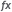 «Редактор выражения»
				 напротив необходимого атрибута;

				- дважды щёлкните по необходимому атрибуту;

			- в настольном приложении дважды щёлкните по необходимому
			 атрибуту.

	В открывшемся окне редактора выражения
	 выберите необходимое поле источника данных.

	Если к календарному измерению привязано
	 поле таблицы, содержащее дату и время, то при построении куба учитывается
	 только дата.

	Важно.
	 Одно поле источника может использоваться для связи только с одним
	 атрибутом одного измерения.

	После привязки измерения к полю источника данных структура измерения
	 будет иметь вид:

		- в веб-приложении:

	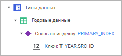

		- в настольном приложении:

	

	Для отвязки измерения от поля источника выделите атрибут измерения
	 в области «Измерения»/«Измерения куба» и нажмите кнопку
	 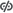
	 «Отвязать».

[Агрегирование
 данных по измерениям с полной отметкой](javascript:TextPopup(this))

	Флажок «Агрегировать данные по
	 измерениям с полной отметкой» определяет признак доступности
	 метода агрегации «[Из
	 фактов источника](../../Agregation.htm#fix_method)» для фиксированных измерений в отчётах.
	 По умолчанию флажок не установлен.

	Примечание.
	 Агрегация по методу «[Из
	 фактов источника](../../Agregation.htm#fix_method)» будет применяться в том случае, когда
	 отметка элементов фиксированного измерения полная, иначе агрегация
	 из фактов источника считаться не будет.

	При выборе в отчёте метода агрегации «[Из фактов источника](../../Agregation.htm#fix_method)»
	 для фиксированных измерений будет применена агрегация, выбранная для
	 агрегации [фактов
	 куба](UiMd_Cube_CreateCube_Master_Standart_2.htm).

	Важно.
	 Не рекомендуется агрегировать данные по измерениям с полной отметкой,
	 если для куба включено [кеширование
	 данных](UiNav.chm::/03_Objects/UiNav_Obj_BasicPropCache.htm). Это приведёт к созданию экземпляра кеша
	 на каждое сочетание отметок измерений, что в свою очередь увеличит
	 общий кеш в размере и негативно скажется на скорости его работы.

Примечание.
 При изменении [типа
 данных](../../../Table/Master/UiDb_relational_table_master_field.htm) в столбцах, которые участвуют в привязках к измерениям, рекомендуется
 выполнить [перепривязку измерений к полям источников
 данных](#bind_dims) в кубе.

## Редактор выражения

Настройка формул выполняется с помощью редактора выражения:

	- редактор выражения в настольном приложении универсален для всех
	 инструментов и объектов платформы. Описание универсального редактора
	 выражения приведено в разделе «[Создание формул и выражений](uinav.chm::/GUI/ExpressionEditor.htm)»;

	- редактор выражения в веб-приложении отличается в зависимости
	 от настраиваемого инструмента или объекта.

Окно редактора выражения для привязки измерений стандартного куба к
 полям источников данных в веб-приложении имеет вид:

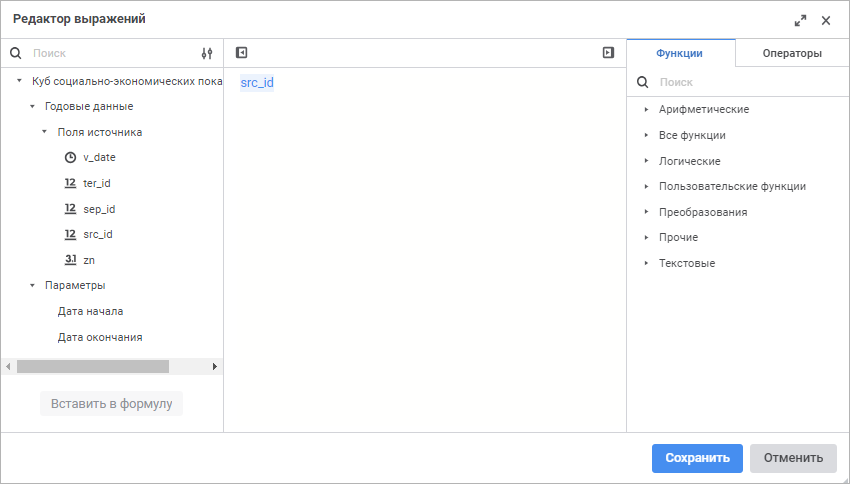

Сформируйте формулу для задания связи поля источника данных с атрибутом
 измерения куба.

В формуле допускается использование операндов, арифметических операций,
 функций, цифр, знаков сравнения и круглых скобок. При этом имеются некоторые
 особенности:

	- вставка всех типов элементов, кроме цифр, может осуществляться
	 как с помощью клавиатуры, так и с помощью специальных панелей;

	- вставка цифр осуществляется только с помощью клавиатуры.

[Вставка операндов](javascript:TextPopup(this))

	Операнды отображаются на панели операндов редактора выражения:

	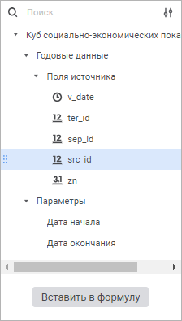

	В качестве операндов используются источники данных и [параметры](../../../reference_book/Master_Table_reference_book/parameters.htm)
	 куба.

Для вставки операнда в область формул выполните одно из действий:

	- с помощью панели операндов:

		- выделите операнд и нажмите кнопку «Вставить
		 в формулу»;

		- дважды щёлкните по операнду;

		- перенесите операнд в область формул с помощью механизма
		 Drag&Drop;

	- с помощью области формул:

		- введите наименование операнда в области формул;

		- щёлкните в области формул в том месте, куда нужно вставить
		 операнд, нажмите сочетание клавиш CTRL+SHIFT и выберите на всплывающей
		 панели требуемый операнд.

Для быстрого поиска операнда начните вводить его наименование частично
 или целиком в строке поиска. После выполнения действия на панели операндов
 будут отображены те операнды, наименования которых удовлетворяют условиям
 поиска.

Для настройки отображения списка операндов используйте команды в раскрывающемся
 меню кнопки  «Настройки
 отображения»:

	- Наименование. По умолчанию.
	 Отображение только наименований операндов;

	- Идентификатор. Отображение
	 только идентификаторов операндов;

	- Наименование и идентификатор.
	 Отображение наименований и идентификаторов операндов в формате: <наименование> (<идентификатор>).

Для скрытия панели операндов нажмите кнопку  «Скрыть панель операндов», для отображения -
 нажмите кнопку  «Отобразить
 панель операндов».

[Вставка функций
 и операторов](javascript:TextPopup(this))

	Функции и операторы отображаются на панели функций и операторов
	 на соответствующих вкладках:

	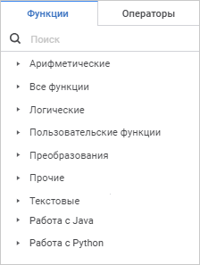

	Для вставки функции или оператора в область формул выполните одно
	 из действий:

		- с помощью панели функций и операторов:

			- выделите функцию/оператор. Отобразится панель с описанием:

	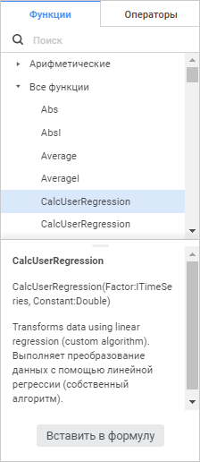

	Нажмите кнопку «Вставить
	 в формулу»;

			- дважды щёлкните по функции/оператору;

			- перенесите функцию/оператор в область формул с помощью
			 механизма Drag&Drop;

		- с помощью области формул:

			- введите функцию/оператор в области формул;

			- щёлкните в области формул в том месте, куда нужно вставить
			 функцию/оператор, нажмите сочетание клавиш CTRL+SHIFT и выберите
			 на всплывающей панели требуемую функцию/оператор.

	Для быстрого поиска функции или оператора начните вводить функцию/оператор
	 частично или целиком в строке поиска. После выполнения действия на
	 панели функций и операторов будут отображены функции/операторы, удовлетворяющие
	 условиям поиска.

	Для скрытия панели функций и операторов нажмите кнопку  «Скрыть
	 панель функций и операторов», для отображения - нажмите
	 кнопку  «Отобразить
	 панель функций и операторов».

См. также:

[Стандартный куб](UiMd_Cube_CreateCube_Master_Standart.htm)

		Справочная
		 система на версию 10.9
		 от 18/08/2025,
		 © ООО «ФОРСАЙТ»,
