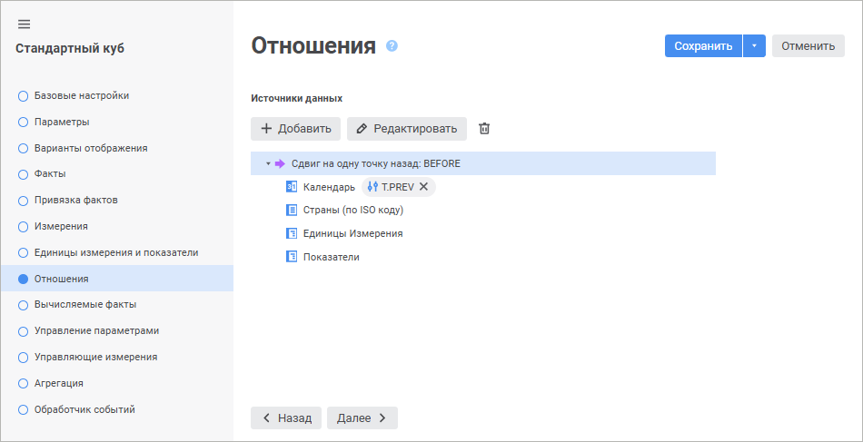
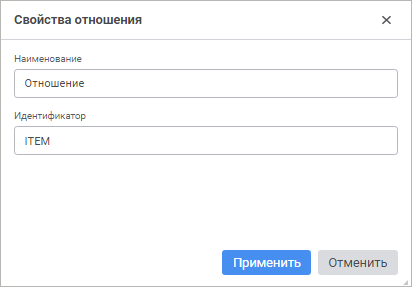
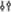
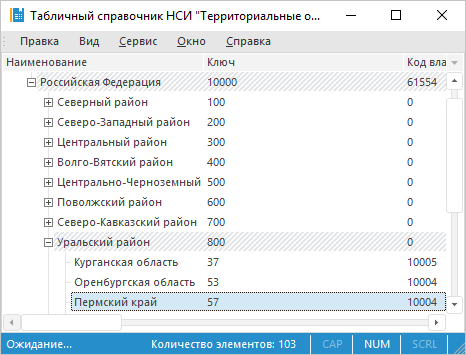
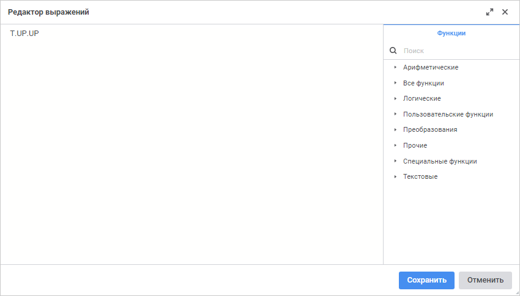
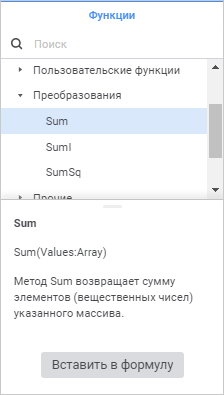
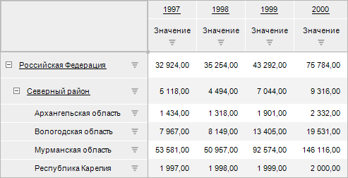

# Страница «Отношения»: Стандартный куб

Страница «Отношения»: Стандартный куб
-

# Отношения

Отношения позволяют получать
 значения фактов путём смещения относительно текущей точки расчёта. Используются
 при формировании выражений [вычисляемых
 фактов](UiMd_Cube_CreateCube_Master_Standart_5.htm) куба.

При построении куба осуществляется извлечение данных из источников,
 которые [связаны](UiMd_Cube_CreateCube_Master_Standart_2.htm)
 с фактами куба, и расчёт значений [вычисляемых
 фактов](UiMd_Cube_CreateCube_Master_Standart_5.htm). Расчёт вычисляемых фактов производится индивидуально в каждой
 ячейке куба. Добавление отношения в формулу вычисляемого факта позволяет
 при расчёте в конкретной ячейке использовать не только значения, заданные
 для фактов в этой ячейке, но и значения фактов в других ячейках, полученных
 путём смещения по измерениям куба. Смещение можно настроить по одному
 или нескольким измерениям одновременно. При использовании в формуле каждое
 отношение может применяться для различных фактов куба.

Добавление и настройка отношений осуществляется на странице «Отношения»
 [мастера стандартного
 куба](UiMd_Cube_CreateCube_Master_Standart.htm).

	 Веб-приложение Настольное приложение

		

		

[Добавление
 отношения](javascript:TextPopup(this))

	Для добавления отношения нажмите кнопку  «Добавить». После выполнения действия
	 будет добавлено отношение со свойствами по умолчанию.

	Для изменения свойств используйте окно «[Свойства
	 отношения](#edit_relations)».

[Редактирование
 отношения](javascript:TextPopup(this))

	Для редактирования выбранного отношения:

		- Откройте окно «Свойства
		 отношения»:

			- в веб-приложении нажмите
			 кнопку  «Редактировать»;

			- в настольном приложении
			 выполните одно из действий:

				- нажмите кнопку «Изменить»;

				- дважды щёлкните по отношению.

	После выполнения действий будет открыто
	 окно «Свойства отношения»:

	

		- Задайте параметры:

			- Наименование.
			 Введите краткое описание отношения. По умолчанию задано наименование
			 «Отношение»;

			- Идентификатор.
			 Введите уникальный идентификатор отношения. По умолчанию задан
			 идентификатор ITEM.

		- Нажмите кнопку «Применить»
		 в веб-приложении или кнопку «ОК»
		 в настольном приложении.

	После выполнения действий свойства отношения будут изменены.

[Удаление отношения](javascript:TextPopup(this))

	Для удаления выбранного отношения:

		- в веб-приложении нажмите кнопку  «Удалить»;

		- в настольном приложении нажмите кнопку «Удалить».

	После подтверждения действия отношение будет удалено.

[Настройка
 отношения измерения](javascript:TextPopup(this))

	Для настройки отношения выбранного измерения:

		- дважды щёлкните по измерению;

		- в веб-приложении нажмите кнопку  «Формула отношения», расположенную
		 напротив измерения, или одноимённую кнопку в существующей формуле
		 отношения;

		- в настольном приложении нажмите кнопку «Изменить».

	После выполнения одного из действий будет открыто окно «Формула
	 отношения»:

		- в веб-приложении:

	

		- в настольном приложении:

	

	С помощью раскрывающегося списка в веб-приложении или переключателей
	 в настольном приложении выберите, каким образом будет задаваться формула
	 отношения:

		- Нет. По умолчанию.
		 В качестве позиции по измерению будет взята текущая;

		- Уровней вверх. Результатом
		 применения отношения будет элемент-владелец, отстоящий на указанное
		 количество уровней от текущего элемента. Количество уровней задается
		 в редакторе чисел, который становится доступным при установленном
		 переключателе. Количество уровней вверх не может превышать общего
		 количества уровней минус один. Если, например, текущим является
		 элемент «Пермский край» территориального справочника, то при указании
		 перехода на один уровень вверх будет выбран элемент «Уральский
		 район», а при указании перехода на два уровня вверх будет выбран
		 элемент «Российская Федерация»:

	

		- Элементов назад.
		 Результатом применения отношения будет элемент того же уровня,
		 отстоящий на указанный порядковый номер от текущего элемента.
		 Порядковый номер задается в редакторе чисел, который становится
		 доступным при установленном переключателе;

		- Указанный элемент.
		 При установке данного переключателя становится доступным раскрывающееся
		 дерево измерения, в котором нужно выбрать конкретный элемент.
		 Тогда независимо от текущей позиции в кубе, результатом применения
		 отношения будет именно выбранный элемент;

	Примечание.
	 При установке данного переключателя для параметрического измерения
	 будет открыто окно «[Установка значений параметров](uinav.chm::/02_Navigator/General_Principles_of_Work.htm#open_param_object)»,
	 в котором необходимо указать значения параметров.

		- Выражение. Результатом
		 применения отношения будет элемент, индекс которого вычисляется
		 по заданному выражению. Выражение задается с помощью кнопок, расположенных
		 рядом с полем ввода, или с помощью [редактора
		 выражения](#formula).

		Составление выражения требуется начинать с текущего элемента измерения,
		 для этого используйте кнопку «Т».
		 Далее можно указать смещение, например: T.PREV, T.PREV.UP, T.UP.NEXT
		 и т.д.

		Для составления выражения используйте кнопки:

			- T. Текущий элемент
			 (следует всегда использовать при составлении выражения);

			- UP. На один
			 уровень вверх;

			- DOWN. На один
			 уровень вниз;

			- NEXT. Следующий
			 элемент;

			- PREV. Предыдущий
			 элемент.

	Для вызова редактора выражения:

			- в веб-приложении нажмите кнопку  «Вставить формулу»;

			- в настольном приложении нажмите кнопку  «Вставить
			 формулу».

	Для вычисления индекса элемента в выражении
	 можно использовать различные арифметические, логические, текстовые
	 функции, пользовательские функции и функции преобразования.

	Также можно указать макрос, реализованный
	 на языке Fore в форме/модуле репозитория. Макрос должен представлять
	 из себя функцию, реализованную в глобальном пространстве имён, или
	 статическую функцию класса. Функция может принимать на вход любые
	 необходимые параметры, для передачи текущего элемента также можно
	 использовать параметр T. Результатом функции должно быть целочисленное
	 значение, соответствующее индексу элемента. Формат вызова функции:
	 [Идентификатор модуля/формы].[Наименование функции] или [Идентификатор
	 модуля/формы].[Наименование класса].[Наименование функции]. Например:

	MyModule.GetElement(T);

	MyModule.TRelations.GetElement(T);

	Примечание. Если
	 для [вычисляемого
	 факта](UiMd_Cube_CreateCube_Master_Standart_5.htm) куба был установлен флажок «[Рассчитать
	 по фактическим данным](UiMd_Cube_CreateCube_Master_Standart_5.htm#calculated_facts)», то в качестве входного параметра
	 T может возвращаться массив
	 [ForeVariantType.Matrix](ForeSys.chm::/Enums/ForeVariantType.htm),
	 содержащий целочисленные значения. В этом случае пользовательская
	 функция также должна обрабатывать и возвращать массив целочисленных
	 значений при расчёте отношения.

	В макросе для получения информации о
	 кубе могут использоваться статические свойства класса [CubeClass](KeCubes.chm::/Class/CubeClass/CubeClass.htm),
	 для расчёта смещения по элементам календарного измерения - методы
	 класса [CalendarDimension](kecubes.chm::/class/calendardimension/calendardimension.htm).

	В функцию также могут передаваться значения
	 параметров куба, например:

	MyModule.GetElementParam(T,
	 :PARAM)

	Где: T
	 - текущий элемент, PARAM
	 - идентификатор параметра куба.

## Редактор выражения

Настройка формул выполняется с помощью редактора выражения:

	- редактор выражения в настольном приложении универсален для всех
	 инструментов и объектов платформы. Описание универсального редактора
	 выражения приведено в разделе «[Создание формул и выражений](uinav.chm::/GUI/ExpressionEditor.htm)»;

	- редактор выражения в веб-приложении отличается в зависимости
	 от настраиваемого инструмента или объекта.

Окно редактора выражения для задания формулы отношения в веб-приложении
 имеет вид:

Сформируйте формулу вычисляемого выражения для отношения куба.

В формуле допускается использование арифметических операций, функций,
 цифр, знаков сравнения и круглых скобок. При этом имеются некоторые особенности:

	- вставка функций может осуществляться как с помощью клавиатуры,
	 так и с помощью специальной панели;

	- вставка цифр осуществляется только с помощью клавиатуры.

[Вставка функций](javascript:TextPopup(this))

	Для вставки функции в область формул выполните одно из действий:

		- с помощью панели функций:

			- выделите функцию. Отобразится панель с описанием:

	

	Нажмите кнопку «Вставить
	 в формулу»;

			- дважды щёлкните по функции;

			- перенесите функцию в область формул с помощью механизма
			 Drag&Drop;

		- с помощью области формул:

			- введите функцию в области формул;

			- щёлкните в области формул в том месте, куда нужно вставить
			 функцию, нажмите сочетание клавиш CTRL+SHIFT и выберите на
			 всплывающей панели требуемую функцию.

	Для быстрого поиска функции начните вводить функцию частично или
	 целиком в строке поиска. После выполнения действия на панели функций
	 будут отображены функции, удовлетворяющие условиям поиска.

## Пример

Рассмотрим пример создания отношения и настройки вычисляемого факта
 в уже существующем кубе в настольном приложении. Предполагается, что в
 измерении фактов уже имеется элемент с наименованием «Изменение»,
 который не связан с источником данных и предназначен для расчёта значений
 по формуле.

Исходные данные куба выглядят следующим образом:

Для расчёта изменений показателя по сравнению с текущим и предыдущим
 годом создадим отношение и настроим его параметры. Для получения предыдущего
 значения по календарному измерению необходимо настроить отношение: Создайте
 отношение, задайте ему наименование «Сдвиг
 на одну точку назад» и идентификатор «BEFORE».
 Выделите «Календарь», нажмите
 кнопку «Изменить» и задайте следующие
 настройки:

Созданное отношение в каждой точке расчёта будет получать предыдущее
 значение путём сдвига по календарному измерению на один элемент назад.
 Для расчёта изменения показателя необходимо настроить вычисляемый факт.
 Перейдите на вкладку «Вычисляемые факты»,
 выделите элемент «Изменение» и
 нажмите кнопку «Редактировать».
 Напротив поля ввода «Формула»
 нажмите кнопку  «Вставить
 формулу». В редакторе выражения с помощью элементов из панели данных
 сформируйте формулу «Значение-Сдвиг на
 одну точку назад[Значение]». После нажатия кнопки «ОК»
 все наименования будут заменены идентификаторами и редактор вычисляемого
 факта примет следующий вид:

Сохраните все изменения и закройте мастер куба. Теперь, если открыть
 куб и в отметку добавить вычисляемый факт, то данные куба будут выглядеть
 следующим образом:

См. также:

[Стандартный куб](UiMd_Cube_CreateCube_Master_Standart.htm)

		Справочная
		 система на версию 10.9
		 от 18/08/2025,
		 © ООО «ФОРСАЙТ»,
