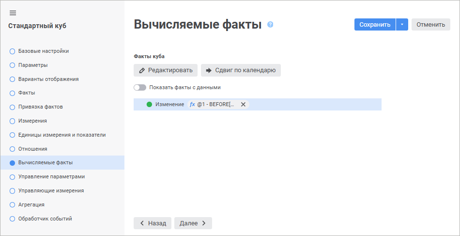
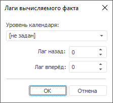
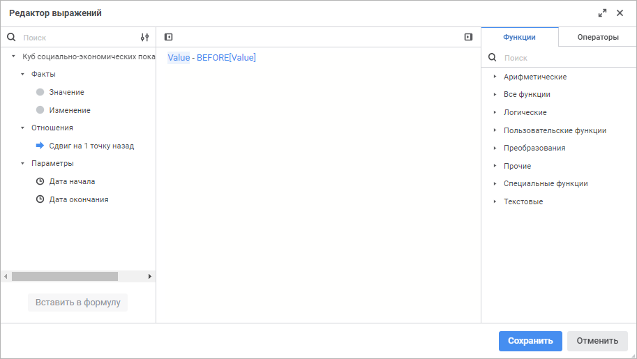
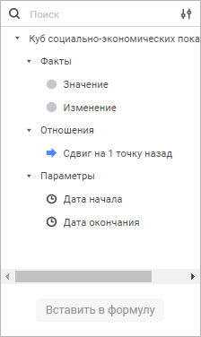
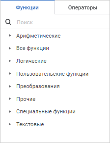

# Страница «Вычисляемые факты»: Стандартный куб

Страница «Вычисляемые факты»: Стандартный куб
-

# Вычисляемые факты

На странице «Вычисляемые факты»
 задаются формулы для вычисляемых фактов. Вычисляемый факт представляет
 собой функцию от значений других [фактов](UiMd_Cube_CreateCube_Master_Standart_1.htm),
 вычисляемых фактов или [отношений](UiMd_Cube_CreateCube_Master_Standart_4.htm).

	 Веб-приложение Настольное приложение

		

		

На данной странице отображаются все факты куба:

	- . Факты, имеющие привязку к полям набора
	 данных;

	- .
	 Факты, не имеющие привязку к полям набора данных. Для них может быть
	 определена формула, по которой будут рассчитываться значения. После
	 задания формулы факты сменят свой значок на /. В
	 веб-приложении при настройке [сдвига по календарю](#lag)
	 значок изменится на .

В веб-приложении для отображения или скрытия фактов куба с данными используйте
 переключатель «Показать факты с данными».

[Настройка
 вычисляемых фактов](javascript:TextPopup(this))

	Для указания или изменения формулы выполните одно из действий:

		- в веб-приложении:

			- выделите вычисляемый факт и нажмите кнопку  «Редактировать»;

			- щёлкните по формуле;

		- в настольном приложении:

			- выделите вычисляемый факт
			 и нажмите кнопку «Изменить»;

			- дважды щёлкните по вычисляемому
			 факту.

	После выполнения действий будет открыто окно «Вычисляемый
	 факт»:

		Веб-приложение
		 Настольное приложение

			

			

	Задайте параметры:

		- Формула. Введите
		 выражение, по которому будет рассчитываться значение вычисляемого
		 факта, с клавиатуры или составьте его с помощью редактора выражения.
		 Для этого нажмите кнопку /
		  «Вставить
		 формулу», будет открыт [редактор выражений](#formula).

	Для составления выражения:

			- используйте имеющиеся параметры
			 куба, [отношения](UiMd_Cube_CreateCube_Master_Standart_4.htm),
			 [факты](UiMd_Cube_CreateCube_Master_Standart_1.htm)
			 и [специальные
			 функции](UiMd_Cube_CreateCube_Master_Standart_5Function.htm);

			- укажите путь к пользовательской
			 функции, которая будет использоваться для расчёта значения
			 вычисляемого факта. Путь задается в следующем формате: [<идентификатор модуля/формы>].[<наименование функции>].
			 Доступ к данным куба, на основании которых может осуществляться
			 расчёт значения, осуществляется посредством класса [CubeClass](KeCubes.chm::/Class/CubeClass/CubeClass.htm);

		- Рассчитать по фактическим
		 данным. Установите флажок для расчёта заданной формулы
		 по фактическим данным: сначала будет оценена матрица с исходными
		 данными, которая извлекается в соответствии с заданной отметкой,
		 а затем осуществляется расчёт только в тех точках, по которым
		 имеются данные.

	Примечание.
	 Установленный флажок влияет на расчёт [отношений
	 куба](UiMd_Cube_CreateCube_Master_Standart_4.htm), если отношение задается в виде [пользовательской
	 функции](UiMd_Cube_CreateCube_Master_Standart_4.htm#relations_expression_editor). Например, если в качестве входного параметра T
	 возвращается массив [ForeVariantType.Matrix](ForeSys.chm::/Enums/ForeVariantType.htm),
	 содержащий целочисленные значения, то при расчёте отношений пользовательская
	 функция также будет обрабатывать и возвращать массив целочисленных
	 значений.

	Если флажок снят, то расчёт будет произведён
	 в соответствии с выставленной отметкой измерений: расчёт в каждой
	 точке полученного декартова произведения отмеченных элементов.

	Особенности расчёта вычисляемого факта:

			- если в формуле вычисляемого факта используются [специальные
			 функции](UiMd_Cube_CreateCube_Master_Standart_5Function.htm) (DIF, FIL, SUM и другие), то значение вычисляемого
			 факта будет рассчитано только для тех точек, для которых имеются
			 необходимые данные в исходной матрице;

			- если в формуле вычисляемого факта используются отношения,
			 которые осуществляют сдвиг или берётся значение конкретного
			 факта, то значение вычисляемого факта будет рассчитано только
			 для тех точек, для которых имеются необходимые данные в исходной
			 матрице;

			- если сдвиг нужно выполнить из отметки, которой нет в
			 матрице, то значение не будет рассчитано;

		- Всегда добавлять в отметку.
		 Установите флажок для включения вычисляемого факта при расчёте
		 результирующей матрицы куба. Флажок не влияет на визуальную отметку
		 при работе с кубом в различных инструментах «Форсайт. Аналитическая платформа»,
		 актуален при работе с кубом в прикладных макросах, которые вычисляют
		 куб и работают с данными куба. Вычисляемые факты, для которых
		 флажок установлен, будут всегда рассчитываться при расчёте результирующей
		 матрицы куба. Если флажок снят, то вычисляемый факт рассчитывается,
		 если он включен в отметку в прикладном макросе;

		- Изменять данные другого
		 факта/Разрешить изменять данные. Установите флажок для
		 изменения значения другого факта и задайте дополнительные параметры:

			- Факт. Выберите
			 в раскрывающемся списке факт куба, значение которого будет
			 изменено;

			- Формула. Для
			 формирования выражения, в соответствии с которым будет происходить
			 изменение значения выбранного выше факта, нажмите кнопку /
			  «Вставить
			 формулу». Будет открыт [редактор
			 выражения](#formula). Если формула не задана, то измененные значения
			 по вычисляемому факту не будут сохранены в куб.

	После выполнения действий к вычисляемому факту будет добавлена соответствующая
	 формула, по которой будет рассчитываться значение факта, и формула
	 для изменения другого факта, если она задана. В веб-приложении при
	 наведении на формулу отображается всплывающая подсказка.

[Сдвиг
 по календарю](javascript:TextPopup(this))

	Сдвиг позволяет расширять отметку по календарному измерению куба
	 для получения дополнительных значений, которые будут использоваться
	 при вычислении формулы вычисляемого факта.

	Примечание.
	 Доступно, если в кубе содержится календарное измерение.

	Для сдвига по календарю выберите вычисляемый факт и выполните одно
	 из действий:

		- в веб-приложении нажмите кнопку  «Сдвиг по календарю»;

		- в настольном приложении нажмите кнопку «Задать
		 лаги».

	После выполнения действия будет открыто окно «Сдвиг
	 по календарю для вычисляемого факта» в веб-приложении или окно
	 «Лаги вычисляемого факта»
	 в настольном приложении:

		Веб-приложение
		 Настольное приложение

			

			

	Задайте параметры:

		- Уровень календаря.
		 Выберите в раскрывающемся списке уровень календаря, по которому
		 будет смещаться отметка. В списке содержатся уровни, определённые
		 в [структуре
		 календарного справочника](../../../reference_book/Master_Calendar_reference_book/UiMd_reference_book_Master_Calendar_page2.htm);

		- Сдвиг назад. Задайте
		 значение, в зависимости от которого отметка будет смещаться назад
		 по выбранному уровню календаря. По умолчанию установлено значение
		 «0»;

		- Сдвиг вперёд. Задайте
		 значение, в зависимости от которого отметка будет смещаться вперёд
		 по выбранному уровню календаря. По умолчанию установлено значение
		 «0».

## Редактор
 выражения

Настройка формул выполняется с помощью редактора выражения:

	- редактор выражения в настольном приложении универсален для всех
	 инструментов и объектов платформы. Описание универсального редактора
	 выражения приведено в разделе «[Создание формул и выражений](uinav.chm::/GUI/ExpressionEditor.htm)»;

	- редактор выражения в веб-приложении отличается в зависимости
	 от настраиваемого инструмента или объекта.

Окно редактора выражения для настройки вычисляемых фактов стандартного
 куба в веб-приложении имеет вид:

Сформируйте формулу, по которой будет рассчитываться вычисляемый факт.

В формуле допускается использование операндов, арифметических операций,
 функций, цифр, знаков сравнения и круглых скобок. При этом имеются некоторые
 особенности:

	- вставка всех типов элементов, кроме цифр, может осуществляться
	 как с помощью клавиатуры, так и с помощью специальных панелей;

	- вставка цифр осуществляется только с помощью клавиатуры.

[Вставка операндов](javascript:TextPopup(this))

	Операнды отображаются на панели операндов редактора выражения:

	

	В качестве операндов используются:

		- [параметры куба](parameters.htm);

		- [факты
		 куба](UiMd_Cube_CreateCube_Master_Standart_1.htm);

		- [отношения
		 куба](UiMd_Cube_CreateCube_Master_Standart_4.htm).

Для вставки операнда в область формул выполните одно из действий:

	- с помощью панели операндов:

		- выделите операнд и нажмите кнопку «Вставить
		 в формулу»;

		- дважды щёлкните по операнду;

		- перенесите операнд в область формул с помощью механизма
		 Drag&Drop;

	- с помощью области формул:

		- введите наименование операнда в области формул;

		- щёлкните в области формул в том месте, куда нужно вставить
		 операнд, нажмите сочетание клавиш CTRL+SHIFT и выберите на всплывающей
		 панели требуемый операнд.

Для быстрого поиска операнда начните вводить его наименование частично
 или целиком в строке поиска. После выполнения действия на панели операндов
 будут отображены те операнды, наименования которых удовлетворяют условиям
 поиска.

Для настройки отображения списка операндов используйте команды в раскрывающемся
 меню кнопки  «Настройки
 отображения»:

	- Наименование. По умолчанию.
	 Отображение только наименований операндов;

	- Идентификатор. Отображение
	 только идентификаторов операндов;

	- Наименование и идентификатор.
	 Отображение наименований и идентификаторов операндов в формате: <наименование> (<идентификатор>).

Для скрытия панели операндов нажмите кнопку  «Скрыть панель операндов», для отображения -
 нажмите кнопку  «Отобразить
 панель операндов».

[Вставка функций
 и операторов](javascript:TextPopup(this))

	Функции и операторы отображаются на панели функций и операторов
	 на соответствующих вкладках:

	

	Для настройки вычисляемых фактов, помимо стандартных функций, также
	 доступно использование [специальных
	 функций](UiMd_Cube_CreateCube_Master_Standart_5Function.htm).

	Для вставки функции или оператора в область формул выполните одно
	 из действий:

		- с помощью панели функций и операторов:

			- выделите функцию/оператор. Отобразится панель с описанием:

	

	Нажмите кнопку «Вставить
	 в формулу»;

			- дважды щёлкните по функции/оператору;

			- перенесите функцию/оператор в область формул с помощью
			 механизма Drag&Drop;

		- с помощью области формул:

			- введите функцию/оператор в области формул;

			- щёлкните в области формул в том месте, куда нужно вставить
			 функцию/оператор, нажмите сочетание клавиш CTRL+SHIFT и выберите
			 на всплывающей панели требуемую функцию/оператор.

	Для быстрого поиска функции или оператора начните вводить функцию/оператор
	 частично или целиком в строке поиска. После выполнения действия на
	 панели функций и операторов будут отображены функции/операторы, удовлетворяющие
	 условиям поиска.

	Для скрытия панели функций и операторов нажмите кнопку  «Скрыть
	 панель функций и операторов», для отображения - нажмите
	 кнопку  «Отобразить
	 панель функций и операторов».

См. также:

[Стандартный куб](UiMd_Cube_CreateCube_Master_Standart.htm)

		Справочная
		 система на версию 10.9
		 от 18/08/2025,
		 © ООО «ФОРСАЙТ»,
