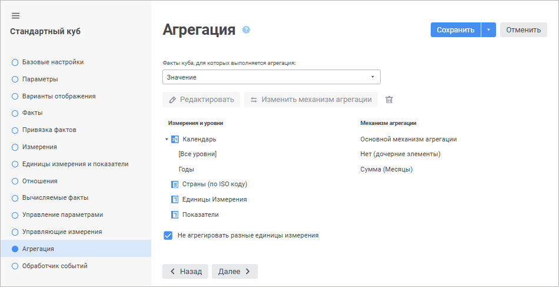

# Страница «Агрегация»: Стандартный куб

Страница «Агрегация»: Стандартный куб
-

# Агрегация данных

На странице «Агрегация» настраиваются
 варианты отображения и агрегация для измерений куба. Для получения подробной
 информации о настройке различных механизмов агрегации обратитесь к разделу
 «[Агрегация
 по уровням измерения](../../Agregation.htm#level)». При открытии куба извлекаются неагрегированные
 данные. Агрегация данных производится непосредственно в открытом кубе.

	 Веб-приложение Настольное приложение

		

		

Для настройки агрегации по уровням измерения в кубе задайте параметры:

[Варианты
 отображения](javascript:TextPopup(this))

	Варианты отображения -
	 это отдельный набор параметров агрегации, который используется для
	 быстрого переключения и расчёта данных при просмотре куба.

	Выбор варианта отображения, для которого будет осуществляться настройка
	 параметров агрегации, осуществляется в раскрывающемся списке «Варианты отображения».

	Примечание.
	 Раскрывающийся список «Варианты отображения»
	 доступен только в настольном приложении. В веб-приложении варианты
	 отображения куба настраиваются на странице «[Варианты отображения](Display_Version_Options.htm)».

	По умолчанию у куба есть один вариант отображения, наименование
	 и идентификатор которого совпадают с наименованием и идентификатором
	 самого куба. Для создания нового варианта отображения нажмите кнопку
	 «Добавить», для изменения
	 существующего - выберите его в раскрывающемся списке и нажмите кнопку
	 «Редактировать». При этих
	 действиях будет открыт диалог «Параметры
	 варианта отображения»:

	

	В диалоге можно определить наименование
	 и уникальный идентификатор
	 варианта отображения. Также в диалоге есть флажок «Скрытый
	 вариант отображения». При установке данного флажка вариант
	 отображения не будет доступен для выбора при работе с кубом в инструменте
	 «Аналитические запросы (OLAP)».

	Кнопка «Установить по умолчанию»
	 позволяет выбрать вариант отображения, который будет применяться при
	 открытии куба.

[Факты куба,
 для которых выполняется агрегация](javascript:TextPopup(this))

	Выберите в раскрывающемся списке факты куба, по значениям которых
	 будет осуществляться агрегация. В списке доступна множественная отметка
	 фактов для одновременной настройки механизма агрегации:

		- если настройки агрегации отмеченных фактов совпадают или
		 не заданы, то изменение настроек будет применяться одновременно
		 для всех отмеченных фактов;

		- если настройки агрегации отмеченных фактов отличаются, то
		 будет выдан диалог подтверждения выполняемого действия. При положительном
		 ответе настройки агрегации отмеченных фактов будут сброшены.

	При необходимости можно определить разные механизмы агрегации для
	 каждого факта отдельно.

[Измерения
 куба](javascript:TextPopup(this))

	Настройте агрегацию по измерениям. Изначально в данной области отображается
	 список элементов, соответствующих измерениям куба.

	Для настройки агрегации выбранного измерения:

		- в веб-приложении нажмите кнопку  «Редактировать»;

		- в настольном приложении:

			- нажмите кнопку «Редактировать»;

			- выполните команду «Редактировать»
			 в контекстном меню измерения;

			- нажмите клавишу F4.

	После выполнения одного из действий будет открыто окно «[<наименование
	 справочника> - Основной
	 механизм агрегации](../../Work_Cube/Tuning_agr/UiMd_Cube_Work_Cube_Tuning_agr_Basic.htm)».

	Примечание.
	 Настройка агрегации доступна, если выбран один элемент в дереве или
	 элементы дерева, относящиеся к одному измерению.

	Для изменения механизма агрегации календарного измерения с основного
	 на хронологический и наоборот нажмите кнопку 
	 «Изменить механизм агрегации».
	 Данное изменение отражается в столбце «Механизм/метод
	 агрегации». При смене механизма агрегации сбрасываются все
	 настройки текущего механизма, при этом выдаётся запрос на подтверждение
	 действия.

	По умолчанию для календарного измерения установлен «[Основной
	 механизм агрегации](../../Work_Cube/Tuning_agr/UiMd_Cube_Work_Cube_Tuning_agr_Basic.htm)». Если для календаря не были заданы
	 настройки агрегации (в столбце «Механизм/метод
	 агрегации» пусто), то при нажатии кнопки  «Изменить
	 механизм агрегации» устанавливается «[Хронологический
	 механизм агрегации](../../Work_Cube/Tuning_agr/UiMd_Cube_Work_Cube_Tuning_agr_chronological.htm)».

	Для сброса настроек агрегации выбранного измерения:

		- в веб-приложении нажмите кнопку  «Удалить»;

		- в настольном приложении:

			- нажмите кнопку «Удалить»;

			- выполните команду «Удалить»
			 в контекстном меню измерения;

			- нажмите клавишу DELETE.

	После выполнения одного из действий будет выдан диалог подтверждения
	 выполняемого действия. При положительном ответе настройки агрегации
	 выбранного измерения будут сброшены.

[Агрегация
 по альтернативной иерархии](javascript:TextPopup(this))

	Если в [измерениях](UiMd_Cube_CreateCube_Master_Standart_3.htm)
	 куба были выбраны справочники, в которых используется [альтернативная
	 иерархия](../../../reference_book/UiMd_reference_book_Hierarchy.htm#alternativehierarchy), то агрегация может быть настроена по уровням альтернативной
	 иерархии.

	У справочников, имеющих альтернативную иерархию, будет отображена
	 папка «Альтернативные иерархии» с доступными для справочника уровнями
	 альтернативной иерархии, для которых можно настроить агрегацию.

	В справочнике «Альтернативный календарь» можно настроить агрегацию
	 для уровней «Годы» или «Кварталы». Агрегация настраивается
	 отдельно для каждого отдельного уровня.

	Настройка агрегации по уровням альтернативной иерархии производится
	 аналогично настройке агрегации по измерениям.

[Не
 агрегировать разные единицы измерения](javascript:TextPopup(this))

	При отметке в измерении элементов с различными единицами измерения
	 происходит некорректная агрегация.

	Для индикации таких измерений и расчётных ячеек установите флажок
	 «Не агрегировать разные единицы измерения».

	Флажок доступен для куба, у которого:

		- На странице «[Измерения](UiMd_Cube_CreateCube_Master_Standart_3.htm)»
		 добавлен справочник со структурой [справочника
		 показателей](../../../Units/Units_Cube.htm#indicators).

		- На странице «[Единицы
		 измерения и показатели](UiMd_Cube_CreateCube_Master_Standart_unit_dim.htm)» добавлен справочник со структурой
		 [справочника
		 показателей](../../../Units/Units_Cube.htm#indicators), при этом не выбран справочник для [единиц
		 измерения](../../../Units/Units_Cube.htm#units).

	Используйте куб с установленным флажком в качестве источника данных
	 для [регламентного
	 отчёта или экспресс-отчёта](UiAnalyticalArea.chm::/TableView/Formatting/Cells_icons.htm#agr).

Примечание.
 Если в кубе настроена агрегация данных, то при настройке отображения [итоговых
 значений](UiAnalyticalArea.chm::/Totals/Calculate_totals.htm) в таблице будет доступен метод расчёта «Итоги из источника».

См. также:

[Стандартный куб](UiMd_Cube_CreateCube_Master_Standart.htm) |
 [Агрегация](../../Agregation.htm) |
 [Пример
 создания куба](../../UiMd_Cube_Example.htm) | [Пример
 настройки агрегации данных в кубах и отчётах](../../Cube_Example_Aggregation.htm)

		Справочная
		 система на версию 10.9
		 от 18/08/2025,
		 © ООО «ФОРСАЙТ»,
