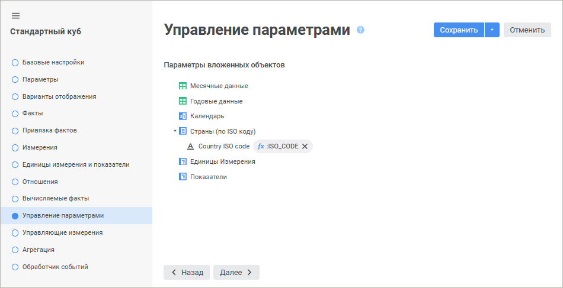
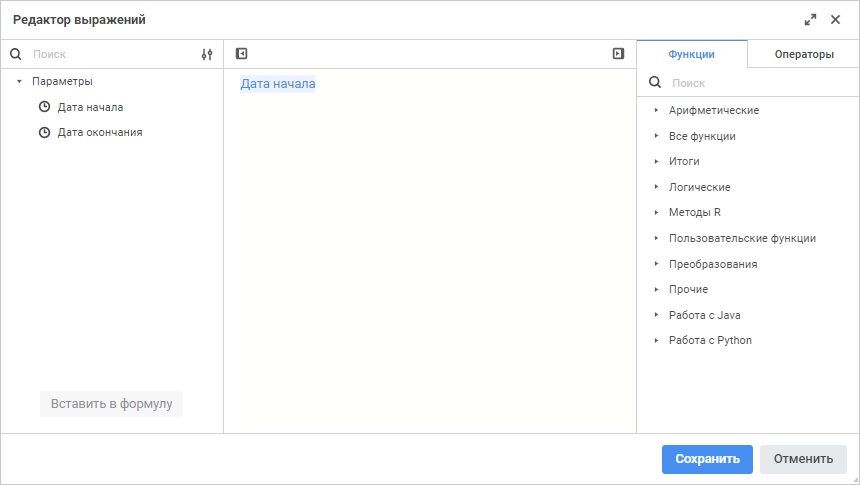
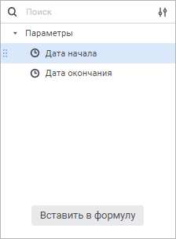
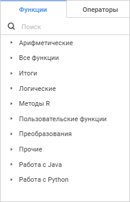

# Страница «Управление параметрами»: Стандартный куб

Страница «Управление параметрами»: Стандартный куб
-

# Управление параметрами вложенных объектов

При открытии куба осуществляется открытие всех объектов, которые он
 использует. Если объекты имеют параметры, то для их открытия необходимо
 передавать значения параметров. Настройка параметров объектов осуществляется
 на странице «Управление параметрами».

	 Веб-приложение Настольное приложение

		

		

На данной странице отображается список всех объектов, используемых кубом.
 Возможны следующие варианты:

	- если объект не имеет параметров, то отображается только его
	 наименование;

	- если объект имеет некоторый набор параметров, то отображается
	 список параметров данного объекта.

Для установки значений параметров:

	- в веб-приложении нажмите кнопку  «Редактор выражения», расположенную
	 напротив параметра;

	- в настольном приложении дважды щёлкните по выбранному параметру.

Будет открыто окно редактора выражения.

## Редактор выражения

Настройка формул выполняется с помощью редактора выражения:

	- редактор выражения в настольном приложении универсален для всех
	 инструментов и объектов платформы. Описание универсального редактора
	 выражения приведено в разделе «[Создание формул и выражений](uinav.chm::/GUI/ExpressionEditor.htm)»;

	- редактор выражения в веб-приложении отличается в зависимости
	 от настраиваемого инструмента или объекта.

Окно редактора выражения для настройки параметров вложенных объектов
 стандартного куба в веб-приложении имеет вид:

Сформируйте формулу, по которой будет рассчитываться значение параметра
 вложенного объекта.

В формуле допускается использование операндов, арифметических операций,
 функций, цифр, знаков сравнения и круглых скобок. При этом имеются некоторые
 особенности:

	- вставка всех типов элементов, кроме цифр, может осуществляться
	 как с помощью клавиатуры, так и с помощью специальных панелей;

	- вставка цифр осуществляется только с помощью клавиатуры.

[Вставка операндов](javascript:TextPopup(this))

	Операнды отображаются на панели операндов редактора выражения:

	

	В качестве операндов используются [параметры
	 куба](parameters.htm).

Для вставки операнда в область формул выполните одно из действий:

	- с помощью панели операндов:

		- выделите операнд и нажмите кнопку «Вставить
		 в формулу»;

		- дважды щёлкните по операнду;

		- перенесите операнд в область формул с помощью механизма
		 Drag&Drop;

	- с помощью области формул:

		- введите наименование операнда в области формул;

		- щёлкните в области формул в том месте, куда нужно вставить
		 операнд, нажмите сочетание клавиш CTRL+SHIFT и выберите на всплывающей
		 панели требуемый операнд.

Для быстрого поиска операнда начните вводить его наименование частично
 или целиком в строке поиска. После выполнения действия на панели операндов
 будут отображены те операнды, наименования которых удовлетворяют условиям
 поиска.

Для настройки отображения списка операндов используйте команды в раскрывающемся
 меню кнопки  «Настройки
 отображения»:

	- Наименование. По умолчанию.
	 Отображение только наименований операндов;

	- Идентификатор. Отображение
	 только идентификаторов операндов;

	- Наименование и идентификатор.
	 Отображение наименований и идентификаторов операндов в формате: <наименование> (<идентификатор>).

Для скрытия панели операндов нажмите кнопку  «Скрыть панель операндов», для отображения -
 нажмите кнопку  «Отобразить
 панель операндов».

[Вставка функций
 и операторов](javascript:TextPopup(this))

	Функции и операторы отображаются на панели функций и операторов
	 на соответствующих вкладках:

	

	Для вставки функции или оператора в область формул выполните одно
	 из действий:

		- с помощью панели функций и операторов:

			- выделите функцию/оператор. Отобразится панель с описанием:

	

	Нажмите кнопку «Вставить
	 в формулу»;

			- дважды щёлкните по функции/оператору;

			- перенесите функцию/оператор в область формул с помощью
			 механизма Drag&Drop;

		- с помощью области формул:

			- введите функцию/оператор в области формул;

			- щёлкните в области формул в том месте, куда нужно вставить
			 функцию/оператор, нажмите сочетание клавиш CTRL+SHIFT и выберите
			 на всплывающей панели требуемую функцию/оператор.

	Для быстрого поиска функции или оператора начните вводить функцию/оператор
	 частично или целиком в строке поиска. После выполнения действия на
	 панели функций и операторов будут отображены функции/операторы, удовлетворяющие
	 условиям поиска.

	Для скрытия панели функций и операторов нажмите кнопку  «Скрыть
	 панель функций и операторов», для отображения - нажмите
	 кнопку  «Отобразить
	 панель функций и операторов».

См. также:

[Стандартный куб](UiMd_Cube_CreateCube_Master_Standart.htm)

		Справочная
		 система на версию 10.9
		 от 18/08/2025,
		 © ООО «ФОРСАЙТ»,
