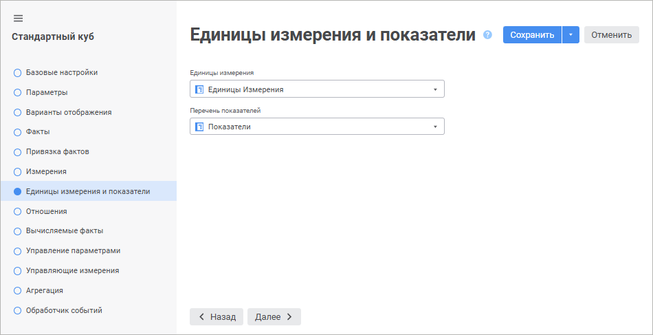

# Страница «Единицы измерения и показатели»: Стандартный куб

Страница «Единицы измерения и показатели»: Стандартный куб
-

# Единицы измерения и показатели

На странице «Единицы измерения и показатели»
 в случае необходимости указывается справочник единиц измерения и справочник
 в качестве перечня показателей. Указание данных справочников позволяет
 реализовать автоматический пересчёт единиц измерения.

	Веб-приложение Настольное приложение

		

		

Выбор справочников производится из раскрывающихся списков, в которых
 отображены все имеющиеся справочники в кубе. Данные справочники должны
 иметь определенную структуру. Описание структуры представлено в разделе
 «[Настройка единиц измерения
 и перечня показателей в кубе](../../../Units/Units_Cube.htm#options)». Если структура выбранного справочника
 показателей или справочника единиц измерения не удовлетворяет необходимым
 условиям, то будет выдано соответствующее сообщение.

Использование единиц измерения одновременно с [хранением
 комментариев](Additional_Settings.htm#comments)/[ведением истории
 измерений](Additional_Settings.htm#history) не поддерживается.

См. также:

[Стандартный куб](UiMd_Cube_CreateCube_Master_Standart.htm)

		Справочная
		 система на версию 10.9
		 от 18/08/2025,
		 © ООО «ФОРСАЙТ»,
