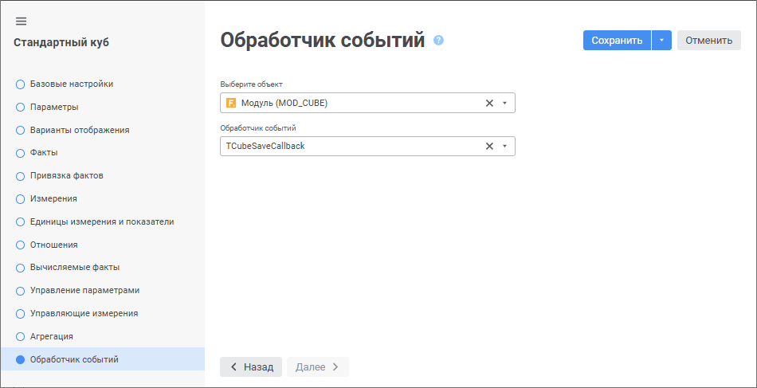

# Страница «Обработчик событий»: Стандартный куб

Страница «Обработчик событий»: Стандартный куб
-

# Обработчик событий

На странице «Обработчик событий»
 задаётся обработчик, позволяющий расширить функциональные возможности
 стандартных кубов.

Примечание.
 Страница «Обработчик событий»
 доступна только в веб-приложении.

В качестве обработчика выступает класс на языке Fore, реализованный
 в модуле или сборке.

Для подключения обработчика событий к кубу перейдите на страницу «Обработчик событий» мастера стандартного
 куба:

[Подключение
 обработчика событий](javascript:TextPopup(this))

	Для подключения обработчика событий:

		- Выберите модуль или сборку в раскрывающемся списке «Выберите объект».

Для быстрого выбора объекта в поле для поиска введите его название/идентификатор/ключ,
 в зависимости от настроек отображения. Поиск будет выполняться автоматически
 по мере ввода текста. Список будет содержать объекты, наименования/идентификаторы/ключи
 которых содержат вводимый текст.

Для настройки отображения объектов репозитория в списке нажмите кнопку
  «Отображение
 объекта» и выберите в раскрывающемся меню вариант отображения:

	- Наименование. Объекты
	 отображаются под своими наименованиями. Вариант по умолчанию;

	- Идентификатор. Объекты
	 отображаются под своими идентификаторами;

	- Ключ. Объекты отображаются
	 под своими ключами.

Выбрать можно несколько вариантов. Идентификатор и ключ будут указаны
 в скобках.

Для сброса отметки выбранных объектов нажмите кнопку 
 «Очистить».

		- Выберите обработчик событий в раскрывающемся списке «Обработчик событий».

	После выполнения действий к кубу будет подключён обработчик событий.

[Отключение
 обработчика событий](javascript:TextPopup(this))

	Для отключения обработчика событий нажмите кнопку  «Удалить»
	 в раскрывающемся списке «Обработчик
	 событий».

[Сигнатура
 обработчика событий](javascript:TextPopup(this))

	Класс, осуществляющий обработку событий. должен иметь модификатор
	 доступа Public, наследоваться
	 и содержать реализацию методов интерфейса [ICubeSaveMatrixCallback](KeCubes.chm::/Interface/ICubeSaveMatrixCallback/ICubeSaveMatrixCallback.htm):

		Public Class <наименование_обработчика>: Object, ICubeSaveMatrixCallback

		    // Событие перед сохранением данных в куб

		    Public Sub OnBeforeSave(callbackSaveArg: ICubeCallbackBeforeSaveArgument);

		    Begin

		        // ...

		    End Sub OnBeforeSave;

		    // Событие после сохранения данных в куб

		    Public Sub OnAfterSave(callbackSaveArg: ICubeCallbackSaveArgument);

		    Begin

		        // ...

		    End Sub OnAfterSave;

		End Class <наименование_обработчика>;

	Для корректной работы обработчика добавьте ссылки на системные сборки:
	 Cubes, Matrix, Metabase.

См. также:

[Стандартный куб](UiMd_Cube_CreateCube_Master_Standart.htm)

		Справочная
		 система на версию 10.9
		 от 18/08/2025,
		 © ООО «ФОРСАЙТ»,
