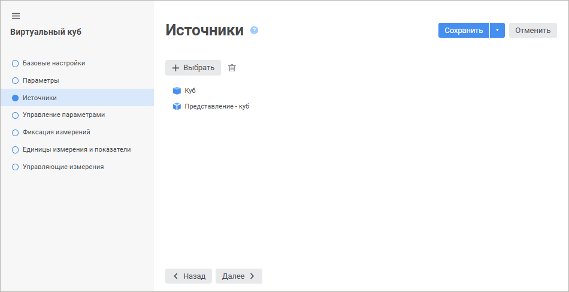
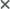

# Страница «Источники»: Виртуальный куб

Страница «Источники»: Виртуальный куб
-

# Источники

Виртуальный куб позволяет объединить в себе данные двух и более кубов.
 При этом данные не копируются в новый куб, а берутся из кубов-источников.

Примечание.
 Если в качестве куба-источника был выбран куб с [настроенной
 возможностью привязки вложений](../Master_Standart/UiMd_Cube_CreateCube_Master_Standart_2.htm), то и виртуальный куб тоже будет иметь
 такую возможность.

	 Веб-приложение Настольное приложение

		

		

[Добавление источника](javascript:TextPopup(this))

	Для добавления источника:

		- в веб-приложении нажмите кнопку  «Добавить»;

		- в настольном приложении нажмите кнопку «Добавить».

	В открывшемся окне выберите необходимый источник.

Для быстрого выбора объекта в поле для поиска введите его название/идентификатор/ключ,
 в зависимости от настроек отображения. Поиск будет выполняться автоматически
 по мере ввода текста. Список будет содержать объекты, наименования/идентификаторы/ключи
 которых содержат вводимый текст.

Для настройки отображения объектов репозитория в списке нажмите кнопку
  «Отображение
 объекта» и выберите в раскрывающемся меню вариант отображения:

	- Наименование. Объекты
	 отображаются под своими наименованиями. Вариант по умолчанию;

	- Идентификатор. Объекты
	 отображаются под своими идентификаторами;

	- Ключ. Объекты отображаются
	 под своими ключами.

Выбрать можно несколько вариантов. Идентификатор и ключ будут указаны
 в скобках.

Для сброса отметки выбранных объектов нажмите кнопку 
 «Очистить».

	Примечание.
	 Настройка отображения объекта доступна в веб-приложении.

	В качестве источника для выбора доступны:

		- все виды кубов;

		- базы данных временных рядов;

		- ярлыки, ссылающиеся на кубы или базы данных временных рядов.

	Примечание.
	 Недопустимо использовать ярлыки, ссылающиеся на объекты из других
	 репозиториев.

[Удаление источника](javascript:TextPopup(this))

	Для удаления выбранного источника:

		- в веб-приложении нажмите кнопку  «Удалить»;

		- в настольном приложении нажмите кнопку «Удалить».

	Будет выдан запрос для подтверждения выполняемого действия.

См. также:

[Виртуальный куб](UiMd_Cube_CreateCube_Master_Virtual.htm)

		Справочная
		 система на версию 10.9
		 от 18/08/2025,
		 © ООО «ФОРСАЙТ»,
