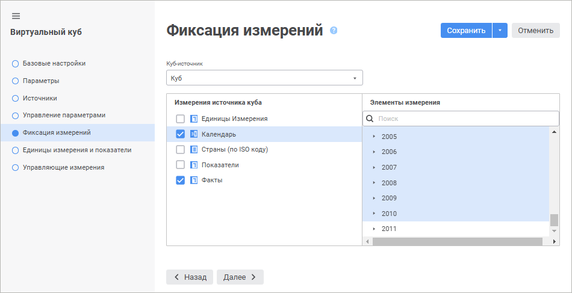

# Страница «Фиксация измерений»: Виртуальный куб

Страница «Фиксация измерений»: Виртуальный куб
-

# Фиксация измерений

На странице «Фиксация измерений»
 производится фиксация измерений. Измерение фактов куба формируется на
 основе отмеченных элементов фиксированных измерений.

	 Веб-приложение Настольное приложение

		

		

Для фиксации измерений:

	- В раскрывающемся списке «Куб-источник»
	 выберите куб-источник.

	- В списке «Измерения куба-источника»
	 установите флажки напротив наименований измерений, которые необходимо
	 зафиксировать.

Примечание.
 При установке флажка для параметрического измерения будет выдано окно
 «[Установка значений параметров](uinav.chm::/02_Navigator/General_Principles_of_Work.htm#open_param_object)»,
 в котором необходимо указать значения параметров.

	- В списке «Элементы измерения»
	 установите отметку элементов. Для работы с отметкой элементов доступно
	 контекстное меню:

		- Отметить все. Устанавливает
		 отметку для всех элементов измерения;

		- Снять отметку. Снимает
		 отметку со всех элементов измерения;

		- Отметить подчиненные по
		 уровню. Устанавливает отметку для всех элементов, расположенных
		 на одном уровне с указанным элементом измерения;

		- Отметить все подчиненные.
		 Устанавливает отметку для всех дочерних элементов выбранного элемента
		 измерения;

		- Снять отметку с подчиненных.
		 Снимает отметку со всех дочерних элементов выбранного элемента
		 измерения;

		- Расширенная отметка.
		 Устанавливает/снимает отметку с указанного уровня.

Для измерений куба-источника, несовпадающих с измерениями других кубов-источников,
 флажки будут установлены автоматически, снять их возможности не будет.
 Для элементов таких измерений установите отметку в списке «Элементы
 измерения». Если для элементов каких-либо зафиксированных измерений
 не будет произведена отметка, то при попытке перейти на следующую страницу
 будет выдано сообщение с указанием, в каких измерениях необходимо ее произвести.

См. также:

[Виртуальный куб](UiMd_Cube_CreateCube_Master_Virtual.htm)

		Справочная
		 система на версию 10.9
		 от 18/08/2025,
		 © ООО «ФОРСАЙТ»,
