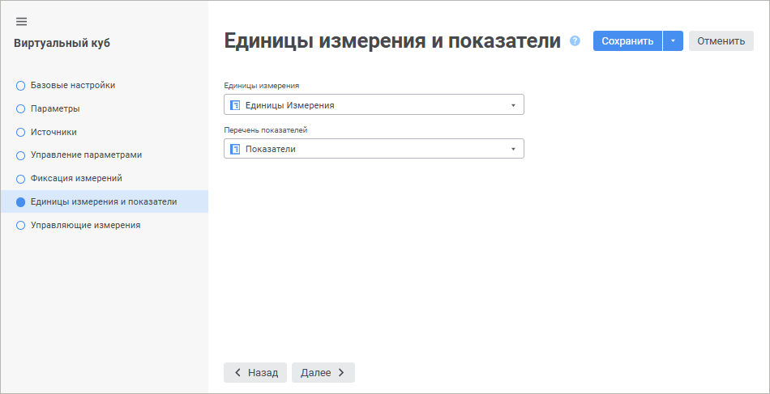

# Страница «Единицы измерения и показатели»: Виртуальный куб

Страница «Единицы измерения и показатели»: Виртуальный куб
-

# Единицы измерения и показатели

На странице «Единицы измерения и показатели»
 в случае необходимости указывается справочник единиц измерения и справочник
 в качестве перечня показателей. Указание данных справочников позволяет
 реализовать автоматический пересчёт единиц измерения.

	Веб-приложение Настольное приложение

		

		

Выбор справочников производится из раскрывающихся списков, в которых
 отображены все имеющиеся справочники в кубе. Данные справочники должны
 иметь определенную структуру: [Единицы
 измерения и показатели](../../../Units/Units_Cube.htm#options). Если структура выбранного справочника показателей
 или справочника единиц измерения не удовлетворяет необходимым условиям,
 то будет выдано соответствующее сообщение.

См. также:

[Виртуальный куб](UiMd_Cube_CreateCube_Master_Virtual.htm)

		Справочная
		 система на версию 10.9
		 от 18/08/2025,
		 © ООО «ФОРСАЙТ»,
