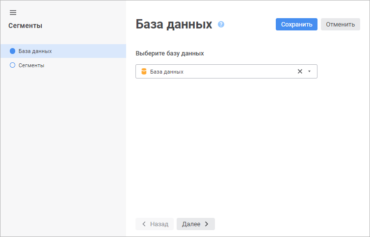

# База данных: Сегменты куба

База данных: Сегменты куба
-

# База данных

На странице «База данных» задаётся
 база данных репозитория, в которой будут храниться таблицы сегментов.
 В таблицах сохраняется отметка куба, заданная для сегмента, а также установленные
 права доступа:

При первом открытии мастера сегментов будет осуществлена проверка, выбрана
 ли для репозитория [база
 данных по умолчанию](UiNav.chm::/02_Navigator/Repo_Default.htm). Если база выбрана, то будет предложено использовать
 её для таблиц сегментов.

Для смены базы данных используйте кнопку «Выбрать».
 Смена базы данных доступна до того момента, как будет создан первый сегмент.

Для быстрого выбора объекта в поле для поиска введите его название/идентификатор/ключ,
 в зависимости от настроек отображения. Поиск будет выполняться автоматически
 по мере ввода текста. Список будет содержать объекты, наименования/идентификаторы/ключи
 которых содержат вводимый текст.

Для настройки отображения объектов репозитория в списке нажмите кнопку
  «Отображение
 объекта» и выберите в раскрывающемся меню вариант отображения:

	- Наименование. Объекты
	 отображаются под своими наименованиями. Вариант по умолчанию;

	- Идентификатор. Объекты
	 отображаются под своими идентификаторами;

	- Ключ. Объекты отображаются
	 под своими ключами.

Выбрать можно несколько вариантов. Идентификатор и ключ будут указаны
 в скобках.

Для сброса отметки выбранных объектов нажмите кнопку 
 «Очистить».

См. также:

[Сегменты
 куба](segments.htm)

		Справочная
		 система на версию 10.9
		 от 18/08/2025,
		 © ООО «ФОРСАЙТ»,
