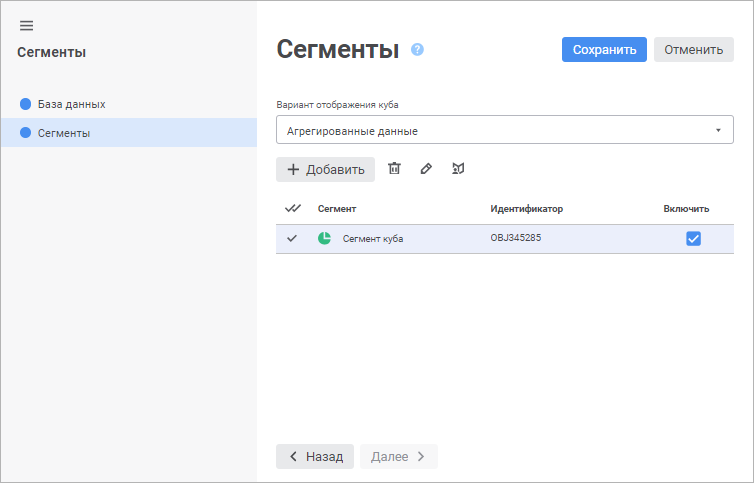
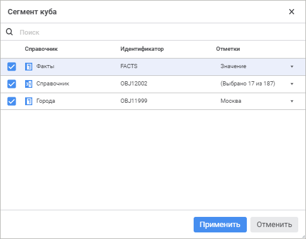
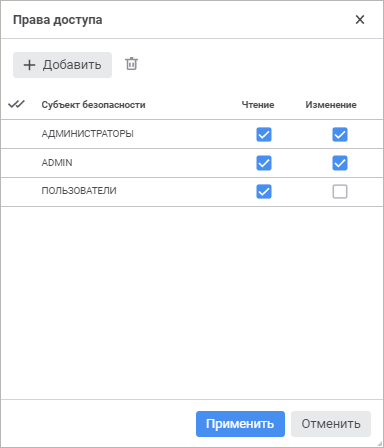

# Сегменты: Сегменты куба

Сегменты: Сегменты куба
-

# Сегменты

На странице «Сегменты» формируется
 список сегментов и задаются права доступа к данным:

[Создание сегментов](javascript:TextPopup(this))

	В раскрывающемся списке «Вариант
	 отображения куба» выберите вариант отображения, с данными которого
	 будет работать сегмент. Нажмите кнопку «Добавить»
	 для создания нового сегмента.

[Определение
 отметки](javascript:TextPopup(this))

	Для задания отметки сегмента выделите его флажком в левом столбце
	 и нажмите кнопку  «Редактировать».
	 Откроется окно «Сегмент куба»:

	

	В окне отметьте флажками измерения, по которым требуется изменить
	 отметку, а в раскрывающемся списке столбца «Отметки»
	 выберите элементы измерений. Отметка должна быть задана минимум у
	 одного измерения. У измерений, для которых флажок снят и отметка не
	 задана, при раздаче прав будет использоваться полная отметка.

	Нажмите кнопку «Применить»
	 для сохранения изменений и закрытия диалога. После формирования отметки
	 перейдите к настройке [прав доступа](#rignts).

[Настройка
 прав доступа](javascript:TextPopup(this))

	Определение прав доступа для сегмента выполняется после настройки
	 [отметки](#seletions). Для этого выделите сегмент флажком
	 в левом столбце и нажмите кнопку  «Права доступа». Откроется окно «Права доступа»:

	

	В окне добавьте необходимый субъект безопасности (пользователя или
	 группу) и определите какими правами он будет обладать: чтение и/или
	 изменение данных. По умолчанию для выбора доступны те субъекты, которые
	 добавлены в менеджере безопасности репозитория. Для работы с доменными
	 субъектами безопасности, которые не добавлены в менеджере безопасности,
	 может потребоваться [дополнительная
	 настройка](Admin.chm::/03_Admin/communication_with_ad.htm) взаимодействия со службами каталогов.

	Нажмите кнопку «Применить»
	 для сохранения изменений и закрытия диалога.

	Примечание.
	 Права доступа пользователей/групп пользователей задаются с помощью
	 инструмента «Менеджер безопасности».
	 В сегментах происходит ограничение имеющихся прав пользователей/групп
	 пользователей на куб.

[Управление сегментами](javascript:TextPopup(this))

	У сегмента можно изменить наименование. Для этого дважды щёлкните
	 в области текста в столбце «Сегмент»
	 и задайте новое наименование. Чтобы изменения применились щелкните
	 за пределами редактора наименования.

	Флажок в столбце «Включить»
	 позволяет изменять активность сегмента. Настройки активного сегмента
	 применяются для управления доступом к данным у субъектов, для которых
	 они настроены. Для временного отключения сегмента снимите флажок в
	 области столбца «Включить».

	Для удаления отмеченных сегментов нажмите кнопку  «Удалить». После подтверждения сегменты
	 будут удалены.

См. также:

[Сегменты
 куба](segments.htm)

		Справочная
		 система на версию 10.9
		 от 18/08/2025,
		 © ООО «ФОРСАЙТ»,
